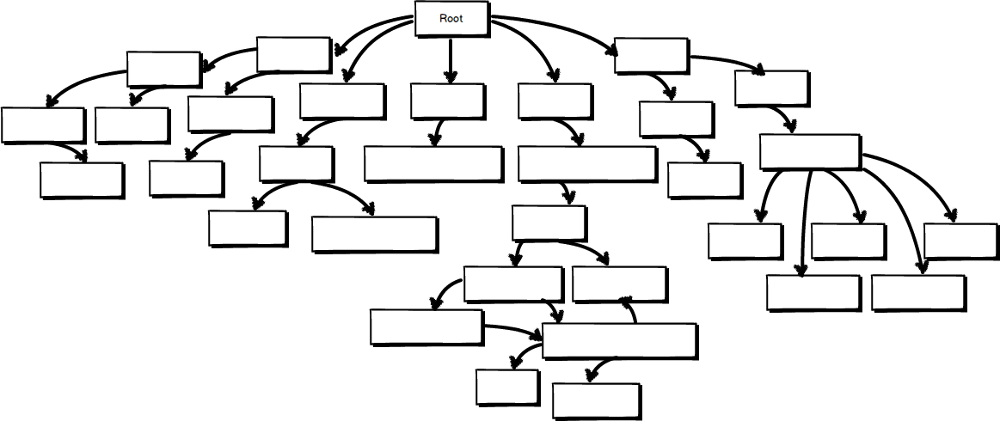
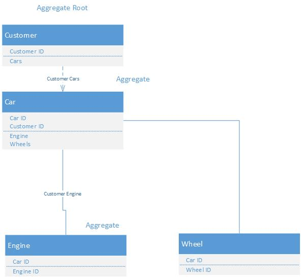
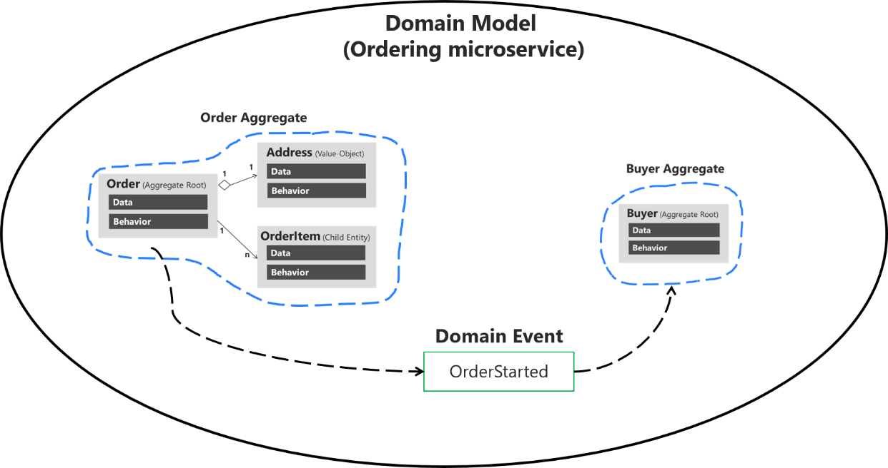
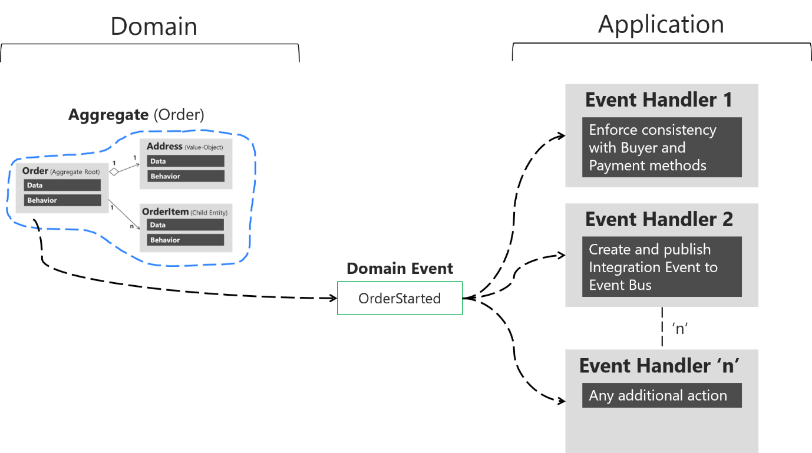
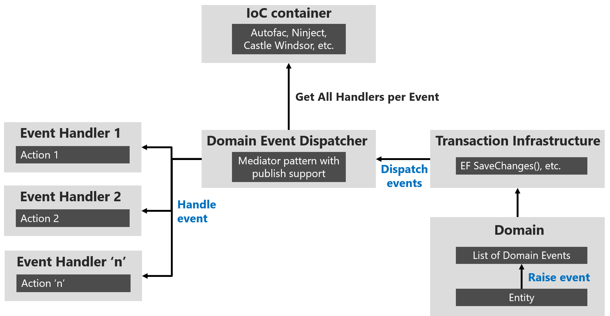

# DDD - een inleiding


Eric Evans is de authoriteit aangaande DDD.

## Waaron is DDD zo fantastisch?

- Ontwikkeling is domeingericht, niet UI/Database gericht
- De domeinlaag vangt alle bedrijfslogica op, waardoor je "service"-laag erg dun wordt, d.w.z. slechts een toegangspoort tot je domein biedt via DTO's
- Domeingeoriënteerde ontwikkeling maakt het mogelijk om een echte service georiënteerde architectuur te implementeren, d.w.z. dat uw services herbruikbaar zijn omdat ze niet UI/Presentatie laag specifiek zijn 
- Unit tests zijn gemakkelijk te schrijven omdat code horizontaal schaalt en niet verticaal, waardoor je methodes dun en gemakkelijk testbaar zijn
- DDD is een verzameling van patronen en principes: dit geeft ontwikkelaars een kader om mee te werken, waardoor iedereen in het ontwikkelteam dezelfde richting kan opgaan.

## Aggregate Root

Het punt waarvandaan je de structuur aanspreekt:



Een voorbeeld:



## Entity en Value Object

Een Entity heeft een eigen identiteit en geschiedenis (life cycle).

```csharp
// Entity
public class Person
{
    public int Id { get; set; }
    public string Name { get; set; }
    public Address Address { get; set; }
}
 
// Value Object
public class Address
{
    public string City { get; set; }
    public string ZipCode { get; set; }
}
```

Basis voor een entiteit:

```csharp
public abstract class Entity
{
    public virtual long Id { get; protected set; }

    protected Entity()
    {
    }

    protected Entity(long id)
    {
        Id = id;
    }

    public override bool Equals(object obj)
    {
        if (obj is not Entity other)
            return false;

        if (ReferenceEquals(this, other))
            return true;

        if (GetUnproxiedType(this) != GetUnproxiedType(other))
            return false;

        if (Id.Equals(default) || other.Id.Equals(default))
            return false;

        return Id.Equals(other.Id);
    }

    public static bool operator ==(Entity a, Entity b)
    {
        if (a is null && b is null)
            return true;

        if (a is null || b is null)
            return false;

        return a.Equals(b);
    }

    public static bool operator !=(Entity a, Entity b)
    {
        return !(a == b);
    }

    public override int GetHashCode()
    {
        return (this.GetType().ToString() + Id).GetHashCode();
    }
}
```

Basis voor een Value Object: merk op, er is geen property Id voorzien.

```csharp
public abstract class ValueObject<T>
    where T : ValueObject<T>
{
    public override bool Equals(object obj)
    {
        var valueObject = obj as T;
 
        if (ReferenceEquals(valueObject, null))
            return false;
 
        return EqualsCore(valueObject);
    }
 
    protected abstract bool EqualsCore(T other);
 
    public override int GetHashCode()
    {
        return GetHashCodeCore();
    }
 
    protected abstract int GetHashCodeCore();
 
    public static bool operator ==(ValueObject<T> a, ValueObject<T> b)
    {
        if (ReferenceEquals(a, null) && ReferenceEquals(b, null))
            return true;
 
        if (ReferenceEquals(a, null) || ReferenceEquals(b, null))
            return false;
 
        return a.Equals(b);
    }
 
    public static bool operator !=(ValueObject<T> a, ValueObject<T> b)
    {
        return !(a == b);
    }
}
```

## Waarvoor staat DTO?

Data Transfer Object: "anemic" objects.

Code:

```c#
 public class Product
  {
      public Guid Id { get; set; }
      public string Name { get; set; }
      public int Quantity { get; set; }
      public DateTime Created { get; set; }
      public DateTime Modified { get; set; }
      public bool Active { get; set; }
  }
 
  public class Customer
  {
      public Guid Id { get; set; }
      public string FirstName { get; set; }
      public string LastName { get; set; }
      public string Email { get; set; }
      public List Purchases { get; set; }
}
 
  public class Purchase
  {
      public Guid Id { get; set; }
      public List Products { get; set; }
      public DateTime Created { get; set; }
      public Customer Customer { get; set; }
  }
```

Bovenstaande code vertegenwoordigt "anemische" klassen (enkel properties, referenties naar andere objecten). Sommige ontwikkelaars zouden het hierbij houden, en deze klassen gebruiken om gegevens door te geven aan de service en dan deze gegevens rechtstreeks te binden aan de UI. Laten we verder gaan.

Wanneer een klant online winkelt, kiest hij eerst artikelen, daarna kijkt hij verder rond, en uiteindelijk zal hij een aankoop doen. We moeten met andere woorden deze artikelen ergens bewaren, laten we dit een winkelwagen noemen, een object dat geen identiteit heeft en vergankelijk is.

Cart is ons **Value Object**:

```c#
public class Cart
{
    public List Products { get; set; }
}
```

De winkelwagen bevat gewoon een lijst met producten. De klant kan deze producten afrekenen als hij daar klaar voor is.

We kunnen het bovenstaande gebruiken als een business use case: "De klant kan deze producten afrekenen wanneer hij er klaar voor is".

Voorbeeldcode:

```c#
Cart cart = new Cart() 
{ 
    Products = new Product[]
    { 
        new Product(), 
        new Product() 
    } 
};
 
Customer customer = new Customer()
{
    FirstName = "Josh",
    LastName = "Smith"
};
 
Purchase purchase = customer.Checkout(cart);
```

Wat is hier aan de hand? De klant checkt het product uit en krijgt een aankoopbon terug. Normaal gesproken in de zakelijke context krijg je een ontvangstbewijs terug, dit geeft basisinformatie over de aankoop, kortingen, en fungeert als een garantie die ik kan gebruiken om terug te verwijzen naar mijn aankoop.

We kunnen Purchase herdopen tot Receipt, maar wacht, wat betekent aankoop in de zakelijke context?

"Verwerven door betaling van geld of een equivalent daarvan; kopen."

*(Het teruggeven van het aankoopobject zou zinvol zijn als de klant daadwerkelijk een aankoop had gedaan, d.w.z. dat we de klant vooraf hadden geauthenticeerd en dan gewoon de authenticatiecode van de betaling aan de kassa hadden doorgegeven, maar om dit eenvoudig te houden gaan we dit niet doen)*

De klant kan nu afrekenen, wanneer hij afrekent krijgt hij een Purchase object terug (dit zal verdere gegevensmanipulatie toelaten).

Bovenstaande code moet ge-re-factored worden, als we een aankoop teruggeven, gaan we die dan toevoegen aan de collectie van de klant, d.w.z. Customer.Purchases.Add(...)? Dit lijkt vreemd, als we een methode Customer.Checkout(...) hebben zouden we moeten proberen om relevante data daar en dan vast te leggen. Customer zou alleen business methods moeten tonen, als we iets anders moeten tonen om data te verzamelen dan doen we het niet goed.

Verfijning:

```c#
public class Customer
{
    public Guid Id { get; set; }
    public string FirstName { get; set; }
    public string LastName { get; set; }
    public string Email { get; set; }
    public List Purchases { get; set; }
 
    public Purchase Checkout(Cart cart)
    {
        Purchase purchase = new Purchase()
        {
             Customer = this,
             Products = cart.Products,
             Created = DateTime.Now
        };
 
        this.Purchases.Add(purchase);
        return purchase;
    }
}
```

Ok, dus nu wanneer de klant uitcheckt uit een winkelwagentje, zal de aankoop worden toegevoegd aan de aankoop collectie en ook teruggegeven, zodat het verder kan worden gebruikt in onze logica. Dit is geweldig, maar een andere software engineer kan naar binnen gaan en ons domein compromitteren. Ze kunnen gewoon Orders direct aan de klant toevoegen zonder uit te checken, d.w.z. Customer.Orders.Add(...).

Verdere verfijning:

```c#
public class Customer
{
    private List purchases = new List();
 
    public Guid Id { get; set; }
    public string FirstName { get; set; }
    public string LastName { get; set; }
    public string Email { get; set; }
    public ReadOnlyCollection Purchases { get { return this.purchases.AsReadOnly(); } }
 
    public Purchase Checkout(Cart cart)
    {
        Purchase purchase = new Purchase()
        {
             Customer = this,
             Products = cart.Products,
             Created = DateTime.Now
        };
        this.purchases.Add(purchase);
        return purchase;
    }
}
```

Nu kunnen bestellingen niet worden gecompromitteerd, en code dwingt software ingenieurs om een kar te controleren. Hoe zit het met andere eigenschappen? Die zijn niet beschermd. We weten dat de klantstatus niet zomaar kan worden veranderd, we moeten door een proces gaan. Je moet jezelf afvragen, wanneer persoonlijke informatie van de klant wordt gewijzigd, moeten we dan een e-mail sturen? Moeten we een API van een derde partij oproepen om onze gegevens te synchroniseren? Op dit moment hebben uw business analisten misschien niet de behoefte om zoiets te doen, dus laten we ons daar geen zorgen over maken, laten we gewoon deze velden beschermen, zodat ze niet kunnen worden gewijzigd.

```c#
public class Customer
{
    private List purchases = new List();
 
    public Guid Id { get; protected set; }
    public string FirstName { get; protected set; }
    public string LastName { get; protected set; }
    public string Email { get; protected set; }
    public ReadOnlyCollection Purchases { get { return this.purchases.AsReadOnly(); } }
    
    public Purchase Checkout(Cart cart)
    {
        Purchase purchase = new Purchase()
        {
             Customer = this,
             Products = cart.Products,
             Created = DateTime.Now
        };
        this.purchases.Add(purchase);
        return purchase;
    }
}
```

Dat is geweldig, nu kunnen andere software engineers in het team geen persoonlijke informatie meer wijzigen zonder een nieuwe methode toe te voegen zoals Customer.ChangeDetails(...).

Rekening houdend met wat hierboven is gezegd, denkproces, constant re-factoren en het model laten overeenkomen met het werkelijke bedrijfsdomein, is dit wat ik tot nu toe heb:

```c#
public class Product
{
    public Guid Id { get; protected set; }
    public string Name { get; protected set; }
    public int Quantity { get; protected set; }
    public DateTime Created { get; protected set; }
    public DateTime Modified { get; protected set; }
    public bool Active { get; protected set; }
}
 
public class Cart
{
    private List products;
 
    public ReadOnlyCollection Products
    {
        get { return products.AsReadOnly(); }
    }
 
    public static Cart Create(List products)
    {
        Cart cart = new Cart();
        cart.products = products;
        return cart;
    }
}

public class Purchase
{
    private List products = new List();
 
    public Guid Id { get; protected set; }
    public ReadOnlyCollection Products
    {
        get { return products.AsReadOnly(); }
    }
    public DateTime Created { get; protected set; }
    public Customer Customer { get; protected set; }
 
    public static Purchase Create(Customer customer, ReadOnlyCollection products)
    {
        Purchase purchase = new Purchase()
        {
            Id = Guid.NewGuid(),
            Created = DateTime.Now,
            products = products.ToList(),
            Customer = customer
        };
        return purchase;
    }
}
 
public class Customer
{
    private List purchases = new List()
 
    public Guid Id { get; protected set; }
    public string FirstName { get; protected set; }
    public string LastName { get; protected set; }
    public string Email { get; protected set; }
    public ReadOnlyCollection Purchases { get { return this.purchases.AsReadOnly(); } }
 
    public Purchase Checkout(Cart cart)
    {
        Purchase purchase = Purchase.Create(this, cart.Products);
        this.purchases.Add(purchase);
        return purchase;
    }
 
    public static Customer Create(string firstName, string lastName, string email)
    {
        Customer customer = new Customer()
        {
             FirstName = firstName,
             LastName = lastName,
             Email = email
        };
        return customer;
    }
}
```

Voorbeeld van gebruik:

```c#
Cart cart = Cart.Create(new List() { new Product(), new Product() });
Customer customer = Customer.Create("josh", "smith", "josh.smith@microsoft.com");
Purchase purchase = customer.Checkout(cart);
```

**Samenvatting:** 

- DDD draait om het vastleggen van bedrijfslogica in het domein, d.w.z. entiteiten, aggregate roots, value objects en domeinservices.
- DDD gaat over het denkproces en de uitdaging waar wat heen moet en wat het meest logisch is.
- DDD gaat over het constant herformuleren en het volwassen maken van je model naarmate je meer vereisten krijgt. Hoe meer vereisten je krijgt, hoe beter en sterker je domein zal zijn. Daarom zijn requirements goud waard en iets waar software engineers altijd naar moeten streven om ze te begrijpen.

**Nuttige links:**

- [Onion architecture](http://jeffreypalermo.com/blog/the-onion-architecture-part-1/), een heel goed voorbeeld van waar het bij domein-gedreven ontwerpen om gaat
- [Aggregate root](http://martinfowler.com/bliki/DDD_Aggregate.html), goede uitleg van wat aggregate root is
- [Explanation of Aggregate Root, Entity and Value objects](http://lostechies.com/jimmybogard/2008/05/21/entities-value-objects-aggregates-and-roots/)
- [Supple Design, Intention revealing interfaces, etc.](http://www.cs.colorado.edu/~kena/classes/6448/s05/lectures/lecture30.pdf) Pdf University of Colorado

# DDD - Domain Events

Wanneer er iets gebeurd is in het domein, kan er een domain event worden opgeroepen. Het kan gaan van een triviale verandering van een eigenschap tot een algemene verandering van de objecttoestand. Dit is een fantastische manier om een actuele gebeurtenis in uw domein te beschrijven, b.v. klant heeft uitgecheckt, klant is aangemaakt, enzovoort.

We breiden ons voorbeeld uit:

```c#
public class Product
{
    public Guid Id { get; protected set; }
    public string Name { get; protected set; }
    public int Quantity { get; protected set; }
    public DateTime Created { get; protected set; }
    public DateTime Modified { get; protected set; }
    public bool Active { get; protected set; }
}
 
public class Cart
{
    private List products;
 
    public ReadOnlyCollection Products
    {
        get { return products.AsReadOnly(); }
    }
 
    public static Cart Create(List products)
    {
        Cart cart = new Cart();
        cart.products = products;
        return cart;
    }
}
 
public class Purchase
{
    private List products = new List();
 
    public Guid Id { get; protected set; }
    public ReadOnlyCollection Products
    {
        get { return products.AsReadOnly(); }
    }
    public DateTime Created { get; protected set; }
    public Customer Customer { get; protected set; }
 
    public static Purchase Create(Customer customer, ReadOnlyCollection products)
    {
        Purchase purchase = new Purchase()
        {
            Id = Guid.NewGuid(),
            Created = DateTime.Now,
            products = products.ToList(),
            Customer = customer
        };
        return purchase;
    }
}
 
public class Customer
{
    private List purchases = new List()
 
    public Guid Id { get; protected set; }
    public string FirstName { get; protected set; }
    public string LastName { get; protected set; }
    public string Email { get; protected set; }
    public ReadOnlyCollection Purchases { get { return this.purchases.AsReadOnly(); } }
 
    public Purchase Checkout(Cart cart)
    {
        Purchase purchase = Purchase.Create(this, cart.Products);
        this.purchases.Add(purchase);
        DomainEvents.Raise(new CustomerCheckedOut() { Purchase = purchase });
        return purchase;
    }
 
    public static Customer Create(string firstName, string lastName, string email)
    {
        Customer customer = new Customer()
        {
             FirstName = firstName,
             LastName = lastName,
             Email = email
        };
        return customer;
    }
}
 
public class CustomerCheckedOut : IDomainEvent
{
    public Purchase Purchase { get; set; }
}
 
public class CustomerCheckedOutHandle : Handles CustomerCheckedout
{
    public CustomerCheckedOutHandle()
    {
   
    }
 
    public void Handle(CustomerCheckedOut args)
    {
        //send notifications, emails, update third party systems, etc
    }
}
```

Bijvoorbeeld in ons geval, wanneer de klant Customer.Checkout(...) aanroept, wekken we het "CustomerCheckedOut" event op. Wanneer de gebeurtenis wordt afgehandeld, mag het niet de status van het inkoopobject veranderen, het mag alleen aanvullend gedrag mogelijk maken. Bijvoorbeeld het versturen van een e-mail, het bijwerken van de maandelijkse financiële balans, het aanroepen van API's van derden, enz.

Dit is hoe je het zou kunnen gebruiken:

```c#
public class CustomerCheckedOut : IDomainEvent
{
    public Purchase Purchase { get; set; }
}
 
public class CustomerCheckedOutHandle : Handles CustomerCheckedOut
{
    readonly IEmailSender emailSender;
 
    public CustomerCheckedOutHandle(IEmailSender emailSender)
    {
        this.emailSender = emailSender;
    }
 
    public void Handle(CustomerCheckedOut args)
    {
        this.emailSender.Send(args.Purchase.Customer, EmailTemplate.PurchaseMade);
        //send notifications, update third party systems, etc
    }
}
 
public interface IEmailSender
{
    void Send(Customer customer, EmailTemplate template);
}
 
public enum EmailTemplate
{
    PurchaseMade,
    CustomerCreated
}

```

Het kan verwarrend zijn, wat stop je in de Customer.Checkout(...) method en wat stop je in de handler?

De Customer.Checkout(...) methode moet doen wat deze moet doen met de toegang tot de eigenschappen/velden waartoe het toegang heeft. Dus een aankoopobject aanmaken en toevoegen aan de collectie, het aantal aankopen van de klant verhogen, de laatste aankoopdatum van het klantobject bijwerken, je snapt het idee.

Waar heeft de handler toegang toe? Alle interfaces van de infrastructuurlaag. Dit maakt het een goede plaats om emails en notificaties te sturen, te synchroniseren met diensten van derden, audit records aan te maken, enzovoort.

**Samenvatting:**

- Domain event handlers mogen de toestand van het object dat de domeingebeurtenis veroorzaakte niet veranderen.
- Domeingebeurtenissen moeten binnen het domein worden opgewekt.
- Domeingebeurtenissen handlers moeten worden gezien als een neveneffect / kettingreactie facilitator.


**Nuttige links:** 

- [Domain Events - Salvation](http://www.udidahan.com/2009/06/14/domain-events-salvation/)
- [Strengthening your domain - domain events](http://lostechies.com/jimmybogard/2010/04/08/strengthening-your-domain-domain-events/)

# DDD - Specification Pattern

Het *specification pattern* is fantastisch, [lees David Fancher](http://davefancher.com/2012/07/03/specifications-expression-trees-and-nhibernate/).

Met het specification pattern kan je zakelijke queries aan elkaar rijgen.

Voorbeeld:

```c#
ISpecification<Customer> spec = 
    new CustomerRegisteredInTheLastDays(30).And(new CustomerPurchasedNumOfProducts(2));
```

```C#
public class Customer : IDomainEntity
   {
       private List<Purchase> purchases = new List<Purchase>();
 
       public Guid Id { get; protected set; }
       public string FirstName { get; protected set; }
       public string LastName { get; protected set; }
       public string Email { get; protected set; }
       public string Password { get; protected set; }
       public DateTime Created { get; protected set; }
       public bool Active { get; protected set; }
 
       public ReadOnlyCollection<Purchase> Purchases { get { return this.purchases.AsReadOnly(); } }
 
       public static Customer Create(string firstname, string lastname, string email)
       {
           Customer customer = new Customer()
           {
               FirstName = firstname,
               LastName = lastname,
               Email = email,
               Active = true,
               Created = DateTime.Today
           };
 
           DomainEvents.Raise<CustomerCreated>(new CustomerCreated() { Customer = customer });
           return customer;
       }
 
       public Purchase Checkout(Cart cart)
       {
           Purchase purchase = Purchase.Create(this, cart.Products);
           this.purchases.Add(purchase);
           DomainEvents.Raise<CustomerCheckedOut>(new CustomerCheckedOut() { Purchase = purchase });
           return purchase;
       }
   }
```

Voorbeelden van specificaties:

```c#
public class CustomerRegisteredInTheLastDays : SpecificationBase<Customer>
    {
        readonly int nDays;
 
        public CustomerRegisteredInTheLastDays(int nDays)
        {
            this.nDays = nDays;
        }
 
        public override Expression<Func<Customer,bool>>  SpecExpression
        {
            get
            { 
                return customer => customer.Created >= DateTime.Today.AddDays(-nDays)
                    && customer.Active;
            }
        }
    }
 
    public class CustomerPurchasedNumOfProducts : SpecificationBase<Customer>
    {
        readonly int nPurchases;
 
        public CustomerPurchasedNumOfProducts(int nPurchases)
        {
            this.nPurchases = nPurchases;
        }
 
        public override Expression<Func<Customer,bool>>  SpecExpression
        {
            get
            { 
                return customer => customer.Purchases.Count == this.nPurchases 
                    && customer.Active;
            }
        }
    }
```

Abstract Repository:

```c#
public interface IRepository<TEntity> 
    where TEntity : IDomainEntity
{
    TEntity FindById(Guid id);
    TEntity FindOne(ISpecification<TEntity> spec);
    IEnumerable<TEntity> Find(ISpecification<TEntity> spec);
    void Add(TEntity entity);
    void Remove(TEntity entity);
}
```

Abstract Repository query voorbeeld:

```c#
IRepository<Customer> customerRepository = new Repository<Customer>();
 
ISpecification<Customer> spec = 
    new CustomerRegisteredInTheLastDays(30).And(new CustomerPurchasedNumOfProducts(2));
 
IEnumerable<Customer> customers = customerRepository.Find(spec);
```

**Samenvatting:**

- Met de specificatie kan je gegevens op een abstracte manier bevragen, d.w.z. je kan collections in memory of een RDBMS bevragen. Dit zorgt voor abstractie t.o.v. persistentie/infrastructuur.
- Specificatie kapselt een bedrijfsregel in een spec in.
- Het specificatiepatroon staat je toe om je business rules aan elkaar te klinken als een ketel.
- Specificatie maakt je domeinlaag **DRY** d.w.z. je hoeft niet steeds opnieuw dezelfde LINQ te schrijven.
- Specificaties zijn eenvoudig te unit-testen.
- Specificaties worden opgeslagen in de domeinlaag, dit zorgt voor volledige zichtbaarheid.
- Specificaties zijn super elegant.

**Tips:**

- Splits complexe business logica regels op in uw specificatie omdat een RDBMS moeite kan hebben om ze te interpreteren in een SQL query. Dit is over het algemeen een goede tip omdat u geen rommelige SQL in uw database wilt. 
- Query gegevens rond de entiteit eigenschappen, probeer niet de eigenschappen van de entiteit te veranderen, d.w.z. in plaats van te schrijven customer.Created.AddDays(30) >= DateTime.Today schrijf customer.Created >= DateTime.Today.AddDays(-30). De eerste zal proberen het te compileren als een SQL en zal falen omdat het te complex is, de tweede zal de waarde omzetten naar een parameter. 
- Aangezien specificaties logische queries zijn, mogen ze de toestand van de aanroeper of de aanroepende objecten niet veranderen. d.w.z. roep geen methoden op die de toestand veranderen, zoals customer.Checkout(....) && customer.Active == true. Deze tip gaat hand in hand met de tip hierboven.

**Nuttige links:**

- [Specifications, Expression Trees, and NHibernate](http://davefancher.com/2012/07/03/specifications-expression-trees-and-nhibernate/).
- [Specification Pattern](http://en.wikipedia.org/wiki/Specification_pattern): boolean specification pattern.

# DDD - Infrastructuur

Als je van database gecentreerde ontwikkeling komt (waar de database het hart van de applicatie is) dan zal dit moeilijk voor je zijn. In domein-gedreven ontwerp zijn database en algemene gegevensbronnen niet belangrijk, je applicatie is persistentie-onwetend.

Zet je infrastructuur interfaces in de Domain Model Layer. Je domein zal ze gebruiken om gegevens te verkrijgen, het hoeft niet uit te maken hoe, het weet alleen dat er een interface is en het zal die gebruiken. Dit vereenvoudigt de dingen en stelt u in staat om u te concentreren op uw eigenlijke domein in plaats van u zorgen te maken over welke database u zult gebruiken, waar de gegevens vandaan komen, enz.

**Infrastructuur: contracten**

```c#
public interface IEmailDispatcher
{
    void Dispatch(MailMessage mailMessage);
}
 
public interface INewsletterSubscriber
{
    void Subscribe(Customer customer);
}

//this lives in the core library and you can inherit from it and extend it e.g. ICustomerRepository : IRepository<Customer> then you can add some custom methods to your new interface. This can be useful if you want to uselize some of rich features of the ORM that you are using (should be a very rare case)
public interface IRepository<TEntity> 
    where TEntity : IDomainEntity
{
    TEntity FindById(Guid id);
    TEntity FindOne(ISpecification<TEntity> spec);
    IEnumerable<TEntity> Find(ISpecification<TEntity> spec);
    void Add(TEntity entity);
    void Remove(TEntity entity);
} 
```

**Infrastructuur: implementatie**

```c#
public class NHibernateRepository<TEntity> : IRepository<TEntity>
        where TEntity : IDomainEntity
    {
        public TEntity FindById(Guid id)
        {
            throw new NotImplementedException();
        }
 
        public TEntity FindOne(ISpecification<TEntity> spec)
        {
            throw new NotImplementedException();
        }
 
        public IEnumerable<TEntity> Find(ISpecification<TEntity> spec)
        {
            throw new NotImplementedException();
        }
 
        public void Add(TEntity entity)
        {
            throw new NotImplementedException();
        }
 
        public void Remove(TEntity entity)
        {
            throw new NotImplementedException();
        }
    }
 
    public class SmtpEmailDispatcher : IEmailDispatcher
    {
        public void Dispatch(MailMessage mailMessage)
        {
            throw new NotImplementedException();
        }
    }
 
    public class WSNewsletterSubscriber : INewsletterSubscriber
    {
        public void Subscribe(Customer customer)
        {
            throw new NotImplementedException();
        }
    }
```

Voorbeeld van gebruik:

```c#
public class CustomerCreatedHandle : Handles<CustomerCreated>
{
    readonly INewsletterSubscriber newsletterSubscriber;
    readonly IEmailDispatcher emailDispatcher;
 
    public CustomerCreatedHandle(INewsletterSubscriber newsletterSubscriber, IEmailDispatcher emailDispatcher)
    {
        this.newsletterSubscriber = newsletterSubscriber;
        this.emailDispatcher = emailDispatcher;
    }
 
    public void Handle(CustomerCreated args)
    {
        //example #1 calling an interface email dispatcher this can have differnet kind of implementation depending on context, e.g
        // smtp = SmtpEmailDispatcher (current), exchange = ExchangeEmailDispatcher, msmq = MsmqEmailDispatcher, etc... let infrastructure worry about it
        this.emailDispatcher.Dispatch(new MailMessage());
 
        //example #2 calling an interface newsletter subscriber  this can differnet kind of implementation e.g
        // web service = WSNewsletterSubscriber (current), msmq = MsmqNewsletterSubscriber, Sql = SqlNewsletterSubscriber, etc... let infrastructure worry about it
 
        this.newsletterSubscriber.Subscribe(args.Customer);
    }
}
```

**Samenvatting:**

- Infrastructuur bevat implementatie klassen die daadwerkelijk praten met de infrastructuur IO, Sql, Msmq, enzovoort.
- Het domein is het hart van de applicatie, niet de infrastructuur (dit kan moeilijk te begrijpen zijn als je uit een DBA achtergrond komt).
- Infrastructuur is niet belangrijk in Domein-ontwerp ontwerp, het faciliteert de applicatie ontwikkeling niet het leidt het.
- Infrastructuur zou geen domein logica moeten bevatten, alle domein logica zou in het domein moeten zitten. (Ik garandeer je dat als je voor het eerst begint, je er logica in stopt zonder dat je het weet).

**Tips:**

- Infrastructuur bevat implementatie klassen die daadwerkelijk praten met de infrastructuur IO, Sql, Msmq, enz.
- Het domein is het hart van de applicatie, niet de infrastructuur (dit kan moeilijk te begrijpen zijn als je uit een DBA achtergrond komt).
- Infrastructuur is niet belangrijk in Domein-ontwerp ontwerp, het faciliteert de applicatie ontwikkeling niet het leidt het.
- Infrastructuur zou geen domein logica moeten bevatten, alle domein logica zou in het domein moeten zitten. (Ik garandeer je dat als je voor het eerst begint, je er logica in stopt zonder dat je het weet)

De onion-architectuur, geïntroduceerd door Jeffrey Palermo, overwint de problemen van de gelaagde architectuur met groot gemak. Met de onion-architectuur is de game changer dat de Domeinlaag (Entiteiten en Validatieregels die gemeenschappelijk zijn voor de business case) de kern is van de gehele applicatie. Dit betekent meer flexibiliteit en minder koppeling. In deze aanpak kunnen we zien dat alle lagen alleen afhankelijk zijn van de Core lagen.


Links:

https://github.com/iammukeshm/OnionArchitecture

# DDD - Domain Service

Domain Service mag niet worden verward met Application Service of Web Service. Domain Service leeft in de Domain Model Layer. In tegenstelling tot Application of Web Service, moet Domain Service niet elke keer aangeroepen worden om toegang te krijgen tot de Domain Model Layer. Je kunt de interface van je repository aanroepen in de applicatielaag en de domeinentiteit direct ophalen.

**Vereiste:**
Uw bedrijf is verantwoordelijk voor het innen en betalen van Belasting Toegevoegde Waarde (BTW) op basis van uw bedrijfslocatie, de locatie van uw klant en het type product dat u verkoopt.

**Voorbeeld domeinservice:**

```c#
public class TaxDomainService : ITaxDomainService
    {
        readonly IRepository<ProductTax> productTax;
        readonly IRepository<CountryTax> countryTax;
        readonly Settings settings;
 
        public TaxDomainService(Settings settings, IRepository<ProductTax> productTax, IRepository<CountryTax> countryTax)
        {
            this.productTax = productTax;
            this.countryTax = countryTax;
            this.settings = settings;
        }
 
        public decimal Calculate(Customer customer, Product product)
        {
            CountryTax customerCountryTax = this.countryTax.FindById(customer.Country.Id);
            CountryTax businessCountryTax = this.countryTax.FindById(settings.BusinessCountry.Id);
            ProductTax productTax = this.productTax.FindById(product.Code.Id);
            return (product.Cost * customerCountryTax.Percentage) + 
                (product.Cost * businessCountryTax.Percentage) + (product.Cost * productTax.Percentage);
        }
}
```

Voorbeeld van gebruik:

```c#
Customer customer = this.repositoryCustomer.FindById(customerId);
Product product = this.repositoryProduct.FindById(productId);
 
decimal tax = this.taxDomainService.Calculate(customer, product);
 
customer.Cart.Add(CartProduct.Create(customer.Cart, product, productQuantity, tax));
```

**Samenvatting:**

- Met Domain Service kun je logica vastleggen die niet in de Domain Entity thuishoort.
- Met Domain Service kun je orkestreren tussen verschillende Domain Entities.


**Tips:**

- Maak niet te veel Domain Services, het grootste deel van de logica moet in de domein entiteiten zitten, event handlers, enz. 
- Het is een goede plaats voor berekeningen en validaties omdat het toegang heeft tot entiteiten en andere objecten (b.v. Instellingen) die niet beschikbaar zijn via de entiteitsgrafiek.
- Methodes moeten primitieve types teruggeven, aangepaste enums zijn ook goed.

# DDD - Application Services

We hebben ons domein ontwikkeld, onze infrastructuur opgezet, nu moeten we ons domein openstellen voor toepassingen. Dit is waar de applicatiedienst om de hoek komt kijken.

Elke soort applicatie moet in staat zijn om je Application Service te consumeren en te gebruiken, mobiel, desktop of web. Het is goed om dit in gedachten te houden wanneer je je Applicatie Service en Distributed Interface Layer (Web Service) opzet.

**Applicatie Service Contract (leeft in een apart project):**

```c#
public interface ICartService
 {
     CartDto Add(Guid customerId, CartProductDto cartProductDto);
     CartDto Remove(Guid customerId, CartProductDto cartProductDto);
     CartDto Get(Guid customerId);
     CheckOutResultDto CheckOut(Guid customerId);
 }
 
// Dto's are Data Transfer Objects, they are very important as they allow you to input and get the 
// output from Application Services without exposing the actual Domain.
 public class CartDto
 {
     public Guid CustomerId { get; set; }
     public List<CartProductDto> Products { get; set; }
     public DateTime Created { get; set; }
     public DateTime Modified { get; set; }
 }
 
 public class CartProductDto
 {
     public Guid ProductId { get; set; }
     public int Quantity { get; set; }
 }
 
 public class CheckOutResultDto
 {
     public Nullable<Guid> PurchaseId { get; set; }
     public Nullable<CheckOutIssue> CheckOutIssue { get; set; }
 }
```

Voorbeeldimplementatie van een applicatieservice:

```c#
 public class CartService : ICartService
    {
        readonly IRepository<Customer> repositoryCustomer;
        readonly IRepository<Product> repositoryProduct;
        readonly IUnitOfWork unitOfWork;
        readonly ITaxDomainService taxDomainService;
 
        public CartService(IRepository<Customer> repositoryCustomer, 
            IRepository<Product> repositoryProduct, IUnitOfWork unitOfWork, ITaxDomainService taxDomainService)
        {
            this.repositoryCustomer = repositoryCustomer;
            this.repositoryProduct = repositoryProduct;
            this.unitOfWork = unitOfWork;
            this.taxDomainService = taxDomainService;
        }
 
        public CartDto Add(Guid customerId, CartProductDto productDto)
        {
            CartDto cartDto = null;
            Customer customer = this.repositoryCustomer.FindById(customerId);
            Product product = this.repositoryProduct.FindById(productDto.ProductId);
 
            this.validateCustomer(customerId, customer);
            this.validateProduct(product.Id, product);
 
            decimal tax = this.taxDomainService.Calculate(customer, product);
 
            customer.Cart.Add(CartProduct.Create(customer.Cart, product, productDto.Quantity, tax));
 
            cartDto = Mapper.Map<Cart, CartDto>(customer.Cart);
            this.unitOfWork.Commit();
            return cartDto;
        }
 
        public CartDto Remove(Guid customerId, CartProductDto productDto)
        {
            CartDto cartDto = null;
            Customer customer = this.repositoryCustomer.FindById(customerId);
            Product product = this.repositoryProduct.FindById(productDto.ProductId);
 
            this.validateCustomer(customerId, customer);
            this.validateProduct(productDto.ProductId, product);
 
            customer.Cart.Remove(product);
            cartDto = Mapper.Map<Cart, CartDto>(customer.Cart);
            this.unitOfWork.Commit();
            return cartDto;
        }
 
        public CartDto Get(Guid customerId)
        {
            Customer customer = this.repositoryCustomer.FindById(customerId);
            this.validateCustomer(customerId, customer);
            return Mapper.Map<Cart, CartDto>(customer.Cart);
 
        }
 
        public CheckOutResultDto CheckOut(Guid customerId)
        {
            CheckOutResultDto checkOutResultDto = null;
            Customer customer = this.repositoryCustomer.FindById(customerId);
            this.validateCustomer(customerId, customer);
 
            Nullable<CheckOutIssue> checkOutIssue = customer.Cart.IsCheckOutReady();
 
            if (!checkOutIssue.HasValue)
            {
                Purchase purchase = customer.Cart.Checkout();
                checkOutResultDto = Mapper.Map<Purchase, CheckOutResultDto>(purchase);
                this.unitOfWork.Commit();
            }
 
            return checkOutResultDto;
        }
 
        //this is just an example, don't hard code strings like this, use reference data or error codes
private void validateCustomer(Guid customerId, Customer customer)
        {
            if (customer == null)
                throw new Exception(String.Format("Customer was not found with this Id: {0}", customerId));
        }
 
        private void validateProduct(Guid productId, Product product)
        {
            if (product == null)
                throw new Exception(String.Format("Product was not found with this Id: {0}", productId));
        }
    }
```

Voorbeeld van gebruik:

```c#
this.cartService.Add(
    this.customer.Id, 
    new CartProductDto()
    {
        ProductId = viewModel.ProductId,
        Quantity = 2
    }
);
 
CheckOutResultDto checkoutResult = this.cartService.CheckOut(this.customer.id);
```

**Samenvatting:**

- Application Service is een toegangspoort tot uw Domain Model Layer via Dto's.
- Applicatie Service moet geen domein logica inkapselen, het moet echt dun zijn .
- De methode van de applicatieservice moet slechts één ding doen en dat goed doen met één gebied van het domein, meng het niet om "het meer prestatie-efficiënt te maken voor de applicatie die het gebruikt".
- Om toegang te krijgen tot Application Service stel je een interface en Dto's beschikbaar voor input en output (het is belangrijk om je Domain Entity niet bloot te stellen in een onbewerkt formaat, Dto is een proxy en beschermt je domein)
- Presenter (mobiele app, desktop of web), moet verschillende services aanroepen om gegevens te verkrijgen die het nodig heeft en deze te manipuleren om aan de UI te voldoen. Dit lijkt misschien inefficiënt, of verspillend in het begin. Je zult je realiseren dat het eigenlijk net zo snel is (zo niet sneller), makkelijker te testen en te onderhouden. 

**Tips:**

- Gebruik AutoMapper of een andere IoC container om je Domain Entity naar een Dto te mappen, verspil je tijd niet met handmatige mapping. Het maakt je implementatie code onoverzichtelijk en onderhoud wordt een nachtmerrie. 
- Denk niet aan schermen als het gaat om het blootstellen van Application Services, het is een API, denk hoe een mobiele app er toegang toe zou krijgen, of hoe externe potentiële klanten het zouden gebruiken.
- Realiseer je dat je uiteindelijk applicatieservices zult schrijven die passen bij je UI. Dit is niet meer dan natuurlijk omdat dit is wat je al een tijdje doet. Het zal een paar keer duren voordat u uw denkwijze verandert.
- Application Service kan direct worden geconsumeerd als je geen distributie nodig hebt, d.w.z. je MVC app zal gewoon direct naar de Application Service verwijzen, je kunt dan gewoon fouten proberen op te vangen in je Controller.
- Applicatie Service kan worden blootgesteld via Web Service (Distributed Interface Layer). Deze verdere abstractie geeft je de mogelijkheid om fouten te "proberen en op te vangen" zodat ze op een vriendelijker manier kunnen worden blootgesteld. Bovendien kunt u zo uw applicatie toekomstbestendig maken, bijv. door versiebeheer.

## Domain events

Zie [Microsoft documentation](https://docs.microsoft.com/en-us/dotnet/architecture/microservices/microservice-ddd-cqrs-patterns/domain-events-design-implementation).







Een mooi basisvoorbeeld van DDD: [Domain Events with MediatR](https://github.com/cfrenzel/DomainEventsWithMediatR).

<!--
## Voor gevorderden

Zie bijvoorbeeld [.NET Core REST API CQRS with raw SQL and DDD using Clean Architecture](https://github.com/kgrzybek/sample-dotnet-core-cqrs-api). 
-->