# Een eerste "Code First" voorbeeld

We maken een nieuwe **.NET 5 Console applicatie**: CodeFirstDemo.sln. Opgelet: met een "UWP" applicatie zal onderstaande niet zonder meer lukken.

We moeten net als vorige keer Entity Framework installeren. Dit gebeurt nog steeds met behulp van de Package Manager Console:

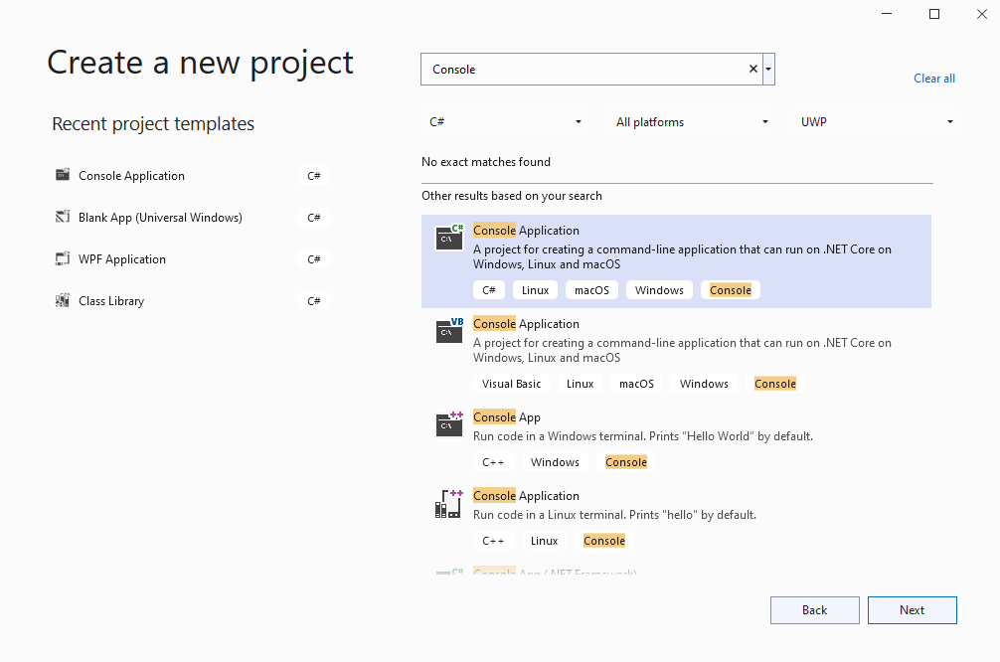

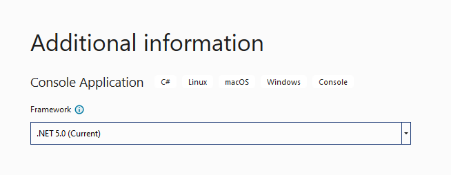

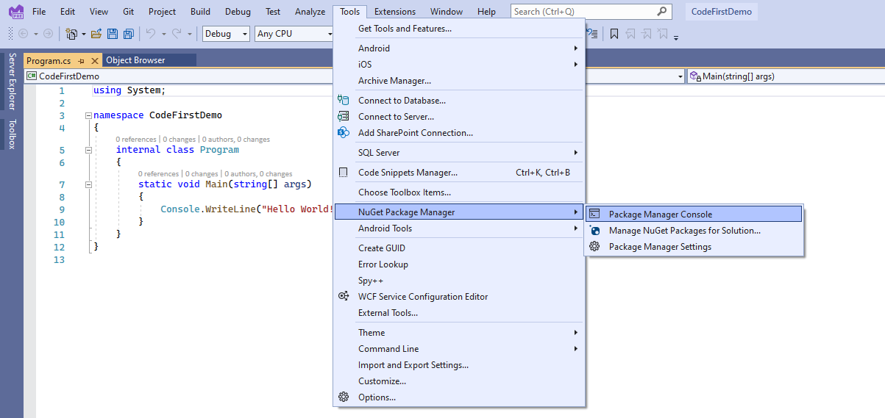

Installeer via Nuget Package Manager:

* Microsoft.EntityFrameworkCore
* Microsoft.EntityFrameworkCore.SqlServer
* Microsoft.EntityFrameworkCore.Tools (voor het gebruik van migrations)

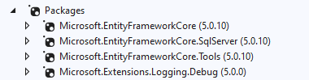

In Nuget Package Manager.Console:

```C#
Install-Package Microsoft.EntityFrameworkCore
Install-Package Microsoft.EntityFrameworkCore.SqlServer
Install-Package Microsoft.EntityFrameworkCore.Tools
Install-Package Microsoft.Extensions.Logging.Debug
```

Omdat we Code First werken maken we eerst een klasse "Post" aan:

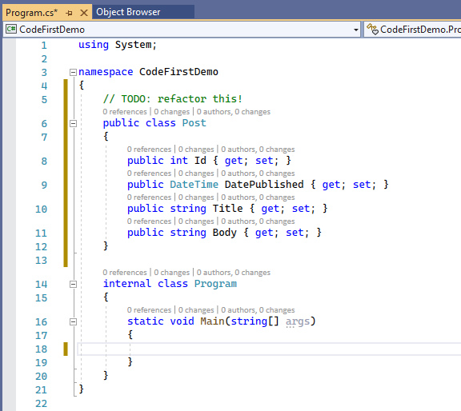


We hebben een DbContext klasse nodig die overerft van DbContext. Hierin moet **minstens een enkele DbSet<>** opgenomen zijn:

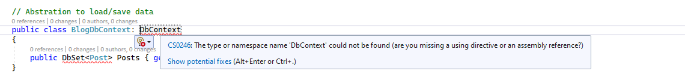

Je kan Intellisense gebruiken om je code aan te vullen:

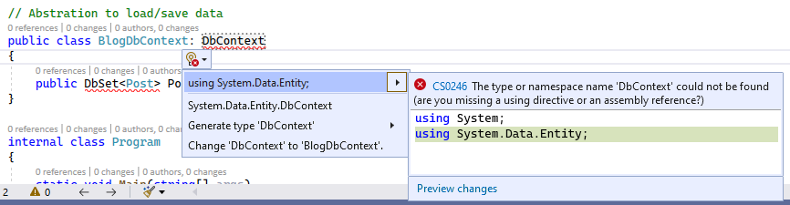

Aangezien we een "gewone" Core Console applicatie bouwen, kunnen we de zogenaamde "connection string" die specificeert hoe de databank gevonden kan worden, opgeven in het app.config bestand:

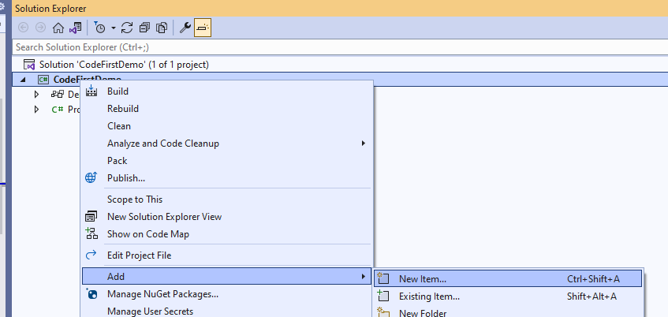

Dit bestand kan je toevoegen via de zogenaamde Solution Explorer:


Een connection string opgegeven kan veel eenvoudiger dan vroeger in het geval van bijvoorbeeld Framework 4.5:

```xml
<connectionStrings>
    <add name="BlogDbContext"  connectionString="Server=localhost,1436;database=CodeFirstDemo;Trusted_Connection=False;user ID=sa;Password=1Secure*Password1" providerName="System.Data.SqlClient"/>
</connectionStrings>
```

Tip: 

* Gebruik dezelfde naam als voor je DbContext klasse
* "data source=.\SQLEXPRESS; initial catalog=CodeFirstDemo; integrated security=SSPI" 
* providerName="System.Data.SqlClient" is nodig bij Code First werken

Om deze informatie te kunnen oplezen in je .NET Core applicatie, moet je via Nuget Package Manager toevoegen: System.Configuration.ConfigurationManager. Vervolgens gebruik je volgende code:

```C#
var cs = System.Configuration.ConfigurationManager.ConnectionStrings["BlogDbContext"].ConnectionString;
```

Vroeger moest je vervolgens "Code First migraties" activeren: hier komen we bij het belangrijkste verschil met "Db First" werken - een en ander zal voortaan automatisch goed beheerd kunnen worden. Deze actie moet maar eenmalig uitgevoerd worden voor je project en gebeurt aan de hand van Nuget Package Manager Console.

Zorg er eerst voor dat je databank operationeel is. Via Docker:

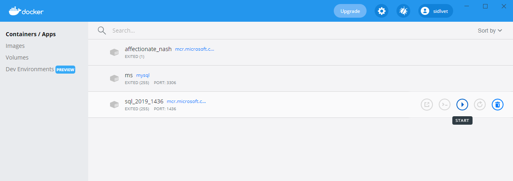

Doe je dit niet, dan krijg je een foutmelding als de volgende:

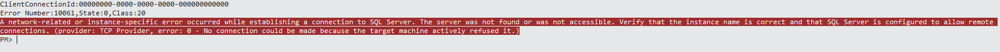

Dit gebeurde door in Package Manager Console in te geven:

```plain
Enable-Migrations
```

In Visual Studio verscheen vervolgens een folder "Migrations" met hieronder een bestand: Configuration.cs.

Vanaf .NET Core is dit niet meer nodig en kan je meteen je eerste migratie aanmaken via Package Manager Console:

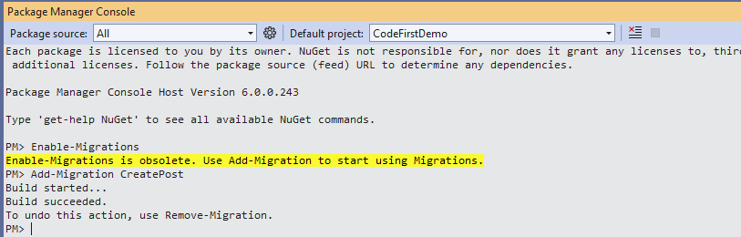

Het resultaat is een bijkomend bestand in folder "Migrations":

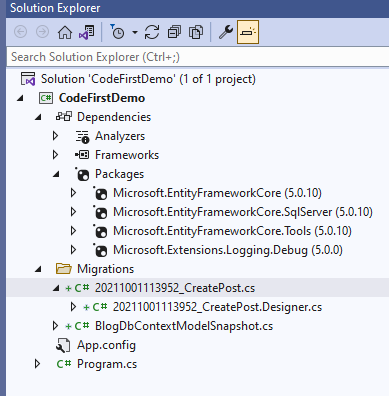

Wanneer we bestand ..._CreatePost.cs bestuderen, zien we twee methods: Up() en Down(). Deze staan voor "Upgrade" en "Downgrade". Doordat voor alle migraties een dergelijk scenario gegenereerd wordt, kunnen we makkelijk van elke versie naar elke versie.

Merk op: veld "Id" is meteen automatisch "not nullable" en "identity". Dit betekent dat EF automatisch conventie boven configuratie stelt. Elke Id wordt een "key"!

EF zal automatisch de gegenereerde code omvormen tot de noodzakelijke SQL queries wanneer de code uitgevoerd wordt. Om dit aan het werk te zien, voer uit in Package Manager Console:

```plain
Update-Database
```

Wens je meer informatie omtrent de queries die gegenereerd worden en de stappen die uitgevoerd worden, geef dan in:

```plain
Update-Database -Verbose
```

Het kan interessant zijn om gegenereerde queries zichtbaar te maken. Voeg met nuget toe: 

Microsoft.Extensions.Logging.Debug of Microsoft.Extensions.Logging.Console of SeriLog.Extensions.Logging of ...

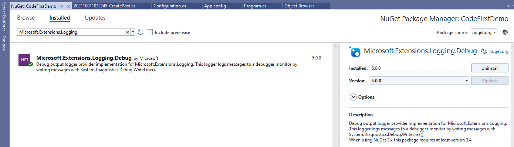

Indien we Microsoft.Extensions.Logging.Debug kiezen, dan verschijnt de informatie in het Output > Debug logging scherm van Visual Studio:

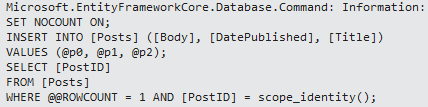

wanneer we volgende code uitvoeren:

```c#
var context = new BlogDbContext();
Post post = new() { Body = "body", DatePublished = DateTime.Now, Title = "title" /*, PostId = 1*/ };
context.Posts.Add(post);
context.SaveChanges();
```

## "Code First" enkel voor "Green Field" Projects?

Nee:

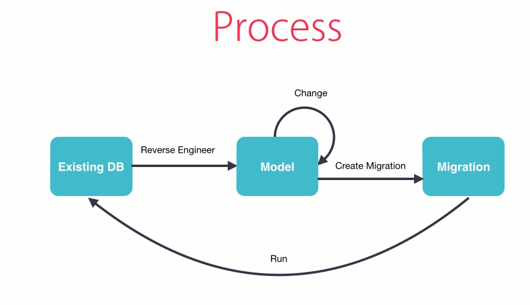


## Code First met een bestaande databank

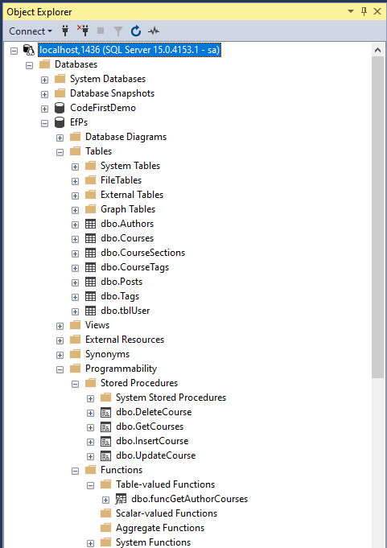

Maak de databank aan met sql/EfPsSqlServer.sql. Reverse engineering kan vervolgens gedaan worden met het commando Scaffold-DbContext in Package Manager Console:

```plain
Scaffold-DbContext [-Connection] [-Provider] [-OutputDir] [-Context] [-Schemas>] [-Tables>] 
                    [-DataAnnotations] [-Force] [-Project] [-StartupProject] [<CommonParameters>]
```

```plain
Scaffold-DbContext "Server=.\SQLExpress;Database=SchoolDB;Trusted_Connection=True;" Microsoft.EntityFrameworkCore.SqlServer -OutputDir Models
```

of voor SQLServer onder Docker:

```plain
Scaffold-DbContext "Server=localhost,1436;database=EfPs;Trusted_Connection=False;user ID=sa;Password=1Secure*Password1" Microsoft.EntityFrameworkCore.SqlServer -OutputDir Models
```

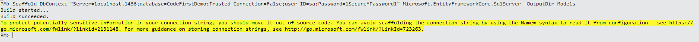

Merk op: vroeger werd code gegenereerd voor stored procedures, maar vanaf EF Core niet meer. Mogelijkheden om deze toch uit te voeren:

```C#
context.Database.ExecuteSqlCommand("YourStoredProcedure @p0, @p1", parameters: new[] { "Joseph", "Gates" });
```

of beter nog, volgens Microsoft (https://docs.microsoft.com/en-us/ef/core/querying/raw-sql):

```C#
var user = "johndoe";

var blogs = context.Blogs
    .FromSqlRaw("EXECUTE dbo.GetMostPopularBlogsForUser {0}", user)
    .ToList();
```

*Noot: je kan "tracking" tijdelijk afzetten met .AsNoTracking() voor .ToList().*

Best maak je een migratie aan die bijvoorbeeld "Initial" noemt met Package Manager Console. **Plaats de code in Up() en Down() in commentaar want je database bestaat al**, en voer vervolgens met Package Manager Console "Update-Database -Verbose" uit. Er zal niets uitgevoerd worden, maar vanaf dit moment is het mogelijk om Code-First uitbreidingen of wijzigingen te doen, een nieuwe migratie aan te maken en vervolgens de database up-to-date te zetten.

```plain
Add-Migration Initial
Update-Database -Verbose
```

## Een nieuwe klasse aanmaken

Conventie: Id of Klassenaam + Id voor Primary Key.

Best Practise: werk per kleine verandering, atomair, en maak gebruik van meer migraties.


Best Practise: "Database Centric". Migraties hebben betrekking op objecten in de databank.

Voeg toe:

```C#
public class Category
{
	public int Id { get;set; } // conventie
    public string Name { get; set; }
}
```

Zoals gesteld: je kan category al toevoegen aan een andere klasse, maar doe dit nog niet: beter meer migraties met minder wijzigingen.

Geef in in Package Manager Console:

```plain
add-migration AddCategoriesTable
```

De gegenereerde migratie is leeg: de klasse is niet "discoverable". Voeg een DbSet<Category> toe aan EfPscontext.cs:

```c#
public virtual DbSet<Category> Categories { get; set; }
```

Merk op: de -Force optie is verdwenen bij "Add-Migration" in EF Core. Je moet met andere woorden eerst "Remove-migration" uitvoeren en daarna "Add-Migration".

```plain
remove-migration
add-migration AddCategoriesTable
```

EF Core overschrijft de vorige migratie.

Hoe gegevens toevoegen met een migratie? Gebruik de Sql() method:

```c#
migrationBuilder.Sql("INSERT INTO Categories (Name) VALUES ('Web Development')");
migrationBuilder.Sql("INSERT INTO Categories (Name) VALUES ('Programming Languages')");
```

Voer vervolgens uit in Package Manager Console:

```plain
Update-Database -verbose
```

Wijzig de Course klasse en voeg een categorie toe aan de voordien gegenereerde code:

```C#
public Category Category { get; set; }
```

Voer uit in Package Manager Console:

```plain
add-migration AddCategoryColumnToCoursesTable
```

Ook nu kan je Sql() methode gebruiken:

```C#
Sql("UPDATE Courses SET Category_Id = 1"); // Geen effect zonder cursus in de database
```

Je hebt colledige controle over je database met EF Core!

Voeg een cursus toe met SSMS; daarvoor zal je eerst een auteur moeten toevoegen.

## Een bestaande klasse wijzigen

### Property toevoegen

Voeg toe aan klasse Course in Course.cs:

```c#
public DateTime DatePublished { get; set; }
```

Maak een migratie aan:

```plain
Add-Migration AddDatePublishedColumnToCoursesTable
```

Pas de databank aan:

```plain
Update-Database -Verbose
```

### Property wijzigen

Maak DatePublished nullable: 

```c#
public DateTime? DatePublished { get; set; }
```

Maak een migratie aan:

```plain
Add-Migration DatePublishedColumnToNullableInCoursesTable
```

Maak nooit een "Fat" migration: moeilijker te benoemen, moeilijker terug te draaien.

```plain
Update-Database -Verbose
```

Verander kolom Title naar Name door middel van refactoring met Visual Studio:

```plain
Add-Migration RenameTitleToNameInCoursesTable
```

Bij EF6 werd er code gegenereerd die opriep: AddColumn() en DropColumn(). Je speelt dan alle waarden kwijt!

Hoe oplossen?

```c#
migrationBuilder.RenameColumn("dbo.Courses", "Title", "Name");
```

of:

```c#
migrationBuilder.Sql("UPDATE COURSES SET Name = Title"); 
```

... te plaatsen voor DropColumn(). Met EntityFramework Core is dit echter niet meer het geval: de gegenereerde code maakt meteen gebruik van RenameColumn().

Controleer ook de Down() methode. Voeg eventueel toe: 

```c#
migrationBuilder.Sql("UPDATE COURSES SET Title = Name"); 
```

### Property verwijderen

Verwijder property DatePublished opnieuw. Maak een migratie aan

```
Add-Migration 'DeleteDatePublishedColumnFromCoursesTable'
```

Pas de databank aan:

```plain
Update-Database -Verbose
```

### Een klasse verwijderen

Verwijder property Category uitde klasse Course. 

```plain
Add-Migration DeleteCategoryColumnFromCoursesTable
```

Bekijk de gegenereerde code.

Pas de databank aan:

```plain
Update-Database -Verbose
```

Verwijder de Category klasse.

Bouw je je applicatie, dan krijg je een fout: zie Context, deze bevat nog een DbSet<Category>; verwijder deze lijn.

```plain
Add-Migration DeleteCategoriesTable
```

Soms wil je de inhoud van een dergelijke tabel bewaren. Maak hiervoor bijvoorbeeld een _Category tabel:

```c#
migrationBuilder.Sql("CREATE TABLE ...");
```

of  maak gebruik van CreateTable(): de code staat nog in een migratie.

```c#
migrationBuilder.CreateTable("dbo._Category", c => new { Id = c.Int(nullable: false, identity: true), Name = c.String(),}).PrimaryKey(t => t.Id);

migrationBuilder.Sql("INSERT INTO _Category (Name) SELECT Name FROM Category");
```

Pas ook Down() aan: 

```C#
migrationBuilder.Sql("INSERT INTO Category (Name) SELECT Name FROM _Category");

migrationBuilder.Droptable("dbo._Category")
```

Opgelet, vergelijk Git: versioning verloopt altijd VOORWAARTS. Corrigeren kan met andere woorden enkel door een nieuwe migratie aan te maken nadat je je model aanpaste.

### Seeding

Kan geïmplementeerd worden in OnModelCreating():

```c#
// met een anonieme klasse:
modelBuilder.Entity<Post>().HasData(
    new { BlogId = 1, PostId = 2, Title = "Second post", Content = "Test 2" });

// Owned entity type seeding:
modelBuilder.Entity<Post>().OwnsOne(p => p.AuthorName).HasData(
    new { PostId = 1, First = "Andriy", Last = "Svyryd" },
    new { PostId = 2, First = "Diego", Last = "Vega" });
```

## Northwind

Goede oefening ...

## Referentiemateriaal

Zie https://www.connectionstrings.com/

Zie https://www.entityframeworktutorial.net/efcore/entity-framework-core.aspx.

