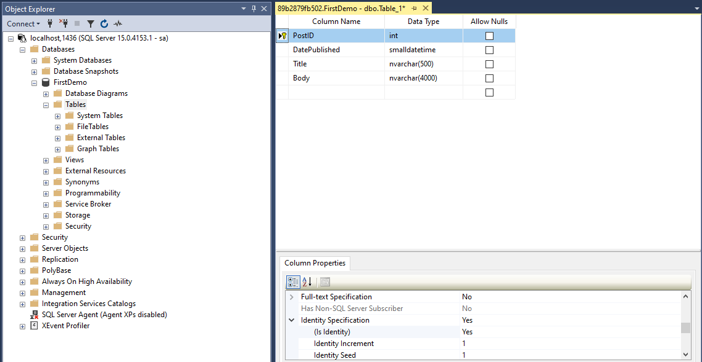
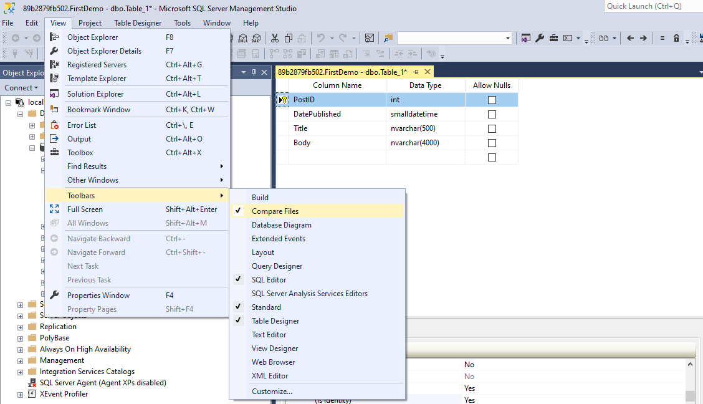
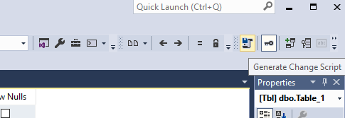
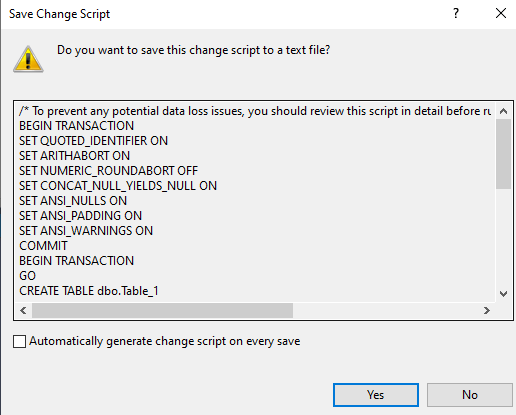
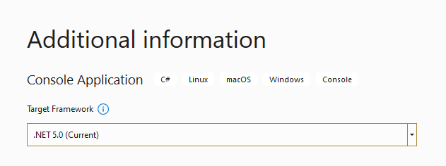
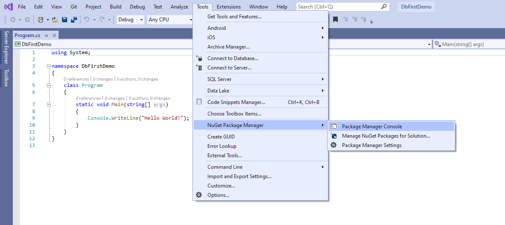
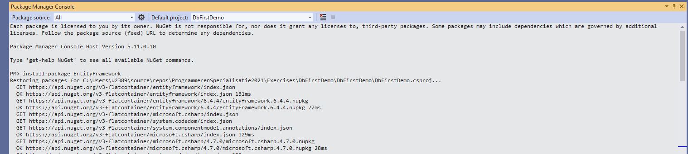
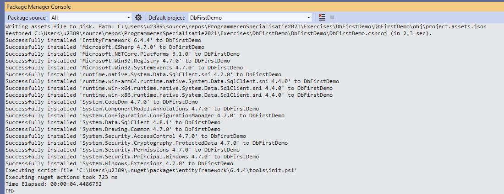
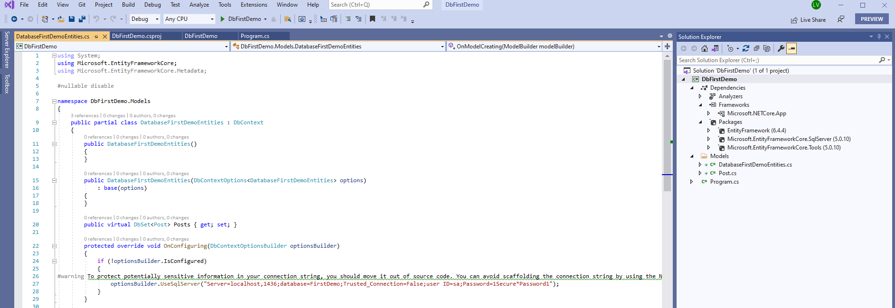

# Entity Framework Database First

In SSMS heb ik een database genaamd **FirstDemo**. We ga een nieuwe tabel maken in deze database: we zullen deze tabel gebruiken voor het opslaan van berichten in een blog. 



Hier komt het lastige deel van de "database eerst" benadering. We hebben deze database hier lokaal, maar om een andere database zoals een test database of een productie database naar deze versie te brengen, hebben we een manier van werken nodig die dit toelaat. Er zijn tools die twee databases kunnen vergelijken en ze naar dezelfde versie kunnen brengen, maar in mijn ervaring zijn deze tools niet altijd betrouwbaar en kunnen soms problemen veroorzaken door afhankelijkheid tussen tabellen en records. Een meer betrouwbare en flexibele maar jammer genoeg meer manuele aanpak is het aanmaken van een change script telkens we een wijziging aanbrengen aan onze database. Dan kunnen we deze change scripts ergens in de repository opslaan en ze op elke database uitvoeren om ze naar de huidige versie te brengen. 

In deze demo kiezen we voor die aanpak. 








Ik ga hier een change script maken en sla dit op als "0001 - Create Posts table.sql" in bijvoorbeeld een directory DatabaseScripts. Tenslotte ga ik deze tabel opslaan in SMMS met als naam "Posts". Even verversen. Nu ga ik naar visual studio, maak een nieuw project aan en importeer deze database en zijn tabellen in mijn project.

Begin met een nieuw project. Ik ga het bij een console applicatie houden voor nu omdat we niet afgeleid willen worden door de complexiteit van web applicaties of wpf applicaties: laten we het gewoon simpel houden en ons eerst focussen op Entity Framework. Met een nieuw project is de eerste stap om Entity Framework te installeren en om dat te doen gebruiken we de zogenaamde package manager console: Tools > Nuget Package Manager > Package Manager Console. 





We voeren uit: 

```plain
install-package EntityFramework
install-package Microsoft.EntityFrameworkCore.SqlServer
install-package Microsoft.EntityFrameworkCore.Tools
Scaffold-DbContext "Server=localhost,1436;database=FirstDemo;Trusted_Connection=False;user ID=sa;Password=1Secure*Password1" Microsoft.EntityFrameworkCore.SqlServer -o Models -Context "DatabaseFirstDemoEntities"
```

Let op: 

* dit is zeer specifiek .NET 5; in de oude .NET frameworks en Visual Studio's kon dit trouwens interactief via een wizard.
* per soort databank zal het laatste commando verschillen; dit commando geldt voor een SQLServer en dan nog specifiek een SQLServer die lokaal geinstalleerd werd en luistert naar poort 1436. Ook de databanknaam en gebruikersnaam en paswoord zijn "hard coded" na de generatie: dit is slechte praktijk en zal je moeten aanpassen!







Zie hier ons nieuwe conceptuele model dat de mapping tussen de database tabellen en onze domein klassen weergeeft. Entity Framework keek naar onze database en ontdekt de tabellen, views, stored procedures en functies die we daar hebben, maar in  dit eenvoudige voorbeeld werkten we enkel met een tabel

Ons "entiteiten"-model wordt niet meer opgeslagen met een .edmx extensie (in de oude frameworks werden t4 templates gebruikt om code te genereren en die konden hieronder teruggevonden worden). 

Bestudeer de werkelijke gegenereerde code, een C# klasse die Entity Framework voor ons heeft gegenereerd, een klasse die is afgeleid van DbContext. DbContext is een klasse die een abstractie vormt overheen de database: deze biedt een eenvoudige api om de gegevens te laden van of op te slaan in de database. We zien eigenschap van het type DbSet genaamd Posts. Een DbSet vertegenwoordigt een tabel in de database. Omdat we in onze database een tabel hebben met de naam Posts hebben we hier een DbSet van het type Post met de naam Posts. De Post klasse die je hier ziet is ook gegenereerde code. De gegenereerde Post klasse heeft vier eigenschappen gebaseerd op de kolommen die we momenteel in de database hebben.

Het belangrijkste hier is dat we begonnen met een database, we creëerden onze tabel en vervolgens importeerden we deze. Elke keer als ik een wijziging in mijn model wil aanbrengen, begin ik met de database en laat ik het datamodel opnieuw aanmaken. Dit is de database first workflow. 

Laat me je tonen hoe we een DbContext kunnen gebruiken om met de database te werken en dit geldt zowel voor database first als code first. Ik ga een instantie maken van onze DbContext klasse die heet DatabaseFirstDemoEntities. Ik ga een nieuwe post maken en initialiseer deze. In een echte toepassing zullen we meestal een identiteitskolom gebruiken en dan mogen we hier geen id specificeren. Context.Posts.Add(): we voegen de nieuwe post toe aan de DbSet. Op dit moment zijn de wijzigingen alleen aanwezig in het geheugen, er is nog niets vastgelegd in de database. Met SaveChanges() worden de aanpassingen wel doorgeschreven. 

Laten we nu de applicatie starten en controleren of de nieuwe rij aan de tabel is toegevoegd met SSMS of Visual Studio. Merk op dat we geen stored procedure hoefden te schrijven en ook niet met ADO .NET klassen als SqlConnection en SqlCommand moesten werken. Entity Framework heeft dit allemaal voor ons geregeld. 

Gegevens oplezen is even eenvoudig: we zullen dit later bestuderen.