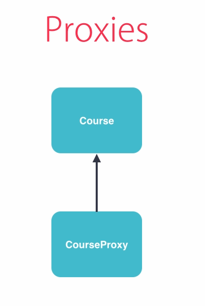

# Entity Framework Core "Code First"

## Annotaties of Fluent API


Courses table

Description kolom: nvarchar(MAX), nullable

EF interpreteert dit op deze manier standaard. Wens je nullable == false?

Ofwel gebruik je dan een annotatie:

```plain
[Required] 
```

uit System.ComponentModel.DataAnnotations

Je voert vervolgens uit in Package Manager Console:

```plain
add-migration foo
```

Bekijk nu de migratie: 

```plain
nullable: false
```

We voeren deze niet uit met 

```plain
Update-Database 
```

en verwijderen de migratie: gewoon een "delete" van de migratie is voldoende omdat we deze nog niet uitvoerden.

Ofwel: "Fluent API"

ga naar context, methode OnModelCreating(). 

```C#
modelBuilder.Entity<Course>(). Property(t => t.Description).IsRequired();
```

Je kan methods "chainen".

```plain
add-migration foo
```

Bekijk de migratie: je ziet hetzelfde resultaat.

Wat is nu het beste? 

Annotaties: 

- minder code
- minder flexibel, vb. voor het configureren van relaties tussen klassen
- je klassen worden vervuild met databankkennis. Annotaties als "foreign key" zijn databankspecifiek. "Separation of Concern" is minder goed
- voor een eenvoudige applicatie zijn annotaties nog verdedigbaar. 
- ix de twee benaderingen echter niet, want dan wordt je onderhoud veel moeilijker!

**Conclusie: beter Fluent API.**

Voorbeelden van Annotations:

```C#
[Table("tbl_Course")]

[Column("sName", TypeName="varchar")]

[Key] [DatabaseGenerated(DatabaseGeneratedOption.None)] : None, Identity, Computed

[MaxLength(255)]

[Index(IsUnique=true)] of [Index("IX_AuthorStudentsCount", 1)]

[ForeignKey("Author")]
```

## Fluent API


... een anoniem object.


**Voor relaties is Fluent API superieur!**

Voor het leggen van relaties kan je in twee richtingen werken tussen twee types.


... of:


## LINQ voor het opvragen van gegevens

### Language Integrated Query

Een programmeermodel van de hand van Microsoft - brug tussen twee werelden: programmeren, gegevens. Mits een zogenaamde LINQ Provider kan je eender welke gegevensbron ondervragen:


#### Voordelen

* Geen SQL queries en stored procedures meer ...
* Verhoogde productiviteit: dezelfde "taal" en interface

#### Nadelen


Bij grote databanken en wanneer je met ingewikkelde queries moet werken, is SQL met stored procedures beter, handiger, sneller.

### Werken met LINQ

Zie [LINQ overzicht](./Linq.md).

### LINQPad en Entity Framework

Installeer de meest recente versie van LINQPad:


Voor voorbeelden die uitvoerbaar zijn via LINQPad, zie gecomprimeerd bestand [LinqPadExamples.zip](./LinqPadExamples.zip).

Pas je DbContext code aan zodat deze optimaal geschikt is om te gebruiken vanuit LINQPad, gebaseerd op volgend voorbeeld:

```C#
using Microsoft.EntityFrameworkCore;
using Microsoft.Extensions.Configuration;
using System;

namespace Sample.Data
{
	// This class demonstrates how to write constructors on your DbContext class such that:
	//
	//   (a) it's friendly to LINQPad, ASP.NET Core, Visual Studio tools and Migrations
	//   (b) you get better ease and flexiblity in how/where you specify the connection string

	public class SampleDbContext : DbContext
	{
		string _connectionString;

		// The constructor that ASP.NET Core expects. LINQPad can use it too.
		public SampleDbContext(DbContextOptions<SampleDbContext> options) : base(options) { }

		// This constructor is simpler and more robust. Use it if LINQPad errors on the constructor above.
		// Note that _connectionString is picked up in the OnConfiguring method below.
		public SampleDbContext(string connectionString) => _connectionString = connectionString;

		// This constructor obtains the connection string from your appsettings.json file.
		// Tell LINQPad to use it if you don't want to specify a connection string in LINQPad's dialog.
		public SampleDbContext ()
		{
			IConfiguration config = new ConfigurationBuilder().AddJsonFile("appsettings.json").Build();
			_connectionString = config.GetConnectionString("DefaultConnection");
		}

		protected override void OnConfiguring(DbContextOptionsBuilder optionsBuilder)
		{
			// Assign _connectionString to the optionsBuilder:
			if (_connectionString != null)				
				optionsBuilder.UseSqlServer(_connectionString);    // Change to UseSqlite if you're using SQLite

			// Recommended: uncomment the following line to enable lazy-loading navigation hyperlinks in LINQPad:
			// if (InsideLINQPad) optionsBuilder.UseLazyLoadingProxies ();
			// (You'll need to add a reference to the Microsoft.EntityFrameworkCore.Proxies NuGet package, and
			//  mark your navigation properties as virtual.)

			// Recommended: uncomment the following line to enable the SQL trace window:
			// if (InsideLINQPad) optionsBuilder.EnableSensitiveDataLogging (true);
		}

		// This property indicates whether or not you're running inside LINQPad:
		internal bool InsideLINQPad => AppDomain.CurrentDomain.FriendlyName.StartsWith("LINQPad");
	}

	// This is just For Visual Studio design-time support and Migrations (LINQPad doesn't use it).
	// Include this class if you want to specify a different connection string when using Visual Studio design-time tools.
	public class SampleDbContextFactory : Microsoft.EntityFrameworkCore.Design.IDesignTimeDbContextFactory<SampleDbContext>
	{
		public SampleDbContext CreateDbContext(string[] args)
			=> new SampleDbContext("...design-time connection string...");
	}
}
```


Je kan bijvoorbeeld "Courses" slepen op je editor:


En vervolgens uitvoeren:


Klik eens op de links in het resultaat: je kan verder doorklikken. Het is zelfs mogelijk om te bekijken welke queries Entity Framework uitvoert. Klikt hiervoor op tab "SQL" in plaats van tab "Results":


Deze mogelijkheden kunnen gebruikt worden om (LINQ) queries te optimaliseren! Je wijzigt de code en je ziet onmiddellijk wat de SQL queries worden. Je ziet ook de zogenaamde query execution time onder je "SQL" tab. 

Je kan eender welke C# code intikken en het resultaat zien: methode Dump(); Makkelijker dan het watch venster gebruiken in Visual Studio!


Probeer eens:

```c#
Courses.AsEnumerable().GroupBy(c => c.Level)
```

en bekijk de door Entity Framework gegeneerde SQL: een GroupBy() met LINQ is niet gelijk aan een "GROUP BY" in SQL.


Met oudere versies van Entity Framework kon je "AsEnumerable()" (of: ToList()) weglaten en dan werd een bijzonder ingewikkelde query gegenereerd. 

### SQLProfiler

Start "SSMS" (geef dit in in je zoekbalk) en kies voor Tools > SQL Profiler:


Voer je LINQPad LINQ query uit en bekijk hoe SQL Profiler toont welke queries er uitgevoerd worden op je databank:


# Eindopdracht: ECB muntwaarden

```c#
// Call a method to get the exchange rate between two currencies: from, to
var exchangeRateUsd = CurrencyConverter.GetExchangeRate("usd", "eur", amount);
var exchangeRateChf = CurrencyConverter.GetExchangeRate("eur", "chf", amount);
```

Implementeer een klasse "CurrencyConverter" met static methodes.

```c#
/// <summary>
/// Available currency tags
/// </summary>
public static string[] GetCurrencyTags()
{
            // Hardcoded currency tags neccesairy to parse the ecb xml's
            return new string[] {"eur", "usd", "jpy", "bgn", "czk", "dkk", "gbp", "huf", "ltl", "lvl"
            , "pln", "ron", "sek", "chf", "nok", "hrk", "rub", "try", "aud", "brl", "cad", "cny", "hkd", "idr", "ils"
            , "inr", "krw", "mxn", "myr", "nzd", "php", "sgd", "zar"};
}
```

Implementeer een methode die currency rates ophaalt bij de ECB in een "canoniek" formaat: we opteren voor EURO.

ECB stelt muntkoersen beschikbaar in RDF/XML formaat: https://en.wikipedia.org/wiki/RDF/XML#:~:text=RDF%2FXML%20is%20a%20syntax,W3C%20standard%20RDF%20serialization%20format (Resource Description Framework, zie ook https://en.wikipedia.org/wiki/Resource_Description_Framework).

"Labeled, directed multi-graph": 

```c#
/// <summary>
/// Get currency exchange rate in euro
/// </summary>
public static decimal GetCurrencyRateInEuro(string currency)
{
  if (currency.ToLower().IsNullOrEmpty())
    throw new ArgumentException("Invalid argument: currency parameter must be specified.");
  if (currency.ToLower() == "eur")
    return (decimal)1.0;

  try
  {
    // Create with currency parameter, a valid RSS url to ECB euro exchange rate feed
    string rssUrl = string.Concat("http://www.ecb.int/rss/fxref-", currency.ToLower() + ".html");

    // Create & load new Xml document
    System.Xml.XmlDocument doc = new System.Xml.XmlDocument();
    doc.Load(rssUrl);

    // Create XmlNamespaceManager for handling XML namespaces
    System.Xml.XmlNamespaceManager nsmgr = new System.Xml.XmlNamespaceManager(doc.NameTable);
    nsmgr.AddNamespace("rdf", "http://purl.org/rss/1.0/");
    nsmgr.AddNamespace("cb", "http://www.cbwiki.net/wiki/index.php/Specification_1.1");

    // Get list of daily currency exchange rate between selected "currency" and the EURO
    System.Xml.XmlNodeList nodeList = doc.SelectNodes("//rdf:item", nsmgr);

    // Loop Through all XMLNODES with daily exchange rates
    foreach (System.Xml.XmlNode node in nodeList)
    {
      // Create a CultureInfo, this is because EU and USA use different sepperators in float (, or .)
      CultureInfo ci = (CultureInfo)CultureInfo.CurrentCulture.Clone();
      ci.NumberFormat.CurrencyDecimalSeparator = ".";

      try
      {
        // Get currency exchange rate with EURO from XMLNODE
        decimal exchangeRate = decimal.Parse(
          node.SelectSingleNode("//cb:statistics//cb:exchangeRate//cb:value", nsmgr).InnerText,
          NumberStyles.Any, 
          ci);

        return exchangeRate;
      }
      catch { }
    }
      
    // No result
    return (decimal)-1.0;
  }
  catch
  {   
    // No result
    return (decimal)-1.0;
  }
}
```

Deze code kan flink verbeterd worden:

* foutafhandeling: vang uitzonderingen op, controleer alle waarden die teruggegeven worden via methodes.
* voorzie logging (later, via SeriLog).

Implementeer vervolgens methode:

```C#
public static decimal GetExchangeRate(string from, string to, decimal amount = 1)
{
    // Fake:
    return 0.0;
}
```

Bedenk hierbij:

* let op alle randvoorwaarden: wat als de hoeveelheid 0 is of de muntcode is niet behoorlijk opgegeven.
* van "eur" naar "eur" is eenvoudig: er is geen herrekening nodig.
* als je "eur" omrekent naar een andere muntcode, dan moet je vermenigvuldigen en reken je een andere muntcode om naar "eur" dan moet je delen.
* wat als geen van beide muntcodes "eur" is? De rekenformule wordt ingewikkelder: (hoeveelheid * waarde_doelmunt) / waarde_vertrekmunt.

# Oefening: volg EF Core tutorials 

1. [Get started](./1_EntityFrameworkCore_GetStarted.pdf)
2. [Data modelling](./2_EntityFrameworkCore_DataModelling.pdf)

# Loading Related Objects

## Strategie 1: Lazy Loading

Vereenvoudigde voorstelling:




Visual Studio Watch window kan bedrieglijk werken: haalt de onderliggende data op bij het openen. Je kan bestuderen met SQL Profiler wanneer je Visual Studio in combinatie met je code welke queries uitvoert door met de debugger door je code te stappen en te kijken in SQL Profiler wanneer er welke queries uitgevoerd worden.

Om "lazy loading" te activeren, pas je DbContext OnConfiguring() methode aan:

```c#
protected override void OnConfiguring(DbContextOptionsBuilder optionsBuilder)
{
  if (!optionsBuilder.IsConfigured)
  {
    optionsBuilder.UseLazyLoadingProxies(true); // Enables lazy loading; off by default!!
  }
}
```

## Best Practices

- Gebruik Lazy Loading wanneer het kostelijk is om je volledige object graph (een object met alle onderliggende objecten) op te vragen.
- Desktop applicaties kunnen wel varen bij lazy loading: de gebruiker klikt door en de minimale set van benodigde objecten wordt opgevraagd en getoond.
- Bij web applicaties heeft Lazy Loading doorgaans een ongunstig effect: wanneer een web client gegevens opvraagt, is het beter dat de service volledig zicht heeft op alle gegevens die doorgegeven moeten worden.

## Het N+1 loading effect

```c#
var courses = context.Courses.ToList();
foreach(var course in courses)
{
    System.Diagnostics.Debug.WriteLine("{0} door {1}", course.Name, course.Author.Name);
}
```

1. Eerst worden alle cursussen opgehaald.
2. De kans bestaat dat vervolgens voor elke cursus de auteurinformatie apart opgehaald (nu is dit wel niet meer het geval bij Entity Framework Core: er wordt gebruik gemaakt van een enkele stored procedure).

Je kan effect dit bestuderen in SQL Profiler.


## Strategie 2: Eager Loading

Eager Loading is precies het omgekeerde van lazy loading. 

```c#
var courses = context.Courses.Include("Author").ToList();
```

De string versie van .Include() gebruiken is geen goede praktijk. Microsoft toont dit nochtans vaak zo. Men noemt een dergelijke string een "magic string". Problemen treden op wanneer je je klasse anders noemt. Gebruik de lambda versie:

```c#
using System.Data.Entity;

var courses = context.Courses.Include(c => c.Author).ToList();
```

Wanneer je "refactoring" toepast, blijft je code in orde.

### Eager loading met meer niveau's


Gebruik .Select():


Ook Eager Loading kan een goede zaak zijn en een slechte: des te meer je .Include() toepast, des te ingewikkelder/groter worden de gegenereerde queries (je introduceert joins) en des te meer gegevens haal je op in het geheugen, wat vertragend kan werken.

Je moet dus goed nadenken wanneer je Lazy Loading of Eager Loading gebruikt.

## Strategie 3: Explicit Loading

MSDN: 

```c#
var author = context.Authors.Single(a => a.Id == 1);
context.Entry(author).Collection(a => a.Courses).Load();
```

Nadelen: 

- veel API te onthouden.
- werkt enkel voor "single entity" (bijvoorbeeld niet voor een hele serie auteurs).

Alternatief:

```c#
var author = context.Authors.Single(a => a.Id == 1);
// Alle cursussen voor deze auteur:
context.Courses.Where(c => c.AuthorId == author.Id).Load();
```

Resultaat in beide gevallen: 2 queries naar de databank.

Een round trip meer kan sneller zijn dan een enorme grote en zware query uitvoeren.

Een filter bij MSDN:

```c#
var author = context.Authors.Single(a => a.Id == 1).Query().Where(c => c.FullPrice == 0).Load();
```

Alternatief:

```c#
context.Courses.Where(c => c.AuthorId == author.Id && c.FullPrice == 0).Load();
```

Conclusie: enkel .Load() onthouden en je queries met Linq schrijven zoals je altijd al deed.

# Change Tracker


```C#
// Add
            {
                var course = new Course
                {
                    Name = "New Course",
                    Description = "New Description",
                    Price = 19,
                    Level = 1,
                    LevelString = "L",
                    Author = new Author() {  /*AuthorId = 1,*/ Name = "Luc Vervoort" } // Change tracker always sees this as a new object! Vroeger kon AuthorId = 1 erbij, nu niet meer
                };
                context.Courses.Add(course);
                context.SaveChanges();
                // Drie oplossingen voor nieuwe auteur:
                // 1. Bestaand object gebruiken: beter voor WPF
                var authors = context.Authors.ToList();
                var author = context.Authors.Single(a => a.AuthorId == 1);
                var course2 = new Course
                {
                    Name = "New Course 2",
                    Description = "New Description",
                    Price = 19,
                    Level = 1,
                    LevelString = "L",
                    Author = author // Change tracker always sees this as a new object!
                };
                context.Courses.Add(course2);
                context.SaveChanges();
                // 2. Foreign key property gebruiken: beter voor web?
                var course3 = new Course
                {
                    Name = "New Course 3",
                    Description = "New Description",
                    Price = 19,
                    Level = 1,
                    LevelString = "L",
                    AuthorId = 1 // Change tracker always sees this as a new object!
                };
                context.Courses.Add(course3);
                context.SaveChanges();
                // 3. Attach object: normaal niet nodig; je gebruikt EF intern en dit is een nadeel
                try
                {
                    var attachedAuthor = new Author() { AuthorId = 1, Name = "Luc Vervoort" }; // genereert tegenwoordig een fout als het object met Id al tracked wordt, bijvoorbeeld 1
                    context.Authors.Attach(attachedAuthor);
                }
                catch(System.Exception e)
                {
                    System.Diagnostics.Debug.WriteLine(e.Message);
                    // The instance of entity type 'Author' cannot be tracked because another instance with the same key value for {'AuthorId'} is already being tracked. When attaching existing entities, ensure that only one entity instance with a given key value is attached.
                    // Consider using 'DbContextOptionsBuilder.EnableSensitiveDataLogging' to see the conflicting key values.
                }
```

Update met Find method

Find() beter dan Single met lambda: korter

```c#
var course = context.Courses.Find(4); // Single(c => c.Id == 4)
course.Name = "New Name";
course.AuthorId = 2;
context.SaveChanges();
```

Verwijderen

Cascade delete


Enabled by default. .WillCascadeOnDelete(false)

Eerst in context ophalen zodat het object tracked wordt. Met .Remove() methode. State gaat naar Deleted. 

Zonder cascade delete


Expliciet te doen: eerst Course, dan parent Author. 

Ik kan niet meteen een auteur verwijderen omwille van referentiele integriteit. 

Oplossing Eager Loading van auteur met Courses. Find() kan niet met Include(): we moeten .Single() terug gebruiken. Een lijst verwijderen kan beter met RemoveRange() in plaats van met een meervoudige Remove(). 

```c#
var author = context.Authors.Include(a => a.Courses).Single(a => a.AuthorId == 2);
context.Authors.Remove(author);
context.SaveChanges();
```

## Best practices

Vooraleer je echt objecten verwijdert uit een databank: denk na! Soms wil je een verwijderd object terughalen, soms wil je historiek. Daarom beter een booleaanse **IsDeleted** property bij elke klasse zodat je een delete logisch kan uitvoeren en niet "fysisch".

# Change Tracker

State of objects van Change Tracker kan naar een audit trail. Laat toe om te bekijken wat er aan de hand is in een DbContext.

```c#
context.ChangeTracker.Entries<Author>();
context.ChangeTracker.Entries();
Console.WriteLine(entry.State);
```

- DbEntityEntry

- CurrentValues

- PropertyNames

- OriginalValues


```c#
entry.CurrentValues["Name"]
entry.CurrentValues["AuthorId"];
```

- States: Added, Modified, Updated,Unchanged leiden tot SQL queries.

- entry.OriginalValues["Name"] heeft property "Entity"

- entry.Reload(); // laat toe terug op te vragen van de databank


# Repository Pattern

Favoriet onderwerp. Veel opinies en alternatieven.


Het gaat over objecten in het geheugen:


... dus niet Update(), Save(), ... . 


Je moet je "frameworks" als tools kunnen gebruiken en nastreven er niet afhankelijk van te zijn:


