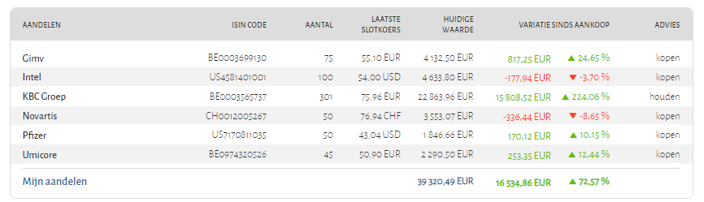
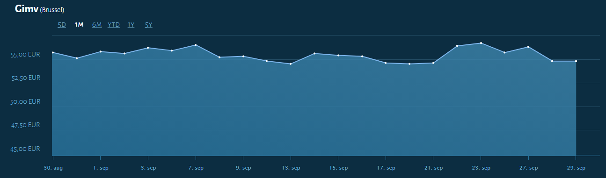

# Eindopdracht

## Technische richtlijnen

* Respecteer de **"10 geboden"** vermeld in de cursus.
* Gebruik je dev.azure.com account en git om je applicatie te ontwikkelen, maar dien je eindoplossing ook tijdig in onder Chamilo.
* Gebruik DDD (Domein Driven Development) en design pattern MVVM bij WPF.
* Gebruik Entity Framework.
* Gebruik logger https://serilog.net/ via nuget package manager:
  * Foutmeldingen en waarschuwingen
  * Program flow
  * Debugging.

## Te implementeren

1. Currency converter

   * Currency tags voor de ECB xml gegevens: eur, usd, jpy, bgn, czk, dkk, gbp, huf, ltl, lvl, pln, ron, sek, chf, nok, hrk, rub, try, aud, brl, cad, cny, hkd, idr, ils , inr, krw, mxn, myr, nzd, php, sgd, zar

   * Xml kan opgevraagd worden via url http://www.ecb.int/rss/fxref-usd.html (eur is altijd 1.0 als omrekening en komt als pagina bij ECB niet voor)

   * Inspiratie:

     * gebruik System.Xml.XmlDocument
     * source code

     ```C#
     System.Xml.XmlNamespaceManager nsmgr = new System.Xml.XmlNamespaceManager(doc.NameTable);
     nsmgr.AddNamespace("rdf", "http://purl.org/rss/1.0/");
     nsmgr.AddNamespace("cb", "http://www.cbwiki.net/wiki/index.php/Specification_1.1");
     System.Xml.XmlNodeList nodeList = doc.SelectNodes("//rdf:item", nsmgr);
     
     foreach (System.Xml.XmlNode node in nodeList)
     {
       // Create a CultureInfo, this is because EU and USA use different separators in float (, or .)
       CultureInfo ci = (CultureInfo)CultureInfo.CurrentCulture.Clone();
       ci.NumberFormat.CurrencyDecimalSeparator = ".";
       try
       {
         // Get currency exchange rate with EURO from XMLNODE
         decimal exchangeRate = decimal.Parse(
                   node.SelectSingleNode("//cb:statistics//cb:exchangeRate//cb:value", nsmgr).InnerText,
                   NumberStyles.Any,
                   ci);
         return exchangeRate;
       }
       catch { }
     }
     ```

     

2. Client code voor:

   1.  Yahoo Finance Api.
   2. Twelve Data Api.

3. Een eigen relationeel databankmodel in SQLServer 2019 (SQLExpress lokaal of SQLServer via Docker).

## Beschrijving

1. Eenmaal geauthenticeerd door Windows moet de gebruiker zich kenbaar maken bij de applicatie en inloggen met een beveiliging; eenmaal ingelogd heeft de gebruiker enkel toegang tot de eigen portefeuilles. De applicatie houdt bij welke Windows gebruiker op welk moment in- en uitlogde bij de applicatie en met welke naam.

2. verschillende portefeuilles per gebruiker: elke portefeuille bevat een aantal aandelenposities (isin code, yahoo api code, naam, aantal, munt, aankoopprijs, tijdsmoment van aankoop). Let op: de gebruiker kan op verschillende momenten van hetzelfde aandeel bijkopen tegen een andere prijs of een aantal aandelen, ook slechts een deel van een aangekocht aantal, verkopen. Al deze transacties worden bewaard in de databank.

3. De gebruiker kan transacties van aandelen volledig beheren via de gebruikersinterface, bijvoorbeeld ook verwijderen zonder dat dit een verkoop impliceert.

4. De gebruiker ziet voor elke aandeelpositie en voor elke portefeuille in een oogopslag of er winst dan wel verlies gemaakt werd tegenover de aankoopprijs. 

   

   Negeer kolom "Advies" in bovenstaand voorstel.

5. De gebruiker kan de frequentie instellen waarmee de huidige waarde van de portefeuille berekend wordt; de berekende waarden worden telkens opgeslagen in de database als "historische gegevens", met een tijdstip, zodat een grafiek getoond kan worden van de evolutie van een aandeel en de evolutie van een portefeuille overheen een selecteerbare periode  van 1 week, 1 maand, een half jaar, het voorbije deel van het huidige jaar, 1 jaar, 5 jaar.

   
 
   Deze visuele voorstelling is maar een voorstel; vertrek van het "Live Chart" voorbeeld dat tijdens de cursus aangereikt werd, om tot je eigen eventueel afwijkende visuele voorstelling te komen.

6. De gebruiker kan als optie instellen of prijzen getoond worden in de originele munt van de transactie of in een gekozen munt (bijvoorbeeld altijd in EUR). Deze instellingen worden eveneens bewaard in de databank.

7. De gebruiker kan voor elk aandeel een benedenwaarde en een bovenwaarde instellen; indien de huidige waarde onder deze benedenwaarde of boven deze bovenwaarde valt, wordt een email verstuurd naar een groep van via de user interface instelbare gebruikers met voldoende informatie in de email in html formaat om de ontvanger toe te laten de email als koop- of verkoopsignaal te interpreteren.

8. Breid het overzicht van punt 4 uit met kolommen die optioneel via de gebruikersinterface aangevinkt kunnen worden zodat ze getoond worden:

   1. Rendement (%) volgens periodes: 1 week, 1 maand, 3 maanden, 6 maanden, 1 jaar, 3 jaar, 5 jaar.
   2. Minimumkoers in periodes: 1 week, 1 maand, 3 maanden, 6 maanden, 1 jaar, 3 jaar, 5 jaar.
   3. Maximumkoers in periodes: 1 week, 1 maand, 3 maanden, 6 maanden, 1 jaar, 3 jaar, 5 jaar.

