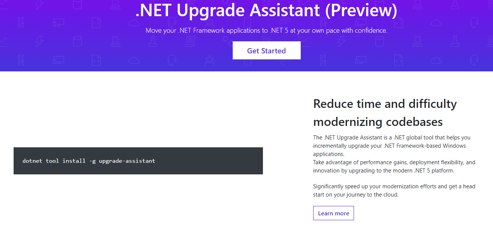
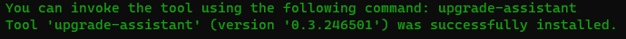

# .NET probleem

Om de zoveel tijd brengt Microsoft een nieuwe versie van de .NET runtime uit, vaak gecombineerd met taalwijzigingen en -verbeteringen en gewijzigde framework API's. Ook de bouwspecificatie wijzigt fequent. Ondanks pogingen om software gebouwd met een oudere omgeving bruikbaar te houden, is het te vaak nodig een project helemaal opnieuw aan te maken, vertrekkende van source code, en hierbij aanpassingen door te voeren om de nieuwe versie van de frameworks te kunnen gebruiken. Tot op zekere hoogte geldt dit ook voor Java, al is het zo dat wat Java betreft, wijzigingen niet tegen hetzelfde hoge tempo doorgevoerd worden.

Vaak worden wijzigingen doorgevoerd met een duidelijk doel voor ogen: open source, cross-platform, ... . Tot onze grote spijt moeten we echter constateren dat er altijd wel een dergelijk nieuw doel opduikt, over een periode van meer dan 30 jaar heen.

Elke nieuwe versie schept meteen gelegenheid om de eigenschappen van de nieuwe versie te "hypen". 

Microsoft is zich bewust van het fenomeen: https://dotnet.microsoft.com/platform/upgrade-assistant. Zie ook: [github](https://github.com/dotnet/upgrade-assistant/blob/main/README.md?WT.mc_id=dotnet-35129-website).



```shell
dotnet tool install -g upgrade-assistant
```



# Live charting for the future?

[LiveCharts 2](./livecharts2.gif)

We zoeken een WPF charting bibliotheek met volgende eigenschappen:

- open source: gratis voor eigen gebruik, vlot aanpasbaar naar de nieuwste .NET versies (.NET 5.0, .NET 6.0, Blazor)
- dynamische realtime visualisatie.

LiveCharts 2.0 is gebaseerd op Skia. Skia is een open source 2D grafische bibliotheek die gemeenschappelijke API's biedt die werken op een groot aantal hardware- en softwareplatforms. Het dient als de grafische engine voor Google Chrome en Chrome OS, Android, Flutter, Mozilla Firefox en Firefox OS, en vele andere producten.

Skia wordt gesponsord en beheerd door Google, maar is beschikbaar voor gebruik door iedereen onder de BSD Free Software License. Hoewel de ontwikkeling van de kerncomponenten wordt gedaan door het Skia-ontwikkelingsteam, mag iedereen bijdragen.

- Canonical source tree: [skia.googlesource.com/skia](https://skia.googlesource.com/skia).
- [API Reference and Overview](https://skia.org/docs/user/api/).
- Skia Fiddle: [fiddle.skia.org](https://fiddle.skia.org/c/@skcanvas_paint).

## Showcase

Voorlopig nog weinig tot geen documentatie: leer uit de voorbeelden.


