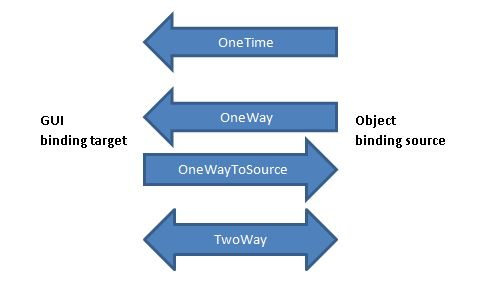
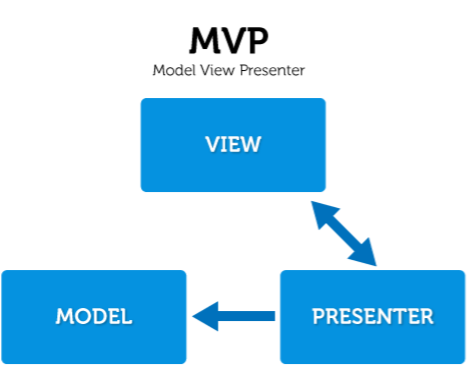
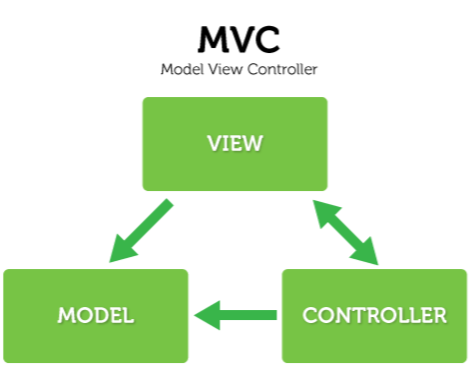

# MVVM

## Waarom MVVM?

Als een ontwikkelaar eenmaal vertrouwd is met WPF en MVVM, kan het moeilijk zijn om de twee van elkaar te onderscheiden. MVVM is zeer geschikt voor het WPF platform, en WPF is ontworpen om het gemakkelijk te maken applicaties te bouwen met het MVVM patroon.

Het belangrijkste aspect van WPF dat MVVM een geweldig patroon maakt om te gebruiken is de **data binding infrastructuur**, die het mogelijk maakt om de View (de presentatie aan de gebruiker) te scheiden van de data en de logica. De View kan worden ontworpen in Expression Blend terwijl het ViewModel kan worden ontwikkeld in Visual Studio .NET. Andere kenmerken van WPF zijn datatemplates en het resource systeem.

## Data binding

Voorbeeld:

```xaml
<Window x:Class="WpfDatabinding.MainWindow"
        xmlns="http://schemas.microsoft.com/winfx/2006/xaml/presentation"
        xmlns:x="http://schemas.microsoft.com/winfx/2006/xaml"       
        Title="MainWindow" Height="194" Width="374">
    <Grid>
        <Grid.ColumnDefinitions>
            <ColumnDefinition Width="Auto" />
            <ColumnDefinition Width="*" />
        </Grid.ColumnDefinitions>
        <Grid.RowDefinitions>
            <RowDefinition/>
            <RowDefinition/>
            <RowDefinition/>
            <RowDefinition/>
            <RowDefinition/>
            <RowDefinition/>
        </Grid.RowDefinitions>
 
        <Label Grid.Column="0" Grid.Row="0" Content="Value1, Init only" VerticalAlignment="Center" />
        <TextBox Grid.Column=" 1" Grid.Row="0" VerticalAlignment="Center" Text="{Binding Value1, Mode=OneTime}" />
 
        <Label Grid.Column="0" Grid.Row="1" Content="Value1, OneWay" VerticalAlignment="Center" />
        <TextBox Grid.Column=" 1" Grid.Row="1" VerticalAlignment="Center" Text="{Binding Value1, Mode=OneWay}" />        
 
        <Label Grid.Column="0" Grid.Row="2" Content="Value2, OneWayToSource" VerticalAlignment="Center" />
        <TextBox Grid.Column=" 1" Grid.Row="2" Text="{Binding Value2, Mode=OneWayToSource}" VerticalAlignment="Center" />
 
        <Label Grid.Column="0" Grid.Row="3" Content="Value3, OneWay" VerticalAlignment="Center" />
        <TextBox Grid.Column=" 1" Grid.Row="3" Text="{Binding Value3, Mode=OneWay, UpdateSourceTrigger=PropertyChanged}" VerticalAlignment="Center" />
         
        <Label Grid.Column="0" Grid.Row="4" Content="Value3, TwoWay" VerticalAlignment="Center" />
        <TextBox Grid.Column=" 1" Grid.Row="4" Text="{Binding Value3, Mode=TwoWay, UpdateSourceTrigger=PropertyChanged}" VerticalAlignment="Center" />
 
        <Label Grid.Column="0" Grid.Row="5" Content="Value3, TwoWay" VerticalAlignment="Center" />
        <TextBox Grid.Column=" 1" Grid.Row="5" Text="{Binding Value3, Mode=TwoWay, UpdateSourceTrigger=PropertyChanged}" VerticalAlignment="Center" />
    </Grid>
</Window>
```

In plaats van eenvoudige tekst literals toe te wijzen aan de TextBoxen zoals: Text="Hallo Wereld!", wijzen we bindingsdefinities toe tussen accolades. Bijvoorbeeld: Text="{Binding Value2, Mode=OneWayToSource}". In dit geval verbinden we de eigenschap "Value2" met de TextBox tekst. 

De **Mode** geeft de richting van de binding aan:



**UpdateSourceTrigger=PropertyChanged** impliceert dat de bronklasse van de binding de interface **INotifyPropertyChanged** heeft geïmplementeerd, die de event implementatie genaamd **PropertyChanged** vereist. Wanneer het programma dit event oproept met de juiste property naam, die ook gedefinieerd is in het XAML bestand, dan zal de binding het GUI element verversen.

En hier is het programma. Maak een **BindingClass** instantie en wijs die toe aan het huidige venster **DataContext**. Er is verder niets te doen. De rest wordt verzorgd door het .Net Framework en de compiler. WPF is vrij abstract. Veel code wordt gegenereerd uit de XAML bestanden. Je kunt de gegenereerde code niet zien zonder op het pictogram "Show All Files" in de Solution Explorer te drukken. Wat belangrijk is om te weten is dat we vooral kijken naar gedeeltelijke bestanden (hier: "public partial class MainWindow : Window"). De rest is automatisch gegenereerde broncode.

```c#
using System.Windows;
 
namespace WpfDatabinding {
   public partial class MainWindow : Window {
 
      public MainWindow() {
         InitializeComponent();
         DataContext = new BindingClass();
      } //
 
   } // class
} // namespace
```


```c#
using System;
using System.ComponentModel;
using System.Timers;
 
namespace WpfDatabinding {
   public class BindingClass : INotifyPropertyChanged {
      public event PropertyChangedEventHandler PropertyChanged;
 
      private string _Value1 = "Value1 XX:XX:XX";
      private string _Value2 = "Value2 XX:XX:XX";
      private string _Value3 = "Value3 XX:XX:XX";
 
      public string Value1 { get { return _Value1; } set { _Value1 = value; RaiseEvent("Value1"); } }
      public string Value2 { get { return _Value2; } set { _Value2 = value; RaiseEvent("Value2"); Console.WriteLine(_Value2); } } // event has no effect
      public string Value3 { get { return _Value3; } set { _Value3 = value; RaiseEvent("Value3"); } } // event has effect on TwoWay
 
      public BindingClass() {
         Timer lTimer = new Timer(1000.0);
         lTimer.Elapsed += new ElapsedEventHandler(Timer_Elapsed);
         lTimer.Start();
      } // constructor
 
      void Timer_Elapsed(object sender, ElapsedEventArgs e) {
         string lNow = DateTime.Now.ToString("HH:mm:ss");
         Value1 = "Value1 " + lNow;
      } // 
 
      private void RaiseEvent(string xPropertyName) {
         var lEvent = PropertyChanged;
         if (lEvent == null) return;
         lEvent(this, new PropertyChangedEventArgs(xPropertyName));
      } //
 
   } // class
} // namespace
```

De **BindingClass** is recht-toe-recht-aan. Er zijn geen eventsdie worden getriggerd door de GUI. De scheiding van XAML en programma code is vrij koele cool.

Er zijn drie eigenschappen: Value1, Value2 en Value3.

Naar Value1 wordt constant geschreven door een timer event dat elke seconde wordt opgewekt.

Value2 ontvangt alleen waarden van de GUI, omdat de corresponderende TextBox Mode=OneWayToSource gebruikt. Dit drukt niets af in de GUI, vandaar Console.WriteLine(_Value2) statement. Controleer de uitvoer. 

Het statement RaiseEvent("Value2") heeft geen effect, schrijven naar een TextBox zou de verkeerde richting zijn voor deze mode.
RaiseEvent("Value3") heeft alleen invloed op TwoWay TextBoxes, maar niet op de OneWay TextBox.

## MVVM architectuur


## Verschil tussen MVP, MVC en MVVM

Het is soms moeilijker om het verschil te zien tussen MVP (Model-View-Presenter), MVC (Model-View-Controller) en MVVM (Model-View-View-Model).

### MVP (Model-View-Presenter)

In het MVP patroon stuurt de gebruiker de input naar de view, de view stuurt het door naar de presenter en de presenter wijzigt dan de view of het model, afhankelijk van het type gebruikersactie. View en presenter zijn nauw met elkaar verbonden door een bi-directionele relatie. Het model weet niets van de presentator. De view zelf is passief, daarom heet het ook **presenter pattern**, omdat de presenter de gegevens in de view duwt.



### MVC (Model-View-Controller

Bij dit patroon is er maar één controller die alle invoer onmiddellijk toekrijgt: de controller wijzigt gegevens in het model afhankelijk van invoer. Zowel  model als view worden gemaakt door de controller. De view weet alleen van het model, maar het model weet niets van andere partners.



### MVVM (Model-View-ViewModel)

Het Model View ViewModel (MVVM) is een architectuurpatroon dat afkomstig is van Microsoft. Het is gebaseerd op het Model-view-controller patroon (MVC), en is gericht op moderne UI ontwikkelingsplatformen waarin er een UX ontwikkelaar is die andere eisen stelt dan een meer "traditionele" ontwikkelaar. MVVM is een manier om client applicaties te maken die gebruik maakt van kern kenmerken van het WPF platform, eenvoudige unit testen van applicatie functionaliteit mogelijk maakt, en ontwikkelaars en ontwerpers helpt samen te werken met minder technische moeilijkheden.

#### View

Een View wordt gedefinieerd in XAML en zou geen logica in de code-behind moeten hebben. Het bindt aan het view-model door enkel gebruik te maken van data binding. De View bevat de visuele controls die aan de gebruiker getoond zullen worden en kan ook animaties, navigatie-aspecten, thema's en andere interactieve features bevatten ten behoeve van de visuele presentatie. De View is rechtstreeks gebonden aan het Model. Delen van het Model worden eenvoudig getoond in de View door eenrichtingsgegevensbinding. Andere delen van het model kunnen worden bewerkt door besturingselementen rechtstreeks in twee richtingen aan de gegevens te binden. Het fungeert als een brug tussen uw software en de gebruikers ervan.

#### Model

Model is verantwoordelijk voor het blootstellen van gegevens op een manier die gemakkelijk door WPF kan worden gebruikt.  Wanneer het ophalen van gegevens duur is, abstraheert het de dure operaties en blokkeert nooit de UI thread. Het is de gegevens- of bedrijfslogica, volledig UI-onafhankelijk, die de toestand opslaat en de verwerking van het probleemdomein uitvoert. Het model is geschreven in code of wordt wordt mapped op gegevens in relationele tabellen of XML of iets dergelijks.

#### ViewModel

Een ViewModel is een model voor een view in de applicatie of we kunnen zeggen als abstractie van de view. Het moet INotifyPropertyChanged en/of INotifyCollectionChanged implementeren, al naar gelang het geval. Het stelt gegevens bloot die relevant zijn voor het uitzicht en stelt de gedragingen voor de uitzichten bloot, gewoonlijk via Commando's. Het ViewModel is de lijm tussen de gegevens (het model) en de buitenwereld. Het ViewModel is waar de View aan gebonden is. Het verschaft een specialisatie van het Model dat de View kan gebruiken voor gegevens-binding.


## De eenvoudigste implementatie

ViewModelBase en RelayCommand heb je minstens nodig om eenvoudig MVVM code te schrijven. We plaatsen deze code best in een afzonderlijke eerder technische, ondersteunende "WPF" assembly die dan in elk project herbruikt kan worden.

### ViewModelBase

Liever een automatisch mechanisme dan een interface die steeds opnieuw geïmplementeerd moet worden: naar een "base" klasse.

Redenen:

- **Prestaties** - Prestaties zijn "koning". Je kan het je niet veroorloven dat je UI bevriest terwijl je view al zijn bindingen met de eigenschappen in je view model uitwerkt.
- **Eenvoud** - Ik wil bij een property events opwerpen met één regel code en niet rommelen met strings indien niet nodig.
- Reactive Extensions (Rx) - **Events zijn "old school"**: ik wil een "observable" property change event notificatie systeem in plaats van de PropertyChanged C# event.
- Menselijke fouten - Ik wil geen property change events oproepen voor properties die per ongeluk niet bestaan.
- Afhankelijke properties - Vaak hangt de waarde van één property af van de waarde van een andere. Ik moet dit op de een of andere manier afhandelen.
- **Re-factoring** - Ik wil niet dat mijn code breekt wanneer ik een eigenschap hernoem en vergeet ook een string te hernoemen.
- Is de waarde van een property **echt veranderd** - Ik wil geen property change event oproepen als de waarde van een property niet echt veranderd is.

```c#
using System.ComponentModel;
using System.Runtime.CompilerServices;

namespace ViewModel
{
    public abstract class ViewModelBase : INotifyPropertyChanged
    {
        public event PropertyChangedEventHandler PropertyChanged;

        protected void Set<T>(ref T target, T value, [CallerMemberName] string propertyName = "")
        {
            if(target.Equals(value)) return;
            target = value;
            RaisePropertyChanged(propertyName);
        }

        protected void RaisePropertyChanged([CallerMemberName] string propertyName = "")
        {
            PropertyChanged?.Invoke(this, new PropertyChangedEventArgs(propertyName));
        }
    }
}
```

Magic: [CallerMemberName]

[CallerMemberName] is een attribuut dat in C# 5.0 is geïntroduceerd en waarmee je de methode- of eigenschapsnaam van de aanroeper van de methode kunt verkrijgen. Je kunt dit attribuut met de naam "CallerMemberNameAttribute" vinden onder de namespace System.Runtime.CompilerServices.

 Je kunt het [CallerMemberName] attribuut gebruiken om te vermijden dat je de membernaam specificeert als een String argument voor de aangeroepen methode. Dit is vooral nuttig voor de volgende taken:

- Het gebruik van tracing en diagnostische routines.

- De INotifyPropertyChanged-interface implementeren bij het binden van gegevens. Met deze interface kan een eigenschap van een object aan een gebonden besturingselement melden dat de eigenschap is gewijzigd, zodat het besturingselement de bijgewerkte informatie kan weergeven. Zonder het [CallerMemberName]-attribuut moet u de naam van de eigenschap opgeven als een letterlijke naam.

De volgende tabel toont de lidnamen die worden geretourneerd wanneer je het [CallerMemberName]-attribuut gebruikt:

  | **Origin**                            | **Member Name Result**                                   |
  | ------------------------------------- | -------------------------------------------------------- |
  | Method, property or event             | The name of the method, property or event                |
  | Constructor                           | The string ".ctor"                                       |
  | Static constructor                    | The string ".cctor"                                      |
  | Destructor                            | The string "Finalize"                                    |
  | User-defined operators or conversions | The generated name for the member                        |
  | Attribute constructor                 | The name of the member to which the attribute is applied |
  | No containing member                  | The default value of the optional parameter              |

Onthoud dat je het [CallerMemberName] attribuut kan toepassen op een optionele parameter die een standaard waarde heeft. Je moet een expliciete standaardwaarde opgeven voor de optionele parameter. Je kunt dit attribuut niet toepassen op parameters die niet als optioneel zijn gespecificeerd.

Voorbeeld:

```c#
public static class Trace
{
	public static void Write([CallerMemberName] string memberName = "")
	{
		Console.WriteLine("Called by: " + memberName);	
	}
}
```

```c#
class Program
{
  	private static string +myProperty;
  	public static string MyProperty
  	{
  		get { return _myProperty; }
  		set { _myProperty = value; Trace.Write(); }
  	}
  	
  	static void Main(string[] args)
  	{
  		Trace.Write();
  		MyProperty = "Luc Vervoort";
  	}
}
```

### ComputedViewModelBase

```c#
using System.Collections.Generic;
using System.Reflection;

namespace ViewModel
{
    public abstract class ComputedViewModelBase : ViewModelBase
    {
        public ComputedViewModelBase()
        {
            var properties = new Dictionary<string, HashSet<string>>();
            foreach (var property in this.GetType().GetTypeInfo().DeclaredProperties)
            {
                var computedAttribute = property.GetCustomAttribute<PropertySourceAttribute>();
                if (computedAttribute == null) 
                {
                    continue;
                }

                foreach (var sourceName in computedAttribute.Sources)
                {
                    if (!properties.ContainsKey(sourceName)) 
                    {
                        properties[sourceName] = new HashSet<string>();
                    }

                    properties[sourceName].Add(property.Name);
                }
            }

            PropertyChanged += (sender, e) => 
            {
                if (properties.ContainsKey(e.PropertyName)) 
                {
                    foreach (var computedPropertyName in properties[e.PropertyName])
                    {
                        RaisePropertyChanged(computedPropertyName);
                    }
                }
            };
        }
    }
}
```

### PropertySourceAttribute

```c#
using System;
using System.Collections.Generic;

namespace ViewModel
{
    [AttributeUsageAttribute(AttributeTargets.Property)]
    public class PropertySourceAttribute : Attribute
    {
        public IEnumerable<string> Sources { get; private set; }

        public PropertySourceAttribute(params string[] sources)
        {
            Sources = sources;
        }
    }
}
```

### RelayCommand: te plaatsen in WPF app, not in a separate assembly!

In .NET 5.0 en .NET 6.0 zijn assemblies vereist die automatisch meegenomen worden bij een "WPF" applicatie en niet kunnen opgegeven worden met Nuget Package Manager.

```C#
using System;
using System.Diagnostics;
using System.Windows.Input;

namespace ViewModel
{
    public class RelayCommand : ICommand
	{
    	#region Fields 
	    readonly Action<object> _execute;
	    readonly Predicate<object> _canExecute;
	    #endregion // Fields 
            
    	#region Constructors 
	    public RelayCommand(Action<object> execute) : this(execute, null) { }
        
	    public RelayCommand(Action<object> execute, Predicate<object> canExecute)
    	{
        	if (execute == null)
            	throw new ArgumentNullException("execute");
	        _execute = execute; _canExecute = canExecute;
    	}
	    #endregion // Constructors 
            
	    #region ICommand Members 
	    [DebuggerStepThrough]
    	public bool CanExecute(object parameter)
	    {
    	    return _canExecute == null ? true : _canExecute(parameter);
	    }
        
	    public event EventHandler CanExecuteChanged
    	{
        	add { CommandManager.RequerySuggested += value; }
	        remove { CommandManager.RequerySuggested -= value; }
    	}
	    public void Execute(object parameter) { _execute(parameter); }
	    #endregion // ICommand Members 
	}
}
```

### xUnit test: ViewModelBase

```c#
using ViewModel;
using Xunit;

namespace Tests
{  
    class Pet : ViewModelBase
    {
            private string _name;
            public string Name { get => _name; set => Set(ref _name, value); }
    }
    
    public class ViewModelBaseTest
    {
        [Fact]
        public void TestAll()
        {
            var called = false;
            var calledPropertyName = "";
            var puppy = new Pet();
            puppy.PropertyChanged += (sender, e) =>
            {
                called = true;
                calledPropertyName = e.PropertyName;
            };
            Assert.False(called);
            var newName = "Bassie";
            puppy.Name = newName;
            Assert.True(called);
            Assert.Equal(nameof(puppy.Name), calledPropertyName);
            Assert.Equal(newName, puppy.Name);
        }
    }
}
```

### xUnit test: PropertySource

```c#

using ViewModel;
using Xunit;

namespace Tests
{
    class Contact : ComputedViewModelBase
    {
            private string _name;
            public string Name { get => _name; set => Set(ref _name, value); }

            private string _surname;
            public string Surname { get => _surname; set => Set(ref _surname, value); }

            [PropertySource(nameof(Name), nameof(Surname))]
            public string Fullname => $"{Name} {Surname}".Trim();
    }
    
    public class ComputedViewModelBaseTest
    {
        [Fact]
        public void TestAll() 
        {
            var computedCalledTimes = 0;
            var lastFullname = "";
            var myContact = new Contact();
            myContact.PropertyChanged += (sender, e) =>
            {
                if (e.PropertyName == nameof(myContact.Fullname))
                {
                    computedCalledTimes += 1;
                    lastFullname = myContact.Fullname;
                }
            };
            Assert.Equal(0, computedCalledTimes);
            Assert.Equal("", lastFullname);
            myContact.Name = "Luc";
            Assert.Equal(1, computedCalledTimes);
            Assert.Equal("Luc", lastFullname);
            myContact.Surname = "Vervoort";
            Assert.Equal(2, computedCalledTimes);
            Assert.Equal("Luc Vervoort", lastFullname);
            Assert.Equal("Luc Vervoort", myContact.Fullname);
        }
    }
}
```

## Voorbeeld

### Domain ("Model")

```c#
namespace Domain
{
    public class Student
    {
        #region Properties
        public int Age { get; set; }
        public string FirstName { get; set; }
        #endregion

        #region Ctor
        public Student() // constructor
        {
            Age = 18;
        }
        #endregion

        #region Dtor
        ~Student() // destructor
        {
            System.Diagnostics.Debug.WriteLine("Destroying student " + FirstName);
        }
        #endregion
    }
}
```

### ViewModel

```c#
using System.Collections.ObjectModel;
using System.Windows.Input;

namespace ViewModels
{
    public class StudentsViewModel : ViewModelBase
    {
        public ObservableCollection<Student> StudentList { get; set; } = new ObservableCollection<Student>
        {
                new Student { FirstName = "Bruce" },
                new Student { FirstName = "Harry" },
                new Student { FirstName = "Stuart" },
                new Student { FirstName = "Robert" }
        };

        public string SelectedStudent { get; set; }

        private string _selectedName;
        public string SelectedName
        {
            get => _selectedName;
            set
            {
                if (_selectedName == value)
                {
                    return;
                }
                _selectedName = value;
                // Het doorgeven van het veld is niet meer nodig:
                RaisePropertyChanged(/*"SelectedName"*//*nameof(SelectedName)*/);
            }
        }

        private ICommand _updateStudentNameCommand;
        public ICommand UpdateStudentNameCommand
        {
            get => _updateStudentNameCommand;
            set => _updateStudentNameCommand = value;
        }

        // Om te tonen hoe je Mode=TwoWay gebruikt: wordt aangepast wanneer een student geselecteerd wordt
        private Student _selectedStudentItem;
        public Student SelectedStudentItem
        {
            get => _selectedStudentItem;
            set { if (_selectedStudentItem != value) { _selectedStudentItem = value; } }
        }

        public StudentsViewModel()
        {
            UpdateStudentNameCommand = new RelayCommand(o => SelectedStudentDetails(o), o => CanStudentBeShown());
        }

        // Wanneer het command uitgevoerd wordt:
        public void SelectedStudentDetails(object parameter)
        {
            if (parameter != null)
                SelectedName = (parameter as Student)?.FirstName;
        }

        // Criterium dat bruikbaarheid van knop bepaalt:
        public bool CanStudentBeShown()
        {
            return _selectedStudentItem != null;
        }
    }
}
```

### View

```xml
<Window x:Class="Views.Students"
        xmlns="http://schemas.microsoft.com/winfx/2006/xaml/presentation"
        xmlns:x="http://schemas.microsoft.com/winfx/2006/xaml"
        xmlns:d="http://schemas.microsoft.com/expression/blend/2008"
        xmlns:mc="http://schemas.openxmlformats.org/markup-compatibility/2006"
        xmlns:local="clr-namespace:ViewModels"
        mc:Ignorable="d"
        Title="Students" Height="450" Width="800">
    <Window.DataContext>
        <local:StudentsViewModel x:Name="ViewModel"/>
    </Window.DataContext>
    <Grid>
        <Grid.RowDefinitions>
            <RowDefinition Height="Auto"/>
            <RowDefinition Height="Auto"/>
            <RowDefinition Height="Auto"/>
            <RowDefinition Height="Auto"/>
            <RowDefinition Height="Auto"/>
        </Grid.RowDefinitions>
        <Grid.ColumnDefinitions>
            <ColumnDefinition Width="Auto" />
        </Grid.ColumnDefinitions>
        <StackPanel Grid.RowSpan="2">
            <ListView Name="ListViewStudentDetails" Grid.Row="2" ItemsSource="{Binding StudentList}" SelectedItem="{Binding SelectedStudentItem,Mode=TwoWay}">
                <ListView.View>
                    <GridView>
                        <GridViewColumn Header="Name" DisplayMemberBinding="{Binding FirstName}"/>
                    </GridView>
                </ListView.View>
            </ListView>
            <Button Command="{Binding UpdateStudentNameCommand}" CommandParameter="{Binding ElementName=ListViewStudentDetails,Path=SelectedItem}" Content="Display selected student"/>
            <TextBlock FontWeight="Bold" Text="Selected student is: "><Run Text="{Binding SelectedName, Mode=TwoWay}"/></TextBlock>
        </StackPanel>
    </Grid>
</Window>

```

```c#
using System.Windows;

namespace Views
{
    /// <summary>
    /// Interaction logic for Students.xaml
    /// </summary>
    public partial class Students : Window
    {
        public Students()
        {
            InitializeComponent();
            // DataContext is reeds gezet in xaml
        }
    }
}
```

## INotifyDataErrorInfo

Validatie wordt vaak genegeerd in het Model-View-ViewModel (MVVM) verhaal. Als je een formulier moet maken voor je gebruikers om in te vullen, dan moet je waarschijnlijk de gebruikersinvoer op een of andere manier valideren en de INotifyDataErrorInfo interface kan je daarbij helpen.

We beogen een makkelijk mechanisme dat ons toelaat randvoorwaarden declaratief op te leggen, liefst bij het aanmaken van een instantie van een klasse, dus in de constructor, zodat de implementatie van de eigenlijke properties niet verzwaard wordt en alle randcondities samen voorkomen.

Om dezelfde redenen als in het geval van INotifyPropertyChanged verkiezen we een ondersteunende "base" klasse, of beter: een set van drie klassen:

```c#
namespace Framework.ComponentModel
{
    using System;
    using System.Collections;
    using System.Collections.Generic;
    using System.ComponentModel;
    using System.Diagnostics;
    using System.Linq;
    using System.Reactive.Linq;
    using System.Reflection;
    using System.Runtime.CompilerServices;
    using Framework.ComponentModel.Rules;

    /// <summary>
    /// Provides functionality to provide errors for the object if it is in an invalid state.
    /// </summary>
    /// <typeparam name="T">The type of this instance.</typeparam>
    public abstract class NotifyDataErrorInfo<T> : NotifyPropertyChanges, INotifyDataErrorInfo
        where T : NotifyDataErrorInfo<T>
    {
        private const string HasErrorsPropertyName = "HasErrors";

        private static RuleCollection<T> rules = new RuleCollection<T>();

        private Dictionary<string, List<object>> errors;

        /// <summary>
        /// Occurs when the validation errors have changed for a property or for the entire object. 
        /// </summary>
        event EventHandler<DataErrorsChangedEventArgs> INotifyDataErrorInfo.ErrorsChanged
        {
            add { this.errorsChanged += value; }
            remove { this.errorsChanged -= value; }
        }

        /// <summary>
        /// Occurs when the validation errors have changed for a property or for the entire object. 
        /// </summary>
        private event EventHandler<DataErrorsChangedEventArgs> errorsChanged;

        /// <summary>
        /// Gets the when errors changed observable event. Occurs when the validation errors have changed for a property or for the entire object. 
        /// </summary>
        /// <value>
        /// The when errors changed observable event.
        /// </value>
        public IObservable<string> WhenErrorsChanged
        {
            get
            {
                return Observable
                    .FromEventPattern<DataErrorsChangedEventArgs>(
                        h => this.errorsChanged += h,
                        h => this.errorsChanged -= h)
                    .Select(x => x.EventArgs.PropertyName);
            }
        }

        /// <summary>
        /// Gets a value indicating whether the object has validation errors. 
        /// </summary>
        /// <value><c>true</c> if this instance has errors, otherwise <c>false</c>.</value>
        public virtual bool HasErrors
        {
            get
            {
                this.InitializeErrors();
                return this.errors.Count > 0;
            }
        }

        /// <summary>
        /// Gets the rules which provide the errors.
        /// </summary>
        /// <value>The rules this instance must satisfy.</value>
        protected static RuleCollection<T> Rules => rules;

        /// <summary>
        /// Gets the validation errors for the entire object.
        /// </summary>
        /// <returns>A collection of errors.</returns>
        public IEnumerable GetErrors() => this.GetErrors(null);

        /// <summary>
        /// Gets the validation errors for a specified property or for the entire object.
        /// </summary>
        /// <param name="propertyName">Name of the property to retrieve errors for. <c>null</c> to 
        /// retrieve all errors for this instance.</param>
        /// <returns>A collection of errors.</returns>
        public IEnumerable GetErrors(string propertyName)
        {
            Debug.Assert(
                string.IsNullOrEmpty(propertyName) ||
                (this.GetType().GetRuntimeProperty(propertyName) != null),
                "Check that the property name exists for this instance.");

            this.InitializeErrors();

            IEnumerable result;
            if (string.IsNullOrEmpty(propertyName))
            {
                List<object> allErrors = new List<object>();

                foreach (KeyValuePair<string, List<object>> keyValuePair in this.errors)
                {
                    allErrors.AddRange(keyValuePair.Value);
                }

                result = allErrors;
            }
            else
            {
                if (this.errors.ContainsKey(propertyName))
                {
                    result = this.errors[propertyName];
                }
                else
                {
                    result = new List<object>();
                }
            }

            return result;
        }

        /// <summary>
        /// Raises the PropertyChanged event.
        /// </summary>
        /// <param name="propertyName">Name of the property.</param>
        protected override void OnPropertyChanged([CallerMemberName] string propertyName = null)
        {
            base.OnPropertyChanged(propertyName);

            if (string.IsNullOrEmpty(propertyName))
            {
                this.ApplyRules();
            }
            else
            {
                this.ApplyRules(propertyName);
            }

            base.OnPropertyChanged(HasErrorsPropertyName);
        }

        /// <summary>
        /// Called when the errors have changed.
        /// </summary>
        /// <param name="propertyName">Name of the property.</param>
        protected virtual void OnErrorsChanged([CallerMemberName] string propertyName = null)
        {
            Debug.Assert(
                string.IsNullOrEmpty(propertyName) ||
                (this.GetType().GetRuntimeProperty(propertyName) != null),
                "Check that the property name exists for this instance.");

            EventHandler<DataErrorsChangedEventArgs> eventHandler = this.errorsChanged;

            if (eventHandler != null)
            {
                eventHandler(this, new DataErrorsChangedEventArgs(propertyName));
            }
        }

        /// <summary>
        /// Applies all rules to this instance.
        /// </summary>
        private void ApplyRules()
        {
            this.InitializeErrors();

            foreach (string propertyName in rules.Select(x => x.PropertyName))
            {
                this.ApplyRules(propertyName);
            }
        }

        /// <summary>
        /// Applies the rules to this instance for the specified property.
        /// </summary>
        /// <param name="propertyName">Name of the property.</param>
        private void ApplyRules(string propertyName)
        {
            this.InitializeErrors();

            List<object> propertyErrors = rules.Apply((T)this, propertyName).ToList();

            if (propertyErrors.Count > 0)
            {
                if (this.errors.ContainsKey(propertyName))
                {
                    this.errors[propertyName].Clear();
                }
                else
                {
                    this.errors[propertyName] = new List<object>();
                }

                this.errors[propertyName].AddRange(propertyErrors);
                this.OnErrorsChanged(propertyName);
            }
            else if (this.errors.ContainsKey(propertyName))
            {
                this.errors.Remove(propertyName);
                this.OnErrorsChanged(propertyName);
            }
        }

        /// <summary>
        /// Initializes the errors and applies the rules if not initialized.
        /// </summary>
        private void InitializeErrors()
        {
            if (this.errors == null)
            {
                this.errors = new Dictionary<string, List<object>>();

                this.ApplyRules();
            }
        }
    }
}

namespace Framework.ComponentModel.Rules
{
    using System;

    /// <summary>
    /// A named rule containing an error to be used if the rule fails.
    /// </summary>
    /// <typeparam name="T">The type of the object the rule applies to.</typeparam>
    public abstract class Rule<T>
    {
        private string propertyName;
        private object error;

        /// <summary>
        /// Initializes a new instance of the <see cref="Rule<T>"/> class.
        /// </summary>
        /// <param name="propertyName">The name of the property this instance applies to.</param>
        /// <param name="error">The error message if the rules fails.</param>
        protected Rule(string propertyName, object error)
        {
            if (propertyName == null)
            {
                throw new ArgumentNullException(nameof(propertyName));
            }

            if (error == null)
            {
                throw new ArgumentNullException(nameof(error));
            }

            this.propertyName = propertyName;
            this.error = error;
        }

        /// <summary>
        /// Gets the name of the property this instance applies to.
        /// </summary>
        /// <value>The name of the property this instance applies to.</value>
        public string PropertyName => this.propertyName;

        /// <summary>
        /// Gets the error message if the rules fails.
        /// </summary>
        /// <value>The error message if the rules fails.</value>
        public object Error => this.error;

        /// <summary>
        /// Applies the rule to the specified object.
        /// </summary>
        /// <param name="obj">The object to apply the rule to.</param>
        /// <returns>
        /// <c>true</c> if the object satisfies the rule, otherwise <c>false</c>.
        /// </returns>
        public abstract bool Apply(T obj);
    }
}

namespace Framework.ComponentModel.Rules
{
    using System;

    /// <summary>
    /// Determines whether or not an object of type <typeparamref name="T"/> satisfies a rule and
    /// provides an error if it does not.
    /// </summary>
    /// <typeparam name="T">The type of the object the rule can be applied to.</typeparam>
    public sealed class DelegateRule<T> : Rule<T>
    {
        private Func<T, bool> rule;

        /// <summary>
        /// Initializes a new instance of the <see cref="DelegateRule<T>"/> class.
        /// </summary>
        /// <param name="propertyName">>The name of the property the rules applies to.</param>
        /// <param name="error">The error if the rules fails.</param>
        /// <param name="rule">The rule to execute.</param>
        public DelegateRule(string propertyName, object error, Func<T, bool> rule)
            : base(propertyName, error)
        {
            if (rule == null)
            {
                throw new ArgumentNullException(nameof(rule));
            }

            this.rule = rule;
        }

        /// <summary>
        /// Applies the rule to the specified object.
        /// </summary>
        /// <param name="obj">The object to apply the rule to.</param>
        /// <returns>
        /// <c>true</c> if the object satisfies the rule, otherwise <c>false</c>.
        /// </returns>
        public override bool Apply(T obj) => this.rule(obj);
    }
}

namespace Framework.ComponentModel.Rules
{
    using System;
    using System.Collections.Generic;
    using System.Collections.ObjectModel;

    /// <summary>
    /// A collection of rules.
    /// </summary>
    /// <typeparam name="T">The type of the object the rules can be applied to.</typeparam>
    public sealed class RuleCollection<T> : Collection<Rule<T>>
    {
        /// <summary>
        /// Adds a new <see cref="Rule{T}"/> to this instance.
        /// </summary>
        /// <param name="propertyName">The name of the property the rules applies to.</param>
        /// <param name="error">The error if the object does not satisfy the rule.</param>
        /// <param name="rule">The rule to execute.</param>
        public void Add(string propertyName, object error, Func<T, bool> rule) =>
            this.Add(new DelegateRule<T>(propertyName, error, rule));

        /// <summary>
        /// Applies the <see cref="Rule{T}"/>'s contained in this instance to <paramref name="obj"/>.
        /// </summary>
        /// <param name="obj">The object to apply the rules to.</param>
        /// <param name="propertyName">Name of the property we want to apply rules for. <c>null</c>
        /// to apply all rules.</param>
        /// <returns>A collection of errors.</returns>
        public IEnumerable<object> Apply(T obj, string propertyName)
        {
            List<object> errors = new List<object>();

            foreach (Rule<T> rule in this)
            {
                if (string.IsNullOrEmpty(propertyName) || rule.PropertyName.Equals(propertyName))
                {
                    if (!rule.Apply(obj))
                    {
                        errors.Add(rule.Error);
                    }
                }
            }

            return errors;
        }
    }
}
```

Voorbeeld van gebruik:

```c#
public class ZombieViewModel : NotifyDataErrorInfo<ZombieViewModel>
{
    private string name;
    private int limbsRemaining;

    static ZombieViewModel()
    {
        Rules.Add(new DelegateRule<ZombieViewModel>(
            "Name",
            "Name cannot be empty.",
            x => !string.IsNullOrEmpty(x.Name)));
        Rules.Add(new DelegateRule<ZombieViewModel>(
            "LimbsRemaining",
            "A zombie can't have less than zero limbs.",
            x => x.LimbsRemaining >= 0));
        Rules.Add(new DelegateRule<ZombieViewModel>(
            "LimbsRemaining",
            "A zombie can only have up to four limbs.",
            x => x.LimbsRemaining <= 4));
    }

    public string Name
    {
        get => this.name;
        set => this.SetProperty(ref this.name, value);
    }

    public int LimbsRemaining
    {
        get => this.limbsRemaining;
        set => this.SetProperty(ref this.limbsRemaining, value);
    }
}
```

