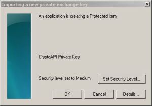

# Serialisatie

## Json

XML is weliswaar geschikt om "cross-platform" gegevens door te sturen door de aard van de codering (leesbare tekst), maar is (te) zeer "woordrijk". Dit leidt tot een hoger geheugengebruik en traagheid tijdens het (de-)serialisatieproces. Er zijn alternatieven op de markt die ook de cross-platform benadering ondersteunen. De meest eenvoudige techniek, die onder meer in web API's wordt gebruikt, is [JSON](https://www.json.org/json-en.html). JSON is goed geïntegreerd in Javascript aangezien een JSON fragment Javascript "is".

Het .Net framework ondersteunt JSON. Dus JSON is een goed begin om je te verdiepen in het versturen van berichten overheen een netwerk in recente jaren. 

Er zijn meer geavanceerde cross-platform oplossingen. [BSON](https://bsonspec.org/) is een echt goede. Daarnaast kun je altijd nog de goede oude .Net data serialisatie (of remoting - deprecated) gebruiken. Als je eerder snelheid dan flexibiliteit nodig hebt, raden we aan om je eigen binair protocol te gebruiken. Helaas zijn aangepaste binaire protocollen foutgevoelig, kan debugging een hel zijn en is de controlefactor bijna nul in het geval het protocol corrupt is. 

Duurt het verzenden van gegevens langer dan het coderen/verpakken van gegevens? Dat is de fundamentele vraag die we ons altijd moeten stellen: dit is een "trade-off". 

[Protocol Buffers](https://developers.google.com/protocol-buffers) is waarschijnlijk de beste vriend van de "binary number cruncher". Het is een gratis (Apache Licentie) platform-overschrijdend product. Er is ook een specifieke versie voor de .Net omgeving. Protocol Buffers is niet de snelste tool op de markt, maar alle snellere tools (zoals bijvoorbeeld [kryo](https://github.com/EsotericSoftware/kryo)) zijn er meer uitsluitend voor Java. Protocol Buffers wordt ondersteund door vele programmeertalen. De snelheid is behoorlijk goed.

Terug naar JSON:

```xml
<person>
  <firstName>John</firstName>
  <lastName>Smith</lastName>
  <age>25</age>
  <address>
    <streetAddress>21 2nd Street</streetAddress>
    <city>New York</city>
    <state>NY</state>
    <postalCode>10021</postalCode>
  </address>
  <phoneNumbers>
    <phoneNumber type="home">212 555-1234</phoneNumber>
    <phoneNumber type="fax">646 555-4567</phoneNumber>
  </phoneNumbers>
</person>
```

wordt in JSON iets als:

```xml
<person firstName="John" lastName="Smith" age="25">
  <address streetAddress="21 2nd Street" city="New York" state="NY" postalCode="10021" />
  <phoneNumbers>
     <phoneNumber type="home" number="212 555-1234"/>
     <phoneNumber type="fax"  number="646 555-4567"/>
  </phoneNumbers>
</person>
```

JSON lijkt meer op C#, is het niet (zie hieronder)? Een echt leuke JSON viewer: [online json](http://www.jsoneditoronline.org/).

```json
{
    "firstName": "John",
    "age": 25,
    "address": {
        "streetAddress": "21 2nd Street",
        "city": "New York",
        "state": "NY",
        "postalCode": "10021"
    },
    "phoneNumber": [
        {
            "type": "home",
            "number": "212 555-1234"
        },
        {
            "type": "fax",
            "number": "646 555-4567"
        }
    ]
}
```

Allereerst moeten we **JavaScriptSerializer** beschikbaar maken. Voeg de referentie "System.Web.Extensions" toe aan je project. De namespace "System.Web.Script.Serialization" is nu beschikbaar.

(Als dit nog in je AssemblyInfo.cs staat, verwijder *[assembly: AllowPartiallyTrustedCallersAttribute]*)

```json
{
  "Food": [
    {
      "Attribute": null,
      "Name": "Banana",
      "Price": 1.99,
      "Description": "Mexican delicious",
      "SomethingElse": null
    },
    {
      "Attribute": null,
      "Name": "Rice",
      "Price": 0.79,
      "Description": "the best you can get",
      "SomethingElse": null
    },
    {
      "Attribute": "What a wonderful world.",
      "Name": "Cornflakes",
      "Price": 3.85,
      "Description": "buy some milk",
      "SomethingElse": null
    },
    {
      "Attribute": null,
      "Name": "Milk",
      "Price": 1.43,
      "Description": "from happy cows",
      "SomethingElse": null
    },
    {
      "Attribute": null,
      "Name": "baked beans",
      "Price": 1.35,
      "Description": "very British",
      "SomethingElse": null
    }
  ],
  "Electronic": [
    {
      "Attribute": null,
      "Name": "Kindle fire",
      "Price": 100,
      "Description": "Amazon loves you",
      "SomethingElse": "the perfect Xmas gift for your kids"
    }
  ],
  "Text": "Luis Armstrong had a fabulous voice."
}
```

```c#
public static void LoadObjectsJSON() {
    string lDesktopPath = Environment.GetFolderPath(Environment.SpecialFolder.DesktopDirectory) + @"\";
    string lFile = lDesktopPath + "Walmart.json";
 
    JavaScriptSerializer lSerializer = new JavaScriptSerializer();
    string lSerialized = File.ReadAllText(lFile);
    WalmartWorld lWalmartWorld = lSerializer.Deserialize<WalmartWorld>(lSerialized);
 
    foreach (WalmartItem lItem in lWalmartWorld.Electronic) Console.WriteLine(lItem);
    foreach (WalmartItem lItem in lWalmartWorld.Food) Console.WriteLine(lItem);
             
    Console.ReadLine();
}
```


```c#
public static void SaveObjectsJSON(WalmartWorld xWalmartWorld) {
    string lDesktopPath = Environment.GetFolderPath(Environment.SpecialFolder.DesktopDirectory) + @"\";
    string lFile = lDesktopPath + "Walmart.json";
 
    JavaScriptSerializer lSerializer = new JavaScriptSerializer();
    string lSerialized = lSerializer.Serialize(xWalmartWorld);
 
    File.WriteAllText(lFile, lSerialized);
}
```

```text
Kindle fire   100.00 Amazon loves you  !!! => the perfect Xmas gift for your kids
Banana          1.99 Mexican delicious
Rice            0.79 the best you can get
Cornflakes      3.85 buy some milk
Milk            1.43 from happy cows
baked beans     1.35 very British
```

Helaas zien we dezelfde puinhoop als in het geval van XML: er zijn verschillende klassen die zich bezighouden met JSON in het .Net framework.
Er is bijvoorbeeld een serializer in de System.Runtime.Serialization.Json namespace genaamd **DataContractJsonSerializer**. Deze is bedoeld voor gebruik met WCF client applicaties en maakt wel gebruik van DataContractAttribute en DataMemberAttribute om de te serialiseren gegevens te identificeren. Als je geen van deze attributen toevoegt, wordt de data genegeerd. Voor het gebruik van DataContractJsonSerializer voeg je de "System.Runtime.Serialization" referentie toe aan je project.

Laten we onze Walmart klassen uitbreiden en de vereiste attributen toevoegen. Je kunt de XML attributen verwijderen als je niet meer met XML wilt werken. Je kunt ze in de code laten staan om de achterdeur open te houden voor een snelle en eenvoudige XML conversie. De XML attributen hebben geen invloed op het programma, het betreft alleen wat extra bytes in je programmacode.

Pas op voor een kleine typefout. Als je DataContractSerializer gebruikt in plaats van DataContractJsonSerializer, dan maak je per ongeluk XML en geen JSON aan.

```c#
[Serializable]
[DataContract(Name="WalmartWorld")]
[XmlRoot("Walmart", Namespace = "")]
public class WalmartWorld {
    [XmlElement("food")]
    [DataMember]
    public List<WalmartItem> Food { get; set; }
 
    [XmlElement("electronic")]
    [DataMember]
    public List<WalmartItem> Electronic { get; set; }
 
    [XmlText]
    [DataMember]
    public string Text { get; set; }
}
 
[Serializable]
[DataContract(Name = "WalmartItem")]
[XmlRoot("Walmart", Namespace = "")]
public class WalmartItem {
    [XmlAttribute("attr")]
    [DataMember(Name = "Attribute")]  // just to demonstrate that you could define a name
    public string Attribute { get; set; }
 
    [XmlElement("name")]
    [DataMember]
    public string Name { get; set; }
 
    [XmlElement("price")]
    [DataMember]
    public double Price { get; set; }
 
    [XmlElement("description")]
    [DataMember]
    public string Description { get; set; }
 
    [XmlElement("somethingElse")]
    [DataMember]
    public string SomethingElse { get; set; }
 
    public override string ToString() {
        return Name.PadRight(12) +
            Price.ToString("#,##0.00").PadLeft(8) + " " +
            Description +
            (string.IsNullOrEmpty(SomethingElse) ? string.Empty : ("  !!! => " + SomethingElse));
    }
}
 
public static void SaveObjectsJSON(WalmartWorld xWalmartWorld) {
    string lDesktopPath = Environment.GetFolderPath(Environment.SpecialFolder.DesktopDirectory) + @"\";
    string lFile = lDesktopPath + "Walmart.json";
 
    using (FileStream lFileStream = new FileStream(lFile, FileMode.OpenOrCreate)) {
        DataContractJsonSerializer lSerializer = new DataContractJsonSerializer(typeof(WalmartWorld));
        lSerializer.WriteObject(lFileStream, xWalmartWorld);
    }
}
 
public static WalmartWorld LoadObjectsJSON() {
    string lDesktopPath = Environment.GetFolderPath(Environment.SpecialFolder.DesktopDirectory) + @"\";
    string lFile = lDesktopPath + "Walmart.json";
 
    DataContractJsonSerializer lSerializer = new DataContractJsonSerializer(typeof(WalmartWorld));
 
    using (FileStream lFileStream = new FileStream(lFile, FileMode.Open)) {
        WalmartWorld lWalmartWorld = lSerializer.ReadObject(lFileStream) as WalmartWorld;
 
        foreach (WalmartItem lItem in lWalmartWorld.Electronic) Console.WriteLine(lItem);
        foreach (WalmartItem lItem in lWalmartWorld.Food) Console.WriteLine(lItem);
                 
        return lWalmartWolrd;
    }
}
```

Voorbeeld json bestand

```json
{"Electronic":[{"Attribute":null,"Description":"LG","Name":"TV","Price":4500,"SomethingElse":null}],"Food":[{"Attribute":null,"Description":"Douwe Egberts","Name":"Coffee","Price":4.5,"SomethingElse":null}],"Text":null}
```

Voorbeeld testprogramma

```c#
static void Main(string[] args)
{
  WalmartWorld wallmart = new();
  wallmart.Electronic = new List<WalmartItem>
  {
     new WalmartItem { Name = "TV", Description = "LG", Price = 4500.0 }
  };
  wallmart.Food = new List<WalmartItem>
  {
     new WalmartItem{ Name = "Coffee", Description = "Douwe Egberts", Price = 4.5 }
  };
  SaveObjectsJSON(wallmart);
  var anotherWallmart = LoadObjectsJSON();
}
```

Je kan een aangepaste naam definiëren voor elk DataMember attribuut. Het JSON-bestand zal dan deze naam gebruiken in plaats van de naam van de property:

```c#
[DataMember(Name = "UseWhateverYouLike")]
public string Attribute { get; set; }
```

## ProtocolBuffers

### Inleidend

De .Net-versie protobuf-net kan [hier](https://github.com/protobuf-net/protobuf-net) worden gedownload.

Op de homepage wordt Protocol Buffers beschreven als volgt:

**Protocol Buffers** is de naam van het *binaire serialisatieformaat* dat Google gebruikt voor veel van hun datacommunicatie. Het is ontworpen met volgende doelen:

- klein in omvang - efficiënte gegevensopslag (veel kleiner dan xml)
- goedkoop te verwerken - zowel op de client als op de server
- platform onafhankelijk - overdraagbaar tussen verschillende programmeer architecturen
- uitbreidbaar - om nieuwe gegevens aan oude berichten toe te voegen

Voeg protobuf-net.dll toe aan je assembly.

Protocol Buffers gebruikt attributen om de te serialiseren typen te identificeren. Het **ProtoMember** attribuut heeft een positief geheel getal nodig. Dit kan pijnlijk zijn, omdat je overlapping moet vermijden als je overerving gebruikt. Maar het gebruik van gehele getallen heeft ook een duidelijk voordeel: het is veel sneller dan strings. Zoals je al weet, draait Protocol Buffers om snelheid.

```c#
using ProtoBuf;
using System;
using System.Collections.Generic;
using System.IO;
using System.Linq;
using System.Text;

[ProtoContract]
public class Book {
    [ProtoMember(1)]
    public string author;
    [ProtoMember(2)]
    public List<Fable> stories;
    [ProtoMember(3)]
    public DateTime edition;
    [ProtoMember(4)]
    public int pages;
    [ProtoMember(5)]
    public double price;
    [ProtoMember(6)]
    public bool isEbook;
 
    public override string ToString() {
        StringBuilder s = new StringBuilder();
        s.Append("by "); s.Append(author);
        s.Append(", edition "); s.Append(edition.ToString("dd MMM yyyy"));
        s.Append(", pages "); s.Append(pages);
        s.Append(", price "); s.Append(price);
        s.Append(", isEbook "); s.Append(isEbook);
        s.AppendLine();
        if (stories != null) foreach (Fable lFable in stories) {
                s.Append("title "); s.Append(lFable.title);
                s.Append(", rating "); s.Append(lFable.customerRatings.Average());
                s.AppendLine();
            }
 
        return s.ToString();
    }
}
 
[ProtoContract]
public class Fable {
    [ProtoMember(1)]
    public string title;
    [ProtoMember(2)]
    public double[] customerRatings;
}
 
public static Book GetData() {
    return new Book {
        author = "Aesop",
        price = 1.99,
        isEbook = false,
        edition = new DateTime(1975, 03, 13),
        pages = 203,
        stories = new List<Fable>(new Fable[] {
            new Fable{ title = "The Fox & the Grapes", customerRatings = new double[]{ 0.7, 0.7, 0.8} },
            new Fable{ title = "The Goose that Laid the Golden Eggs", customerRatings = new double[]{ 0.6, 0.75, 0.5, 1.0} },
            new Fable{ title = "The Cat & the Mice", customerRatings = new double[]{ 0.1, 0.0, 0.3} },
            new Fable{ title = "The Mischievous Dog", customerRatings = new double[]{ 0.45, 0.5, 0.4, 0.0, 0.5} }
    })
    };
}
```

```c#
public static void SerializeData() {
    MemoryStream lStream = new();
    BinaryWriter lWriter = new(lStream); // no "using", because it would close the MemoryStream automatically
    Book lBook = GetData();
    ProtoBuf.Serializer.Serialize<Book>(lStream, lBook);
    lWriter.Flush();
    lStream.Position = 0;
 
    using (BinaryReader lReader = new(lStream)) {
        for (long i = 0, n = lStream.Length; i < n; i++) {
            byte b = lReader.ReadByte();
            Console.Write(string.Format("{0:X2} ", b));
            if ((i+1) % 20 == 0) Console.WriteLine();
        }
        Console.WriteLine();
        Console.WriteLine();
        Console.WriteLine("number of bytes: " + lStream.Length);
    }
    Console.ReadLine();
}
```

```text
0A 05 41 65 73 6F 70 12 31 0A 14 54 68 65 20 46 6F 78 20 26
20 74 68 65 20 47 72 61 70 65 73 11 66 66 66 66 66 66 E6 3F
11 66 66 66 66 66 66 E6 3F 11 9A 99 99 99 99 99 E9 3F 12 49
0A 23 54 68 65 20 47 6F 6F 73 65 20 74 68 61 74 20 4C 61 69
64 20 74 68 65 20 47 6F 6C 64 65 6E 20 45 67 67 73 11 33 33
33 33 33 33 E3 3F 11 00 00 00 00 00 00 E8 3F 11 00 00 00 00
00 00 E0 3F 11 00 00 00 00 00 00 F0 3F 12 2F 0A 12 54 68 65
20 43 61 74 20 26 20 74 68 65 20 4D 69 63 65 11 9A 99 99 99
99 99 B9 3F 11 00 00 00 00 00 00 00 00 11 33 33 33 33 33 33
D3 3F 12 42 0A 13 54 68 65 20 4D 69 73 63 68 69 65 76 6F 75
73 20 44 6F 67 11 CD CC CC CC CC CC DC 3F 11 00 00 00 00 00
00 E0 3F 11 9A 99 99 99 99 99 D9 3F 11 00 00 00 00 00 00 00
00 11 00 00 00 00 00 00 E0 3F 1A 03 08 D2 1D 20 CB 01 29 D7
A3 70 3D 0A D7 FF 3F

number of bytes: 267
```

```c#
public static void ToAndFro() {
    using (MemoryStream lStream = new()) {
        BinaryWriter lWriter = new(lStream);
        Book lBook = GetData();
        ProtoBuf.Serializer.Serialize<Book>(lStream, lBook);
        lWriter.Flush();
        lStream.Position = 0;
 
        Book lCopy = ProtoBuf.Serializer.Deserialize<Book>(lStream);
        Console.WriteLine(lCopy.ToString());
    }
 
    Console.ReadLine();
}
```

```text
by Aesop, edition 13 Mar 1975, pages 203, price 1.99, isEbook False
title The Fox & the Grapes, rating 0.733333333333333
title The Goose that Laid the Golden Eggs, rating 0.7125
title The Cat & the Mice, rating 0.133333333333333
title The Mischievous Dog, rating 0.37
```

### Over het netwerk

We schrijven nu een kleine klasse ("ProtoType") om objecten snel te identificeren tijdens het serialisatie- en deserialisatieproces. De klasse is abstract en vormt onze basisklasse. De klasse "Boek" en "Fabel" zijn bijna ongewijzigd ten opzichte van de vorige berichten. We voegden override ToString() toe in klasse Fable om een mooiere uitvoer te hebben. Beide klassen erven over van onze abstracte basisklasse ProtoType, waardoor vermeden wordt een interface te implementeren en de leesbaarheid van de code meer dan nodig te beïnvloeden.

```c#
using ProtoBuf;
using System;
using System.Collections.Generic;
using System.Text;
using System.Linq;

public class ProtoBufExample {
 
    public enum eType { Unknown = 0, eBook = 1, eFable };
    public abstract class ProtoType {
        public readonly eType objectId;
        public readonly byte[] objectIdAsBytes;
 
        public ProtoType() {
            Type t = this.GetType();
            if (t == typeof(ProtoBufExample.Book)) objectId = eType.eBook; // to identify the object before deserialization
            else if (t == typeof(ProtoBufExample.Fable)) objectId = eType.eFable; // to identify the object before deserialization
            else throw new Exception("object type unknown");
            objectIdAsBytes = BitConverter.GetBytes((Int16)objectId);
        }
    }
 
    [ProtoContract]
    public class Book : ProtoType {            
        [ProtoMember(1)]
        public string author;
        [ProtoMember(2)]
        public List<Fable> stories;
        [ProtoMember(3)]
        public DateTime edition;
        [ProtoMember(4)]
        public int pages;
        [ProtoMember(5)]
        public double price;
        [ProtoMember(6)]
        public bool isEbook;
 
        public override string ToString() {
            StringBuilder s = new StringBuilder();
            s.Append("by "); s.Append(author);
            s.Append(", edition "); s.Append(edition.ToString("dd MMM yyyy"));
            s.Append(", pages "); s.Append(pages);
            s.Append(", price "); s.Append(price);
            s.Append(", isEbook "); s.Append(isEbook);
            s.AppendLine();
            if (stories != null) foreach (Fable lFable in stories) {
                    s.Append("title "); s.Append(lFable.title);
                    s.Append(", rating "); s.Append(lFable.customerRatings.Average()); // Average() is an extension method of "using System.Linq;"
                    s.AppendLine();
                }
 
            return s.ToString();
        } //
    } // class
 
    [ProtoContract]
    public class Fable : ProtoType {
        [ProtoMember(1)]
        public string title;
        [ProtoMember(2)]
        public double[] customerRatings;
 
        public override string ToString() {
            return "title " + title + ", rating " + customerRatings.Average();
        } //
    } // class
 
    public static Book GetData() {
        return new Book {
            author = "Aesop",
            price = 1.99,
            isEbook = false,
            edition = new DateTime(1975, 03, 13),
            pages = 203,
            stories = new List<Fable>(new Fable[] {
                new Fable{ title = "The Fox & the Grapes", customerRatings = new double[]{ 0.7, 0.7, 0.8} },
                new Fable{ title = "The Goose that Laid the Golden Eggs", customerRatings = new double[]{ 0.6, 0.75, 0.5, 1.0} },
                new Fable{ title = "The Cat & the Mice", customerRatings = new double[]{ 0.1, 0.0, 0.3} },
                new Fable{ title = "The Mischievous Dog", customerRatings = new double[]{ 0.45, 0.5, 0.4, 0.0, 0.5} }
            })
        };
    }
}
```

De server moet altijd voor de client gestart worden, anders zou de client niet onmiddellijk een antwoord van de server krijgen. We luisteren op localhost 127.0.0.1 poort 65432 (willekeurige keuze) en wachten op een clientverbinding. We opteerden voor het TCP protocol: dit is gemakkelijk te gebruiken en *reliable* (betrouwbaar). We hoeven ons geen zorgen te maken over transmissieproblemen. Het nadeel van de keuze voor TCP is dat het trager is dan UDP.
De deserializer aan de server-kant kan niet meteen worden uitgevoerd. We moeten eerst het objecttype bepalen. Hiervoor maken we gebruik van onze "ProtoType" klasse. De eerste twee bytes van de transmissie vertellen ons het type. Dit is heel belangrijk voor de snelheid van de deserialisatie. Je ziet dat de ProtoBuf.Serializer.DeserializeWithLengthPrefix methode generiek is. Type casting wordt op die manier geminimaliseerd.

```c#
using System.Net.Sockets;
using System.Threading;
using System.Net;

public class NetworkListener {
                 
    private bool _ExitLoop = true;
    private TcpListener _Listener;
    public delegate void dOnMessage(object xSender, ProtoBufExample.Book xBook);
    public event dOnMessage OnMessage;
    private NetworkStream _NetworkStream = null;
 
    public int Port { get; private set; }
    public string IpAddress { get; private set; }
    public string ThreadName { get; private set; }
 
    public NetworkListener(string xIpAddress, int xPort, string xThreadName) {
        Port = xPort;
        IpAddress = xIpAddress;
        ThreadName = xThreadName;
    }
 
    public bool Connect() {
        if (!_ExitLoop) {
            Console.WriteLine("Listener running already");
            return false;
        }
        _ExitLoop = false;
 
        try {
            _Listener = new TcpListener(IPAddress.Parse(IpAddress), Port);
            _Listener.Start();
 
            Thread lThread = new Thread(new ThreadStart(Loop));
            lThread.IsBackground = true;
            lThread.Name = ThreadName;
            lThread.Start();
 
            return true;
        }
        catch (Exception ex) { Console.WriteLine(ex.Message); }
        return false;
    }
 
    public void Disconnect() {
        _ExitLoop = true;
        _NetworkStream.WriteTimeout = 5; // immediate timeout
    }
 
    private void Loop() {
        try {
            while (!_ExitLoop) {
                Console.WriteLine("Waiting for a client");
                using (TcpClient lClient = _Listener.AcceptTcpClient()) {
                    string lClientIpAddress = lClient.Client.LocalEndPoint.ToString();
                    Console.WriteLine("New client connecting: " + lClientIpAddress);
                    using (_NetworkStream = lClient.GetStream()) {
 
                        while (!_ExitLoop) {
                            try {
                                byte[] lHeader = new byte[2];    // to indentify the object
                                if (_NetworkStream.Read(lHeader, 0, 2) != 2) break;
                                int lObjectType = BitConverter.ToInt16(lHeader, 0);
                                ProtoBufExample.eType lType = (ProtoBufExample.eType)lObjectType;
                                switch (lType) {
                                    case ProtoBufExample.eType.Unknown:
                                        break;
                                    case ProtoBufExample.eType.eBook:
                                        ProtoBufExample.Book lBook = ProtoBuf.Serializer.DeserializeWithLengthPrefix<ProtoBufExample.Book>(_NetworkStream, ProtoBuf.PrefixStyle.Fixed32);
                                        Console.WriteLine(Environment.NewLine + "received a book: ");
                                        Console.WriteLine(lBook.ToString());
 
                                        // raise an event
                                        dOnMessage lEvent = OnMessage;
                                        if (lEvent == null) continue;
                                        lEvent(lClient, lBook);
 
                                        break;
                                    case ProtoBufExample.eType.eFable:
                                        ProtoBufExample.Fable lFable = ProtoBuf.Serializer.DeserializeWithLengthPrefix<ProtoBufExample.Fable>(_NetworkStream, ProtoBuf.PrefixStyle.Fixed32);
                                        Console.WriteLine(Environment.NewLine + "received a fable: ");
                                        Console.WriteLine(lFable.ToString());
                                        break;
                                    default:
                                        Console.WriteLine("Mayday, mayday, we are in big trouble.");
                                        break;
                                }
                            }
                            catch (System.IO.IOException) {
                                if (_ExitLoop) Console.WriteLine("user requested TcpClient shutdown");
                                else Console.WriteLine("disconnected");
                            }
                            catch (Exception ex) { Console.WriteLine(ex.Message); }
                        }
                        Console.WriteLine(Environment.NewLine + "server/listener: shutting down");
                    }
                }
            }
        }
        catch (Exception ex) {
            Console.WriteLine(ex.Message);
        }
        finally {
            _ExitLoop = true;
            if (_Listener != null) _Listener.Stop();
        }
    }
}
```

De client-kant is recht-toe-recht-aan. Er is niet veel verwerking behalve het kiezen van het juiste generic type voor het serialisatieproces. Ik heb een BlockingCollection gebruikt om het wisselen van context makkelijker te maken. Het is niet de snelste oplossing, maar het maakt het passeren van objecten in een thread loop zeker gemakkelijk. Persoonlijk zijn we geen grote fan van de *concurrent collections*: hun gedrag is niet zo voorspelbaar als dat van een oplossing op maat, van eigen hand. _Queue.Take(); blokkeert en wacht tot gegevens aankomen. Het is thread-safe en vereist geen object locking.

```c#
public class NetworkClient {
    public int Port { get; private set; }
    public string IpAddress { get; private set; }
    public string ThreadName { get; private set; }
    private NetworkStream _NetworkStream = null;
    private bool _ExitLoop = true;
    private BlockingCollection<ProtoBufExample.ProtoType> _Queue = new BlockingCollection<ProtoBufExample.ProtoType>();
 
    public NetworkClient(string xIpAddress, int xPort, string xThreadName) {
        Port = xPort;
        IpAddress = xIpAddress;
        ThreadName = xThreadName;
    } //
 
    public void Connect() {
        if (!_ExitLoop) return; // running already
        _ExitLoop = false;
 
        Thread lThread = new Thread(new ThreadStart(Loop));
        lThread.IsBackground = true;
        lThread.Name = ThreadName;
        lThread.Start();
    } //
 
    public void Disconnect() {
        _ExitLoop = true;
        _Queue.Add(null);
        if (_NetworkStream != null) _NetworkStream.ReadTimeout = 100;
    } //
 
    public void Send(ProtoBufExample.ProtoType xObject) {
        if (xObject == null) return;
        _Queue.Add(xObject);
    }
 
    private void Loop() {
        try {
            using (TcpClient lClient = new TcpClient()) {
                lClient.Connect(IpAddress, Port);
                using (_NetworkStream = lClient.GetStream()) {
 
                    while (!_ExitLoop) {
                        try {
                            ProtoBufExample.ProtoType lObject = _Queue.Take();
                            if (lObject == null) break;
 
                            switch (lObject.objectId) {
                                case ProtoBufExample.eType.eBook:
                                    _NetworkStream.Write(lObject.objectIdAsBytes, 0, 2);
                                    ProtoBuf.Serializer.SerializeWithLengthPrefix<ProtoBufExample.Book>(_NetworkStream, (ProtoBufExample.Book)lObject, ProtoBuf.PrefixStyle.Fixed32);
                                    break;
                                case ProtoBufExample.eType.eFable:
                                    _NetworkStream.Write(lObject.objectIdAsBytes, 0, 2);
                                    ProtoBuf.Serializer.SerializeWithLengthPrefix<ProtoBufExample.Fable>(_NetworkStream, (ProtoBufExample.Fable)lObject, ProtoBuf.PrefixStyle.Fixed32);
                                    break;
                                default:
                                    break;
                            }
                        }
                        catch (System.IO.IOException) {
                            if (_ExitLoop) Console.WriteLine("user requested TcpClient shutdown.");
                            else Console.WriteLine("disconnected");
                        }
                        catch (Exception ex) { Console.WriteLine(ex.Message); }
                    }
                    _ExitLoop = true;
                    Console.WriteLine(Environment.NewLine + "client: shutting down");
                }
            }
        }
        catch (Exception ex) { Console.WriteLine(ex.Message); }
    }
}
```

Het hoofdprogramma is best netjes. We krijgen de "Boek" gegevens en sturen die naar localhost. Dan nemen we een enkel verhaal van hetzelfde boek en sturen het opnieuw om te zien of het programma de verschillende types goed behandelt. 

De omkadering (framing) van de geserialiseerde gegevens is zeer belangrijk. Als je deze niet inkadert, dan kun je de types niet bepalen. Er bestaan veel rare voorbeelden op het internet: een snel onderzoek met Google toont dat men dit cruciale punt van framing vaak niet implementeert en beginners in het ongewisse laat.

```c#
public static class NetworkTest {
 
    public static void Test() {
        NetworkListener lServer = new NetworkListener("127.0.0.1", 65432, "Server");
        NetworkClient lClient = new NetworkClient("127.0.0.1", 65432, "Client");
 
        lServer.Connect();
        lServer.OnMessage += new NetworkListener.dOnMessage(OnBook);
 
        lClient.Connect();
 
        // send a book across the network
        ProtoBufExample.Book lBook = ProtoBufExample.GetData();
        lClient.Send(lBook);
 
        // send a fable across the network
        lClient.Send(lBook.stories[1]);
 
        System.Threading.Thread.Sleep(1000);
 
        lClient.Disconnect();
        lServer.Disconnect();
    }
 
    static void OnBook(object xSender, ProtoBufExample.Book xBook) {
        Console.WriteLine("Book event was raised");
    }
}
```

```text
Waiting for a client
New client connecting: 127.0.0.1:65432

received a book:
by Aesop, edition 13 Mar 1975, pages 203, price 1.99, isEbook False
title The Fox & the Grapes, rating 0.733333333333333
title The Goose that Laid the Golden Eggs, rating 0.7125
title The Cat & the Mice, rating 0.133333333333333
title The Mischievous Dog, rating 0.37

Book event was raised

received a fable:
title The Goose that Laid the Golden Eggs, rating 0.7125

client: shutting down

server/listener: shutting down
```

Er is een klein probleem met de OnBook event. We ontvangen gegevens op een thread en blokkeren de thread zolang als nodig is om de event te verwerken. Om thread bottlenecks te vermijden zou je moeten denken aan het doorsturen van "Book" events naar Tasks en deze asynchroon laten afhandelen wat er gedaan moet worden. **ThreadPools** (en de Parallel klasse) kunnen interessant  zijn in deze context.

Zijn we tevreden met onze code? Deze werkt, maar is niet optimaal. We willen in staat zijn om **meta-informatie** mee te sturen en communicatie **bidirectioneel** te laten verlopen. Ook is het nodig om de server **meerdere clients** te laten bedienen en een event kan best afgehandeld worden in een aparte **Task**. **Uitbreiding** en **refactoring** zijn aan de orde.

We verwijderen de ProtoType klasse omdat overerving niet echt een sterk punt is van Protobuf-Net. Het is mogelijk, maar het gemak van code-onderhoud is een duidelijk argument tegen. De complexiteit neemt langzaam toe, we kunnen ons geen code veroorloven die moeilijk te veranderen is.

In theorie zouden we voor elke klasse een Serialize() methode kunnen schrijven, het resultaat zou veel performanter zijn. Je zou de BitConverter klasse kunnen gebruiken om waarden te converteren en dan samen te voegen zonder al te veel overhead te veroorzaken. En door assembler te gebruiken zou je nog een factor 10 kunnen versnellen.

Moderne protocollen verliezen veel tijd door **reflectie** (introspectie), die vooral bestaat uit het in kaart brengen van methoden en eigenschappen. En in tegenstelling tot assembler laten moderne talen niet toe om b.v. eenvoudig een integer naar een geheugenadres te schrijven en alleen de eerste byte ervan te lezen.
Je kunt bits roteren of vermenigvuldigen en delen, wat veel efficiënter is.

In C# kan je de Parallel class gebruiken om de performantie van je oplossing te verbeteren. Natuurlijk moet de verwerkingstijd van elk stukje code aanzienlijk zijn, anders duurt het langer om taken te maken dan om de problemen op te lossen. In trage netwerken kan het zelfs de moeite waard zijn om te overwegen gegevens te bufferen voor ze worden verzonden.

De ProtoType klasse is vervangen door de Header klasse die het type van het volgende datablok aangeeft en ook een identifier toevoegt. Deze identifier kan worden gebruikt om vitale feedback te ontvangen. De server vertelt de client bijvoorbeeld of de datatransmissie succesvol was of niet. Hij kan ook berekeningsresultaten of foutmeldingen sturen.

De gegevensstroom heeft de volgende volgorde: header, data, header, data, header, data ... behalve voor feedback headers; zij hebben geen data blokken nodig. Het enum eType binnen de Header klasse definieert alle mogelijke datatypes: ErrorMessage, Feedback, Book of Fable.
Zoals eerder gezegd gebruiken we geen overerving voor de Header klasse. De code blijft leesbaar en er is geen spaghetti code om indirecte meervoudige overerving te bereiken.

De communicatie verloopt voortaan bidirectioneel. De client gebruikt twee threads, een om te verzenden en een om te ontvangen. De verzendmethode gebruikt nog steeds de BlockingCollection constructie en een eindeloze lus op een aparte thread.
De server kan met meerdere clients tegelijk verbonden zijn. Om het eenvoudig te houden versturen we data zonder van context te wisselen. Dit blokkeert gewoonlijk threads tijdens de IO operatie. We voegen Tasks toe in de event OnMessageBook om een voorbeeld te geven van hoe dit te vermijden. Desondanks gebruikt de send() methode een lock op de client om gelijktijdige schrijfacties op de socket te voorkomen. Dit is een slechte praktijk; je past best geen "locks" toe op objecten die ook op andere plaatsen gelocked kunnen zijn. Dit valt buiten je bereik, je weet niet of het .Net framework of enige andere code een lock gebruikt op hetzelfde object, wat ongewenst gedrag zou kunnen veroorzaken. In het onderstaande voorbeeld zou het beter zijn geweest om het client object in een andere klasse te wikkelen en de lock toe te passen op dat buitenste omkapselende object. 

```c#
public static void Send(TcpClient xClient, ProtoBufExample.Header xHeader) {
  if (xHeader == null) return;
  if (xClient == null) return;
 
  lock (xClient) {
     NetworkStream lNetworkStream = xClient.GetStream();

//....
```

Dit lock probleem kan als volgt vermeden worden:

```c#
public class ClientData {
   public TcpClient Client { get; private set; }
   private DateTime _ConnectedSince;
   private string _UserName;
   //....
 
public static void Send(ClientData xClient, ProtoBufExample.Header xHeader) {
  if (xHeader == null) return;
  if (xClient == null) return;
 
  lock (xClient) {
     NetworkStream lNetworkStream = xClient.Client.GetStream();
  //....
```

De volledige code:

```c#
using System;
using System.Collections.Concurrent;
using System.Collections.Generic;
using System.Linq;
using System.Net;
using System.Net.Sockets;
using System.Text;
using System.Threading;
using System.Threading.Tasks;
using ProtoBuf;
 
namespace DemoApp {
 
   public class ProtoBufExample {
 
      public enum eType : byte { eError = 0, eFeedback, eBook, eFable };
 
      [ProtoContract]
      public class Header {
         [ProtoMember(1)] public eType objectType;
         [ProtoMember(2)] public readonly int serialMessageId;
 
         public object data;
         private static int _HeaderSerialId = 0;
 
         public Header(object xData, eType xObjectType, int xSerialMessageId = 0) {
            data = xData;
            serialMessageId = (xSerialMessageId == 0) ? Interlocked.Increment(ref _HeaderSerialId) : xSerialMessageId;
            objectType = xObjectType; // we could use "if typeof(T) ...", but it would be slower, harder to maintain and less legible
         }
 
         // parameterless constructor needed for Protobuf-net
         public Header() {
         }
      }
 
      [ProtoContract]
      public class ErrorMessage {
         [ProtoMember(1)]
         public string Text;
      }
 
      [ProtoContract]
      public class Book {
         [ProtoMember(1)] public string author;
         [ProtoMember(2, DataFormat = DataFormat.Group)] public List<Fable> stories;
         [ProtoMember(3)] public DateTime edition;
         [ProtoMember(4)] public int pages;
         [ProtoMember(5)] public double price;
         [ProtoMember(6)] public bool isEbook;
 
         public override string ToString() {
            StringBuilder s = new StringBuilder();
            s.Append("by "); s.Append(author);
            s.Append(", edition "); s.Append(edition.ToString("dd MMM yyyy"));
            s.Append(", pages "); s.Append(pages);
            s.Append(", price "); s.Append(price);
            s.Append(", isEbook "); s.Append(isEbook);
            s.AppendLine();
            if (stories != null) foreach (Fable lFable in stories) {
                  s.Append("title "); s.Append(lFable.title);
                  s.Append(", rating "); s.Append(lFable.customerRatings.Average()); // Average() is an extension method of "using System.Linq;"
                  s.AppendLine();
               }
 
            return s.ToString();
         }
      }
 
      [ProtoContract]
      public class Fable {
         [ProtoMember(1)] public string title;
         [ProtoMember(2, DataFormat = DataFormat.Group)]
         public double[] customerRatings;
 
         public override string ToString() {
            return "title " + title + ", rating " + customerRatings.Average();
         } //
      } // class
 
      public static Book GetData() {
         return new Book {
            author = "Aesop",
            price = 1.99,
            isEbook = false,
            edition = new DateTime(1975, 03, 13),
            pages = 203,
            stories = new List<Fable>(new Fable[] {
                new Fable{ title = "The Fox & the Grapes", customerRatings = new double[]{ 0.7, 0.7, 0.8} },
                new Fable{ title = "The Goose that Laid the Golden Eggs", customerRatings = new double[]{ 0.6, 0.75, 0.5, 1.0} },
                new Fable{ title = "The Cat & the Mice", customerRatings = new double[]{ 0.1, 0.0, 0.3} },
                new Fable{ title = "The Mischievous Dog", customerRatings = new double[]{ 0.45, 0.5, 0.4, 0.0, 0.5} }
            })
         };
      }
   }
 
   public class PendingFeedbacks {
      private readonly ConcurrentDictionary<int, ProtoBufExample.Header> _Messages = new ConcurrentDictionary<int, ProtoBufExample.Header>();
 
      public int Count { get { return _Messages.Count; } }
 
      public void Add(ProtoBufExample.Header xHeader) {
         if (xHeader == null) throw new Exception("cannot add a null header");
 
         if (!_Messages.TryAdd(xHeader.serialMessageId, xHeader)) {
            throw new Exception("there must be a programming error somewhere");
         }
      } //
 
      public void Remove(ProtoBufExample.Header xHeader) {
         ProtoBufExample.Header lHeader;
         if (!_Messages.TryRemove(xHeader.serialMessageId, out lHeader)) {
            throw new Exception("there must be a programming error somewhere");
         }
 
         switch (xHeader.objectType) {
            case ProtoBufExample.eType.eError:
               Console.WriteLine("error: " + ((ProtoBufExample.ErrorMessage)xHeader.data).Text);
               Console.WriteLine("the message that was sent out was: " + lHeader.objectType + " with serial id " + lHeader.serialMessageId);
               Console.WriteLine("please check the log files" + Environment.NewLine);
               break;
            case ProtoBufExample.eType.eFeedback:
               // all ok !
               break;
            default:
               Console.WriteLine("warning: This message type was not expected.");
               break;
         }
      }
   }
 
   public static class NetworkTest {
      public static void Test() {
         NetworkListener lServer = new NetworkListener("127.0.0.1", 65432, "Server");
         NetworkClient lClient = new NetworkClient("127.0.0.1", 65432, "Client");
 
         lServer.Connect();
         lServer.OnMessageBook += new NetworkListener.dOnMessageBook(OnMessageBook);
         lServer.OnMessageFable += new NetworkListener.dOnMessageFable(OnMessageFable);
 
         lClient.Connect();
 
         ProtoBufExample.Header lHeader;
 
         // send a book across the network
         ProtoBufExample.Book lBook = ProtoBufExample.GetData();
         lHeader = new ProtoBufExample.Header(lBook, ProtoBufExample.eType.eBook);
         lClient.Send(lHeader);
 
         System.Threading.Thread.Sleep(1000);  // remove this to see the asynchonous processing (the output will look terrible)
 
         // send a fable across the network
         lHeader = new ProtoBufExample.Header(lBook.stories[1], ProtoBufExample.eType.eFable);
         lClient.Send(lHeader);
 
         System.Threading.Thread.Sleep(1000);
 
         lClient.Disconnect();
         lServer.Disconnect();
 
         Console.ReadLine();
      }
 
      // demo: synchronous processing
      static void OnMessageFable(TcpClient xSender, ProtoBufExample.Header xHeader, ProtoBufExample.Fable xFable) {
         Console.WriteLine(Environment.NewLine + "received a fable: ");
         Console.WriteLine(xFable.ToString());
 
         // demo: we tell the server that something went wrong
         ProtoBufExample.ErrorMessage lErrorMessage = new ProtoBufExample.ErrorMessage() { Text = "The fable was rejected. It is far too short." };
         ProtoBufExample.Header lErrorHeader = new ProtoBufExample.Header(lErrorMessage, ProtoBufExample.eType.eError, xHeader.serialMessageId);
         NetworkListener.Send(xSender, lErrorHeader);
      }
 
      // demo: asynchronous processing
      static void OnMessageBook(TcpClient xSender, ProtoBufExample.Header xHeader, ProtoBufExample.Book xBook) {
         Task.Factory.StartNew(() => {
            Console.WriteLine(Environment.NewLine + "received a book: ");
            Console.WriteLine(xBook.ToString());
 
            // send a feedback without any body to signal all was ok
            ProtoBufExample.Header lFeedback = new ProtoBufExample.Header(null, ProtoBufExample.eType.eFeedback, xHeader.serialMessageId);
            NetworkListener.Send(xSender, lFeedback);
            return;
         });
 
         Console.WriteLine("Book event was raised");
      }
   }
 
   public class NetworkListener {
 
      private bool _ExitLoop = true;
      private TcpListener _Listener;
 
      public delegate void dOnMessageBook(TcpClient xSender, ProtoBufExample.Header xHeader, ProtoBufExample.Book xBook);
      public event dOnMessageBook OnMessageBook;
 
      public delegate void dOnMessageFable(TcpClient xSender, ProtoBufExample.Header xHeader, ProtoBufExample.Fable xFable);
      public event dOnMessageFable OnMessageFable;
 
      private List<TcpClient> _Clients = new List<TcpClient>();
 
      public int Port { get; private set; }
      public string IpAddress { get; private set; }
      public string ThreadName { get; private set; }
 
      public NetworkListener(string xIpAddress, int xPort, string xThreadName) {
         Port = xPort;
         IpAddress = xIpAddress;
         ThreadName = xThreadName;
      } //
 
      public bool Connect() {
         if (!_ExitLoop) {
            Console.WriteLine("Listener running already");
            return false;
         }
         _ExitLoop = false;
 
         try {
            _Listener = new TcpListener(IPAddress.Parse(IpAddress), Port);
            _Listener.Start();
 
            Thread lThread = new Thread(new ThreadStart(LoopWaitingForClientsToConnect));
            lThread.IsBackground = true;
            lThread.Name = ThreadName + "WaitingForClients";
            lThread.Start();
 
            return true;
         }
         catch (Exception ex) { Console.WriteLine(ex.Message); }
         return false;
      } //
 
      public void Disconnect() {
         _ExitLoop = true;
         lock (_Clients) {
            foreach (TcpClient lClient in _Clients) lClient.Close();
            _Clients.Clear();
         }
      } //        
 
      private void LoopWaitingForClientsToConnect() {
         try {
            while (!_ExitLoop) {
               Console.WriteLine("waiting for a client");
               TcpClient lClient = _Listener.AcceptTcpClient();
               string lClientIpAddress = lClient.Client.LocalEndPoint.ToString();
               Console.WriteLine("new client connecting: " + lClientIpAddress);
               if (_ExitLoop) break;
               lock (_Clients) _Clients.Add(lClient);
 
               Thread lThread = new Thread(new ParameterizedThreadStart(LoopRead));
               lThread.IsBackground = true;
               lThread.Name = ThreadName + "CommunicatingWithClient";
               lThread.Start(lClient);
            }
         }
         catch (Exception ex) { Console.WriteLine(ex.Message); }
         finally {
            _ExitLoop = true;
            if (_Listener != null) _Listener.Stop();
         }
      } // 
 
      private void LoopRead(object xClient) {
         TcpClient lClient = xClient as TcpClient;
         NetworkStream lNetworkStream = lClient.GetStream();
 
         while (!_ExitLoop) {
            try {
               ProtoBufExample.Header lHeader = ProtoBuf.Serializer.DeserializeWithLengthPrefix<ProtoBufExample.Header>(lNetworkStream, ProtoBuf.PrefixStyle.Fixed32);
               if (lHeader == null) break; // happens during shutdown process
               switch (lHeader.objectType) {
 
                  case ProtoBufExample.eType.eBook:
                     ProtoBufExample.Book lBook = ProtoBuf.Serializer.DeserializeWithLengthPrefix<ProtoBufExample.Book>(lNetworkStream, ProtoBuf.PrefixStyle.Fixed32);
                     if (lBook == null) break;
                     lHeader.data = lBook; // not necessary, but nicer                            
 
                     dOnMessageBook lEventBook = OnMessageBook;
                     if (lEventBook == null) continue;
                     lEventBook(lClient, lHeader, lBook);
                     break;
 
                  case ProtoBufExample.eType.eFable:
                     ProtoBufExample.Fable lFable = ProtoBuf.Serializer.DeserializeWithLengthPrefix<ProtoBufExample.Fable>(lNetworkStream, ProtoBuf.PrefixStyle.Fixed32);
                     if (lFable == null) break;
                     lHeader.data = lFable; // not necessary, but nicer                            
 
                     dOnMessageFable lEventFable = OnMessageFable;
                     if (lEventFable == null) continue;
                     lEventFable(lClient, lHeader, lFable);
                     break;
 
                  default:
                     Console.WriteLine("Mayday, mayday, we are in big trouble.");
                     break;
               }
            }
            catch (System.IO.IOException) {
               if (_ExitLoop) Console.WriteLine("user requested client shutdown");
               else Console.WriteLine("disconnected");
            }
            catch (Exception ex) { Console.WriteLine(ex.Message); }
         }
         Console.WriteLine("server: listener is shutting down");
      } //
 
      public static void Send(TcpClient xClient, ProtoBufExample.Header xHeader) {
         if (xHeader == null) return;
         if (xClient == null) return;
 
         lock (xClient) {
            try {
               NetworkStream lNetworkStream = xClient.GetStream();
 
               // send header (most likely a simple feedback)
               ProtoBuf.Serializer.SerializeWithLengthPrefix<ProtoBufExample.Header>(lNetworkStream, xHeader, ProtoBuf.PrefixStyle.Fixed32);
 
               // send errors
               if (xHeader.objectType != ProtoBufExample.eType.eError) return;
               ProtoBuf.Serializer.SerializeWithLengthPrefix<ProtoBufExample.ErrorMessage>(lNetworkStream, (ProtoBufExample.ErrorMessage)xHeader.data, ProtoBuf.PrefixStyle.Fixed32);
            }
            catch (Exception ex) { Console.WriteLine(ex.Message); }
         }
 
      } 
   }
 
   public class NetworkClient {
      public int Port { get; private set; }
      public string IpAddress { get; private set; }
      public string ThreadName { get; private set; }
      private NetworkStream _NetworkStream = null;
      private TcpClient _Client = null;
      private bool _ExitLoop = true;
      private BlockingCollection<ProtoBufExample.Header> _Queue = new BlockingCollection<ProtoBufExample.Header>();
      private readonly PendingFeedbacks _PendingFeedbacks = new PendingFeedbacks();
 
      public NetworkClient(string xIpAddress, int xPort, string xThreadName) {
         Port = xPort;
         IpAddress = xIpAddress;
         ThreadName = xThreadName;
      } //
 
      public void Connect() {
         if (!_ExitLoop) return; // running already
         _ExitLoop = false;
 
         _Client = new TcpClient();
         _Client.Connect(IpAddress, Port);
         _NetworkStream = _Client.GetStream();
 
         Thread lLoopWrite = new Thread(new ThreadStart(LoopWrite));
         lLoopWrite.IsBackground = true;
         lLoopWrite.Name = ThreadName + "Write";
         lLoopWrite.Start();
 
         Thread lLoopRead = new Thread(new ThreadStart(LoopRead));
         lLoopRead.IsBackground = true;
         lLoopRead.Name = ThreadName + "Read";
         lLoopRead.Start();
      }
 
      public void Disconnect() {
         _ExitLoop = true;
         _Queue.Add(null);
         if (_Client != null) _Client.Close();
         //if (_NetworkStream != null) _NetworkStream.Close();
      }
 
      public void Send(ProtoBufExample.Header xHeader) {
         if (xHeader == null) return;
         _PendingFeedbacks.Add(xHeader);
         _Queue.Add(xHeader);
      } //
 
 
      private void LoopWrite() {
         while (!_ExitLoop) {
            try {
               ProtoBufExample.Header lHeader = _Queue.Take();
               if (lHeader == null) break;
 
               // send header
               ProtoBuf.Serializer.SerializeWithLengthPrefix<ProtoBufExample.Header>(_NetworkStream, lHeader, ProtoBuf.PrefixStyle.Fixed32);
 
               // send data
               switch (lHeader.objectType) {
                  case ProtoBufExample.eType.eBook:
                     ProtoBuf.Serializer.SerializeWithLengthPrefix<ProtoBufExample.Book>(_NetworkStream, (ProtoBufExample.Book)lHeader.data, ProtoBuf.PrefixStyle.Fixed32);
                     break;
                  case ProtoBufExample.eType.eFable:
                     ProtoBuf.Serializer.SerializeWithLengthPrefix<ProtoBufExample.Fable>(_NetworkStream, (ProtoBufExample.Fable)lHeader.data, ProtoBuf.PrefixStyle.Fixed32);
                     break;
                  default:
                     break;
               }
            }
            catch (System.IO.IOException) {
               if (_ExitLoop) Console.WriteLine("user requested client shutdown.");
               else Console.WriteLine("disconnected");
            }
            catch (Exception ex) { Console.WriteLine(ex.Message); }
         }
         _ExitLoop = true;
         Console.WriteLine("client: writer is shutting down");
      }
 
      private void LoopRead() {
         while (!_ExitLoop) {
            try {
               ProtoBufExample.Header lHeader = ProtoBuf.Serializer.DeserializeWithLengthPrefix<ProtoBufExample.Header>(_NetworkStream, ProtoBuf.PrefixStyle.Fixed32);
               if (lHeader == null) break;
               if (lHeader.objectType == ProtoBufExample.eType.eError) {
                  ProtoBufExample.ErrorMessage lErrorMessage = ProtoBuf.Serializer.DeserializeWithLengthPrefix<ProtoBufExample.ErrorMessage>(_NetworkStream, ProtoBuf.PrefixStyle.Fixed32);
                  lHeader.data = lErrorMessage;
               }
               _PendingFeedbacks.Remove(lHeader);
            }
            catch (System.IO.IOException) {
               if (_ExitLoop) Console.WriteLine("user requested client shutdown");
               else Console.WriteLine("disconnected");
            }
            catch (Exception ex) { Console.WriteLine(ex.Message); }
         }
         Console.WriteLine("client: reader is shutting down");
      }
   } 
}
```

```text
waiting for a client
new client connecting: 127.0.0.1:65432
waiting for a client
Book event was raised

received a book:
by Aesop, edition 13 Mar 1975, pages 203, price 1.99, isEbook False
title The Fox & the Grapes, rating 0.733333333333333
title The Goose that Laid the Golden Eggs, rating 0.7125
title The Cat & the Mice, rating 0.133333333333333
title The Mischievous Dog, rating 0.37

received a fable:
title The Goose that Laid the Golden Eggs, rating 0.7125
error: The fable was rejected. It is far too short.
the message that was sent out was: eFable with serial id 2
please check the log files

client: writer is shutting down
server: listener is shutting down
user requested client shutdown
client: reader is shutting down
```

## Encryptie

### AES

Na het serialiseren, opslaan en verzenden van gegevens over het netwerk, richten we ons op cryptografie: de versleuteling van de gegevens om voor meer veiligheid te zorgen (minder leesbaar over het netwerk).

Het vereenvoudigde proces is:

```text
data => password => encryption => cipher => password => decryption => data
```

We concentreren ons op het bekende [AES](http://www.youtube.com/user/TownsendSecurity)-algoritme: dit heeft een goede en betrouwbare geschiedenis. Je kunt AES nauwelijks kraken in bijvoorbeeld drie toegestane pogingen per vijf minuten. AES (Advanced Encryption Standard) wordt naar verluidt gebruikt door de Amerikaanse overheid en is aanbevolen door het Amerikaanse National Institute of Standards and Technology (NIST).

Het .Net Framework ondersteunt cryptografie in de System.Security.Cryptography namespace. Het AES-algoritme is te vinden in de klasse AesManaged. Het maakt gebruik van [symmetrische encryptie](https://en.wikipedia.org/wiki/Symmetric-key_algorithm); er is slechts één wachtwoord.

Naast het wachtwoord is er een zogenaamde [Initialization Vector](http://en.wikipedia.org/wiki/Initialization_vector) (IV). Deze voegt meer willekeurigheid toe. De IV zorgt ervoor dat gegevens niet in dezelfde vercijferde gegevens resulteren. Je zou bijna kunnen zeggen dat elk resultaat uniek is. Repeterende patronen zijn veel moeilijker te vinden.

Gebruikers voeren wachtwoorden in, maar het AES-algoritme gebruikt deze niet rechtstreeks. In plaats daarvan heeft het sleutels nodig. Daarom moeten we wachtwoorden omzetten in sleutels.

Sleutelgroottes van 128, 160, 192, 224 en 256 bits worden door het algoritme ondersteund, maar alleen de 128, 192 en 256-bits sleutelgroottes worden in de AES-standaard gespecificeerd.
Blokgroottes van 128, 160, 192, 224 en 256 bits worden door het algoritme ondersteund, maar alleen de blokgrootte van 128 bits wordt in de AES-norm gespecificeerd.

```c#
using System;
//using System.IO;
//using System.Linq;
using System.Security.Cryptography;
using System.Text;

namespace AESSimple
{
    internal class Program
    {
        private static AesManaged GetAesAlgo()
        {
            AesManaged lAlgo = new();
            lAlgo.BlockSize = 128;
            lAlgo.KeySize = 128;
            lAlgo.Key = ASCIIEncoding.ASCII.GetBytes("Bastian/M/K/Ohta"); // 128 bits = 16 bytes = 16 ASCII characters
            lAlgo.IV = ASCIIEncoding.ASCII.GetBytes("1234567890123456"); // 128 bits = 16 bytes = 16 ASCII characters
            Console.WriteLine("Aes block size is " + lAlgo.BlockSize + " bits");
            return lAlgo;
        }

        static byte[] Encrypt(SymmetricAlgorithm xAlgo, byte[] xData)
        {
            ICryptoTransform lEncryptor = xAlgo.CreateEncryptor(xAlgo.Key, xAlgo.IV);
            return lEncryptor.TransformFinalBlock(xData, 0, xData.Length);
        }

        static byte[] Decrypt(SymmetricAlgorithm xAlgo, byte[] xCipher)
        {
            ICryptoTransform lDecryptor = xAlgo.CreateDecryptor(xAlgo.Key, xAlgo.IV);
            return lDecryptor.TransformFinalBlock(xCipher, 0, xCipher.Length);
        }

        public static void Test1()
        {
            string lText = "Let's encrypt and decrypt this text :)";
            byte[] lTextAsBytes = UnicodeEncoding.Unicode.GetBytes(lText);

            Console.WriteLine("text length in characters " + lText.Length);
            Console.WriteLine("text length in bytes " + lTextAsBytes.Length);

            using (SymmetricAlgorithm lAlgo = GetAesAlgo())
            {
                byte[] lEncrypted = Encrypt(lAlgo, lTextAsBytes);
                Console.WriteLine("encrypted data size in bytes " + lTextAsBytes.Length);

                byte[] lDecrypted = Decrypt(lAlgo, lEncrypted);
                Console.WriteLine("decrypted text length in bytes " + lDecrypted.Length);

                string lResult = UnicodeEncoding.Unicode.GetString(lDecrypted);
                Console.WriteLine("text length in characters now " + lResult.Length);
                Console.WriteLine();
                Console.WriteLine("the text was: \"" + lResult + "\"");
            }
        }
        static void Main(string[] args)
        {
            Test1();
        }
    }
}
```

```text
text length in characters 38
text length in bytes 76
Aes block size is 128 bits
encrypted data size in bytes 76
decrypted text length in bytes 76
text length in characters now 38

the text was: “Let’s encrypt and decrypt this text :)”
```

Deze code codeert/decodeert alle gegevens in het geheugen zonder gebruik te maken van een stream. Het volgende voorbeeld gebruikt de FileStream klasse om een bestand op te slaan op het bureaublad. Sommige mensen geven er de voorkeur aan om de memory stream te gebruiken: dit is echter geen vereiste. Hiervoor zag je al hoe je iets in het geheugen kunt converteren zonder de MemoryStream klasse te gebruiken.

```c#
public static void Test2() {
   string lDesktopPath = Environment.GetFolderPath(Environment.SpecialFolder.DesktopDirectory) + @"\";
   string lFileName = lDesktopPath + "Encrypted.bin";
   string lText = "Let's encrypt and decrypt this text :)";
   byte[] lTextAsBytes = UnicodeEncoding.Unicode.GetBytes(lText);
 
   Console.WriteLine("text length in characters " + lText.Length);
   Console.WriteLine("text length in bytes " + lTextAsBytes.Length);
 
   try {
      using (SymmetricAlgorithm lAlgo = GetAesAlgo()) {
         EncryptToStream(lAlgo, lFileName, lTextAsBytes);
 
         FileInfo lFileInfo = new FileInfo(lFileName);
         Console.WriteLine("encrypted file size in bytes " + lFileInfo.Length);
 
         int lLength;
         byte[] lDecrypted = DecryptFromStream(lAlgo, lFileName, out lLength);
         Console.WriteLine("decrypted text length in bytes " + lDecrypted.Length);
         //Console.WriteLine("decrypted text length in bytes " + lLength);
 
         string lResult = UnicodeEncoding.Unicode.GetString(lDecrypted);
         //string lResult = UnicodeEncoding.Unicode.GetString(lDecrypted, 0, lLength);
 
         Console.WriteLine("text length in characters now " + lResult.Length);
         Console.WriteLine();
         Console.WriteLine("text before encryption: \"" + lText + "\"");
         Console.WriteLine("text after decryption: \"" + lResult + "\"");
      }
   }
   catch (Exception ex) { Console.WriteLine(ex.Message); }
}
 
static void EncryptToStream(SymmetricAlgorithm xAlgo, string xFileName, byte[] xData) {
   ICryptoTransform lEncryptor = xAlgo.CreateEncryptor(xAlgo.Key, xAlgo.IV);
   System.IO.File.Delete(xFileName);
   using (FileStream lFileStream = new(xFileName, FileMode.CreateNew)) {
      using (CryptoStream lCryptoStream = new(lFileStream, lEncryptor, CryptoStreamMode.Write)) {
         lCryptoStream.Write(xData, 0, xData.Length);
      }
   }
}
 
static byte[] DecryptFromStream(SymmetricAlgorithm xAlgo, string xFileName, out int xLength) {
   ICryptoTransform lDecryptor = xAlgo.CreateDecryptor(xAlgo.Key, xAlgo.IV);
   using (FileStream lFileStream = new(xFileName, FileMode.Open)) {
      using (CryptoStream lCryptoStream = new(lFileStream, lDecryptor, CryptoStreamMode.Read)) {
         int lLength = (int)lFileStream.Length;
         byte[] lResult = new byte[lLength];
         xLength = lCryptoStream.Read(lResult, 0, lLength);
         return lResult;
      }
   }
}
```

```text
text length in characters 38
text length in bytes 76
Aes block size is 128 bits
encrypted file size in bytes 80
decrypted text length in bytes 80
text length in characters now 40

text before encryption: “Let’s encrypt and decrypt this text :)”
text after decryption: “Let’s encrypt and decrypt this text 🙂 ”
```

Een typische beginnersfout werd toegepast: zie de toegevoegde tekstberichten over de gegevenslengtes. Commentarieer de volgende regels om de fout te repareren:

```c#
Console.WriteLine("decrypted text length in bytes " + lDecrypted.Length);
//Console.WriteLine("decrypted text length in bytes " + lLength);
 
string lResult = UnicodeEncoding.Unicode.GetString(lDecrypted);
//string lResult = UnicodeEncoding.Unicode.GetString(lDecrypted, 0, lLength);
```

Verander bovenstaande code in:

```C#
//Console.WriteLine("decrypted text length in bytes " + lDecrypted.Length);
Console.WriteLine("decrypted text length in bytes " + lLength);
 
//string lResult = UnicodeEncoding.Unicode.GetString(lDecrypted);
string lResult = UnicodeEncoding.Unicode.GetString(lDecrypted, 0, lLength);

```

```text
text length in characters 38
text length in bytes 76
Aes block size is 128 bits
encrypted file size in bytes 80
decrypted text length in bytes 76
text length in characters now 38

text before encryption: “Let’s encrypt and decrypt this text :)”
text after decryption: “Let’s encrypt and decrypt this text :)”
```

De blokgrootte is 128 bits (=16 bytes). 76 bytes zijn geen veelvoud van 16, maar 80 bytes wel. Dit resulteert in een groter bestand, dat padding gebruikt aan het eind. Het nemen van de verkeerde grootte heeft geleid tot een verkeerde gedecodeerde tekst.

Best sla je geen wachtwoorden op. Wachtwoorden worden gebruikt als sleutels om gegevens te ontcijferen. Als het wachtwoord fout is, dan is de gedecodeerde data fout. Sommige programmeurs nemen wachtwoorden op in de source code om ze "lui" te vergelijken met wachtwoordinvoer. Dit is echt een slechte praktijk!
Hoe dan ook, sommige toepassingen slaan wachtwoorden op om het inloggen te vergemakkelijken: je internet browser heeft dergelijke functionaliteit. In dit geval moet je het resultaat "salt"-en. Salt maakt het kraken van wachtwoorden tijdrovender, het houdt criminelen echter niet tegen. Maar alle beetjes helpen. John Doe zal niet in staat zijn om je salted wachtwoord te gebruiken.

De goede oude hardcore hackers stoorden zich niet aan het gebruik van wachtwoorden. Het was vaak niet eens nodig om ze te kraken. Hackers hadden freezer modules die de computer konden bevriezen en toegang gaven tot alle geheugen, inclusief de lopende assembler code. Je hoefde de PC alleen te bevriezen als hij om een wachtwoord vroeg. Je controleerde waar je programmateller stond en voerde een sprong uit in de code om hetzelfde te doen als wat je zou doen nadat je het wachtwoord had ingevoerd. Het enige wat je dus hoefde te doen was een onvoorwaardelijk branch commando toevoegen om het wachtwoordverzoek te omzeilen. Tegenwoordig werkt het een beetje anders.
Wat leren we hieruit? De uitvoerbare code moet je versleutelen om jezelf efficiënt te beschermen. Het is niet genoeg om alleen data te versleutelen. De beste code decodeert zichzelf bit voor bit at runtime.

Terug naar salt. Soms gebruiken gebruikers hetzelfde wachtwoord. Als je deze wachtwoorden met individuele salt waarden in je database opslaat, dan zien ze er wel heel anders uit. Nogmaals, dit maakt het criminele leven van John Doe moeilijker. Een statische saltwaarde is dus geen goed idee. Je kunt de saltwaarde beter direct naast je wachtwoord opslaan. Je kunt de saltwaarde zelfs versleutelen met hardcoded algoritmeparameters. Dit maakt het weer een stukje veiliger.

```c#
using System.Linq;

public static void Test3() {
 
   // variable salt
   Console.WriteLine("random salt");
   string lPassword = "MySooperDooperSekr1tPa$$wörd";
   byte[] lKey, lSalt;
   GenerateSaltedKey(lPassword, out lKey, out lSalt, 128);
   Console.WriteLine("password: " + lPassword);
   Console.WriteLine("key: " + string.Join(" ", lKey));
   Console.WriteLine("salt: " + string.Join(" ", lSalt));
   Console.WriteLine();
   Console.WriteLine("saving to database");
   Console.WriteLine("[Base64String] key: " + Convert.ToBase64String(lKey));
   Console.WriteLine("[Base64String] salt: " + Convert.ToBase64String(lSalt));
   Console.WriteLine();
 
   // backtest
   byte[] lKey2 = GenerateKey128(lPassword, lSalt); // do we get the same key?
   Console.WriteLine("key: " + string.Join(" ", lKey));
   Console.WriteLine("key: " + string.Join(" ", lKey2));
   if (lKey.SequenceEqual(lKey2)) Console.WriteLine("keys are equal");
   else Console.WriteLine("Oh dear, something went wrong!");
   Console.WriteLine();
 
   // static salt
   Console.WriteLine("static salt");
   for (int i = 0; i < 10; i++) {
      byte[] lStaticKey = GenerateKey128(lPassword);
      Console.WriteLine(i + " static key " + string.Join(" ", lStaticKey));
   }
} 
 
private const int _Iterations = 2500;
 
private static void GenerateSaltedKey(string xPassword, out byte[] xKey, out byte[] xSalt, int xKeySize = 256) {
   xKeySize /= 8; // now in bytes
   var keyGenerator = new Rfc2898DeriveBytes(xPassword, xKeySize, _Iterations);
   xKey = keyGenerator.GetBytes(xKeySize);
   xSalt = keyGenerator.Salt;
} 
 
private static byte[] GenerateKey128(string xPassword) {
   byte[] lSalt = { 252, 132, 52, 13, 64, 158, 12, 10, 50, 80, 74, 63, 15, 54, 76, 246 }; // 16 bytes == 128 bits
   return new Rfc2898DeriveBytes(xPassword, lSalt, _Iterations).GetBytes(16);
} 
 
private static byte[] GenerateKey128(string xPassword, byte[] xSalt) {
   return new Rfc2898DeriveBytes(xPassword, xSalt, _Iterations).GetBytes(16);
} 
```

```text
random salt
password: MySooperDooperSekr1tPa$$wörd
key: 139 209 30 237 82 66 102 245 193 89 175 218 62 190 7 8
salt: 58 247 144 225 92 236 82 167 255 185 6 135 45 104 86 98

saving to database
[Base64String] key: i9Ee7VJCZvXBWa/aPr4HCA==
[Base64String] salt: OveQ4VzsUqf/uQaHLWhWYg==

key: 139 209 30 237 82 66 102 245 193 89 175 218 62 190 7 8
key: 139 209 30 237 82 66 102 245 193 89 175 218 62 190 7 8
keys are equal

static salt
0 static key 103 183 126 80 87 205 118 92 45 195 66 134 124 104 32 206
1 static key 103 183 126 80 87 205 118 92 45 195 66 134 124 104 32 206
2 static key 103 183 126 80 87 205 118 92 45 195 66 134 124 104 32 206
3 static key 103 183 126 80 87 205 118 92 45 195 66 134 124 104 32 206
4 static key 103 183 126 80 87 205 118 92 45 195 66 134 124 104 32 206
5 static key 103 183 126 80 87 205 118 92 45 195 66 134 124 104 32 206
6 static key 103 183 126 80 87 205 118 92 45 195 66 134 124 104 32 206
7 static key 103 183 126 80 87 205 118 92 45 195 66 134 124 104 32 206
8 static key 103 183 126 80 87 205 118 92 45 195 66 134 124 104 32 206
9 static key 103 183 126 80 87 205 118 92 45 195 66 134 124 104 32 206
```

Het aantal iteraties staat op 2500 (private const int _Iterations = 2500). Dit is een willekeurig getal. Een waarde boven de 1000 wordt over het algemeen aanbevolen. Het vertelt de sleutel/IV generator hoeveel keer hij moet draaien. Zorg ervoor dat je hetzelfde aantal iteraties gebruikt wanneer je dezelfde resultaten wilt.

### Asymmetrische encryptie

Hierbij worden twee sleutels gebruikt: een openbare en een particuliere sleutel. Het .NET Framework biedt de klassen RSACryptoServiceProvider en DSACryptoServiceProvider voor asymmetrische encryptie.

De openbare sleutel moet bekend zijn om gegevens te kunnen versleutelen. De private sleutel kan worden gebruikt om gegevens te decoderen. Een publieke sleutel kan niet worden gebruikt om gegevens te ontsleutelen.
De twee sleutels zijn mathematisch aan elkaar gerelateerd, maar je kunt de private sleutel niet bepalen door de publieke sleutel te kennen en vice versa.
RSA (RSACryptoServiceProvider klasse) is een algoritme voor publieke sleutels met sleutelgroottes van 1024 tot 4096. De sleutelgroottes zijn uiteraard veel groter dan voor het AES-algoritme. Ze dragen echter niet bij tot een grotere veiligheid.

We beginnen met de sleutelgeneraties: deze worden teruggegeven in XML-formaat.

```c#
public static void Test4() {
   string lPublicKey, lPrivateKey;
   GetKeys(out lPublicKey, out lPrivateKey);
 
   Console.WriteLine(Environment.NewLine + " P U B L I C  K E Y : " + Environment.NewLine);
   Console.WriteLine(lPublicKey);
   Console.WriteLine(Environment.NewLine + " P R I V A T E  K E Y : " + Environment.NewLine);
   Console.WriteLine(lPrivateKey);
   Console.ReadLine();
}
 
private static void GetKeys(out string xPublicKey, out string xPrivateKey) {
   using (RSACryptoServiceProvider lRSA = new RSACryptoServiceProvider()) {
      xPublicKey = lRSA.ToXmlString(false);
      xPrivateKey = lRSA.ToXmlString(true);
   }
}
```

Je hoeft niet met XML te werken. U kunt ook rechtstreeks toegang krijgen tot binaire gegevens door gebruik te maken van de methoden ExportParameters of ExportCspBlob.

```c#
private static void GetKeys() {
   using (RSACryptoServiceProvider lRSA = new RSACryptoServiceProvider()) {
      RSAParameters xPublicKey = lRSA.ExportParameters(false);
      byte[] lP = xPublicKey.P;
      byte[] lQ = xPublicKey.Q;
      byte[] lModulus = xPublicKey.Modulus;
      byte[] lExponent = xPublicKey.Exponent;
      // ...
 
      byte[] xPrivateKey = lRSA.ExportCspBlob(true);          
   }
}
```

We hebben nu twee sleutels. Laten we dat in de praktijk brengen.

```c#
private static void GetKeys(out string xPublicKey, out string xPrivateKey) {
   using (RSACryptoServiceProvider lRSA = new RSACryptoServiceProvider()) {
      xPublicKey = lRSA.ToXmlString(false);
      xPrivateKey = lRSA.ToXmlString(true);
   }
}
 
public static void HowToUseAsymmetricEncryption() {
   string lText = "Let's encrypt and decrypt this text :)";
   byte[] lData = UnicodeEncoding.Unicode.GetBytes(lText);
 
   string lPublicKey, lPrivateKey;
   GetKeys(out lPublicKey, out lPrivateKey);
 
   byte[] lEncrypted;
   using (RSACryptoServiceProvider lRSA = new RSACryptoServiceProvider()) {
      lRSA.FromXmlString(lPublicKey);
      lEncrypted = lRSA.Encrypt(lData, false);
   }
 
   byte[] lDecrypted;
   using (RSACryptoServiceProvider lRSA = new RSACryptoServiceProvider()) {
      lRSA.FromXmlString(lPrivateKey);
      lDecrypted = lRSA.Decrypt(lEncrypted, false);
   }
 
   string lResult = UnicodeEncoding.Unicode.GetString(lDecrypted);
   Console.WriteLine(lResult);
}
```

Er zijn vele manieren om sleutels op te slaan. Een ervan is om ze op de computer op te slaan, zodat ze van overal toegankelijk zijn. Dit kan worden bereikt door "RSACryptoServiceProvider.UseMachineKeyStore" op true te zetten. Of u kunt CspParameters instantiëren en UseMachineKeyStore in Flags instellen (zie het volgende voorbeeld).
De eigenschap UseMachineKeyStore is van toepassing op alle code in het huidige toepassingsdomein, terwijl een CspParameters-object alleen van toepassing is op klassen die er expliciet naar verwijzen. Door RSACryptoServiceProvider te instancieren met CspParameters als constructorparameter, worden de sleutels automatisch opgeslagen. Er is geen expliciete Store() methode.
Om de sleutels te verwijderen gebruik je gewoon de RSACryptoServiceProvider-instantie, stelt u PersistKeyInCsp in op false en roept u vervolgens de methode Clear() op.
Maak deze twee regels in de code ongedaan en je zult de uitzondering "Key not valid for use in specified state" zien. De sleutels van de nieuwe instantie zijn niet meer dezelfde.

```c#
private static void GetKeys(out string xPublicKey, out string xPrivateKey) {
   using (RSACryptoServiceProvider lRSA = new RSACryptoServiceProvider()) {
      xPublicKey = lRSA.ToXmlString(false);
      xPrivateKey = lRSA.ToXmlString(true);
   }
} //
 
private static CspParameters GetCspParameters() {
   CspParameters lCspParams = new CspParameters();
   lCspParams.Flags |= CspProviderFlags.UseMachineKeyStore;   // all users of this computer have access
   //lCspParams.Flags |= CspProviderFlags.UseUserProtectedKey;  // a popup window will ask for confirmation
   //lCspParams.Flags |= CspProviderFlags.UseNonExportableKey;  // you can use the key, but not read or export it
   lCspParams.KeyContainerName = "MySecretKeyContainer";
   return lCspParams;
}
 
public static void HowToUseAsymmetricEncryption2() {
   CspParameters lCspParams;
   string lText = "Let's encrypt and decrypt this text :)";
   byte[] lData = UnicodeEncoding.Unicode.GetBytes(lText);
 
   string lPublicKey, lPrivateKey;
   GetKeys(out lPublicKey, out lPrivateKey);
 
   try {
      lCspParams = GetCspParameters(); // new instance         
 
      byte[] lEncrypted;
      using (RSACryptoServiceProvider lRSA = new RSACryptoServiceProvider(lCspParams)) {
         lRSA.FromXmlString(lPublicKey);
         lRSA.FromXmlString(lPrivateKey); // assigned here to show that we assigned it to a different RSACryptoServiceProvider instance
         lEncrypted = lRSA.Encrypt(lData, false);
 
         byte[] x = lRSA.ExportCspBlob(true);
          
         // how to delete a KeyContainer
         // lRSA.PersistKeyInCsp = false; 
         // lRSA.Clear();
      }
 
 
      lCspParams = GetCspParameters(); // new instance to demonstrate the independence
 
      using (RSACryptoServiceProvider lRSA = new RSACryptoServiceProvider(lCspParams)) {
         byte[] lDecrypted = lRSA.Decrypt(lEncrypted, false);
         string lResult = UnicodeEncoding.Unicode.GetString(lDecrypted);
         Console.WriteLine(lResult);
      }
   }
   catch (Exception ex) {
      Console.WriteLine(ex.Message + Environment.NewLine);
      Console.WriteLine(ex.StackTrace);
   }
}
```

Speel met de "CspProviderFlags.UseUserProtectedKey" vlag. Een pop-up zou moeten verschijnen wanneer je het commentaar van de lijn in methode GetCspParameters() verwijdert.



Test ook de "spProviderFlags.UseNonExportableKey" vlag. Voeg volgende regel toe:

```c#
byte[] x = lRSA.ExportCspBlob(true)
```

om het effect te demonstreren.

## Compressie

De overweging om compressie toe te passen heeft te maken met hoeveelheid en snelheid. Hoe meer data je hebt, of hoe minder netwerk/harddisk snelheid je hebt, hoe aantrekkelijker compressie wordt.
Streaming media zouden zonder complexe compressie nog in het stenen tijdperk staan. En hoe zit het met backup software?

Voor veel lokale netwerkberichten zien we een ander beeld. Het kan langer duren om gegevens te comprimeren en dan te verzenden dan om de overeenkomstige ruwe gegevens te verzenden. Voor kleine pakketten is het zeker niet de moeite waard. Je hebt grotere gegevens nodig om compressie efficiënt te maken.

Sommige bestanden zoals MP3 of JPG moeten niet worden gecomprimeerd. Ze zijn al gecomprimeerd. Deze bestanden worden niet kleiner. Je besteedt veel tijd aan het comprimeren van gegevens om daarna een groter bestand te hebben.

Het .Net Framework ondersteunt GZip en Zip.

We zien hoe GZIP gebruikt kan worden om gegevens eenvoudig te comprimeren/decomprimeren met enkele ingebouwde methodes van het .Net Framework. Een StopWatch is toegevoegd om te laten zien hoeveel tijd je zou besteden aan het inpakken van gegevens. Reken maar uit en kijk hoe redelijk compressie is in vergelijking met je apparaat- of netwerksnelheid.

Je zou natuurlijk geen MemoryStream gebruiken om de byte-gegevens te genereren. Je kunt het vervangen door bijvoorbeeld een NetworkStream of een FileStream.

```
//byte[] lData = new byte[cDataSize];
//lDecompressorStream.Read(lData, 0, cDataSize);
```

De bovenstaande regels zijn in het volgende voorbeeld van de broncode gecommentarieerd. De reden hiervoor is dat het programma geen header gebruikt om de grootte van de ruwe gegevens vooraf te kennen. Daarom kan de uiteindelijke gedecomprimeerde grootte niet worden toegewezen. Het voorbeeld zou goed lopen, omdat de grootte in dit geval bekend is, maar het zou een twijfelachtig voorbeeld zijn.

```c#
using System;
using System.Diagnostics;
using System.IO;
using System.IO.Compression;
using System.Linq;

const int cDataSize = 10000;
const int cIterations = 1000;
 
public static void Test() {
   Stopwatch lWatch = new Stopwatch();
   lWatch.Start();
 
   byte[] lSource = GenerateRandomData(cDataSize);
   for (int i = 0, n = cIterations; i < n; i++) {
      byte[] lCompressed = Compress(lSource);
      byte[] lTarget = Decompress(lCompressed);
 
      if (i < n - 5) continue; // we just print the last 5 results
      // compare the result with the original data
      Console.WriteLine("before: " + string.Join(" ", lSource.Take(20)) + " ...  ,length: " + lSource.Length);
      Console.WriteLine("after:  " + string.Join(" ", lTarget.Take(20)) + " ...  ,length: " + lTarget.Length);
      Console.WriteLine("compressed size was: " + lCompressed.Length + " = " + (lCompressed.Length/(double)lSource.Length).ToString("0.00%"));
      Console.WriteLine();
   }
 
   lWatch.Stop();
   Console.WriteLine();
   Console.WriteLine("time elapsed: " + lWatch.ElapsedMilliseconds.ToString("#,##0") + " ms");
   Console.WriteLine("iterations: " + cIterations.ToString("#,##0"));
}
  
// creates random data with frequent repetitions
private static byte[] GenerateRandomData(int xDataSize) {
   byte[] lData = new byte[xDataSize];
   Random lRandom = new Random(DateTime.Now.Millisecond);
   for (int i = 0, n = lData.Length; i < n; i++) {
      lData[i] = (byte)lRandom.Next(0, 10);
   }
 
   return lData;
}
  
private static byte[] Compress(byte[] xData) {
   MemoryStream lTargetStream = new MemoryStream();
   using (GZipStream lCompressorStream = new GZipStream(lTargetStream, CompressionMode.Compress)) {
      lCompressorStream.Write(xData, 0, xData.Length);
   }
 
   return lTargetStream.ToArray();
}
 
private static byte[] Decompress(byte[] xCompressedData) {
   GZipStream lDecompressorStream = new GZipStream(new MemoryStream(xCompressedData), CompressionMode.Decompress);
   MemoryStream lTargetStream = new MemoryStream();
   lDecompressorStream.CopyTo(lTargetStream);
 
   int lLength = (int)lTargetStream.Length;
   byte[] lDecompressedData = new byte[lLength];
   lTargetStream.Seek(0, SeekOrigin.Begin);
   lTargetStream.Read(lDecompressedData, 0, lLength);
          
   return lDecompressedData;
}     
```

```text
before: 8 5 6 1 2 3 0 8 8 6 5 5 0 4 4 8 3 2 9 0 … ,length: 10000
after: 8 5 6 1 2 3 0 8 8 6 5 5 0 4 4 8 3 2 9 0 … ,length: 10000
compressed size was: 5089 = 50.89%

before: 8 5 6 1 2 3 0 8 8 6 5 5 0 4 4 8 3 2 9 0 … ,length: 10000
after: 8 5 6 1 2 3 0 8 8 6 5 5 0 4 4 8 3 2 9 0 … ,length: 10000
compressed size was: 5089 = 50.89%

before: 8 5 6 1 2 3 0 8 8 6 5 5 0 4 4 8 3 2 9 0 … ,length: 10000
after: 8 5 6 1 2 3 0 8 8 6 5 5 0 4 4 8 3 2 9 0 … ,length: 10000
compressed size was: 5089 = 50.89%

before: 8 5 6 1 2 3 0 8 8 6 5 5 0 4 4 8 3 2 9 0 … ,length: 10000
after: 8 5 6 1 2 3 0 8 8 6 5 5 0 4 4 8 3 2 9 0 … ,length: 10000
compressed size was: 5089 = 50.89%

before: 8 5 6 1 2 3 0 8 8 6 5 5 0 4 4 8 3 2 9 0 … ,length: 10000
after: 8 5 6 1 2 3 0 8 8 6 5 5 0 4 4 8 3 2 9 0 … ,length: 10000
compressed size was: 5089 = 50.89%

time elapsed: 1,274 ms
iterations: 1,000
```

