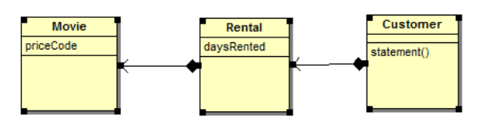
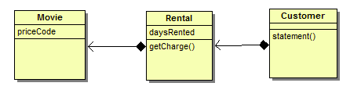

## Single Responsibility Principle

> Een klasse heeft slechts een (!) enkele bestaansreden en kan maar om een (!) enkele reden gewijzigd worden.

> Gather together the things that change for the same reasons. Separate things that change for different reasons.

Eigenschappen van SRP zijn:

- *coupling*
- *cohesion*

> ***Cohesion***: compacte, coherente samenhang. Lage cohesie betekent dat een klasse zich bezig houdt met heel uiteenlopende taken, en niet gefocust is op de strikte, zuivere taak die zou moeten gebeuren. Hoge cohesie betekent dat een klasse doet wat er moet gebeuren, niet meer en niet minder. Probeer er voor te zorgen dat alle methoden in een klasse betrekking hebben tot een enkel doel, m.a.w. er een hoge cohesie heerst.
>
> ***Coupling***: de beperking van de mate waarin een klasse van nog andere klassen afhangt. Hoeveel weet een klasse over de werking (*internals*) van een andere klasse?

**Men streeft naar "low coupling" en "high cohesion"**.

### Waarop letten?

Klassen mogen maar een beperkt aantal instantievariabelen hebben. De methoden van deze klasse moeten één of meerdere van deze variabelen manipuleren.

### Wat bedoelen we met verantwoordelijkheid?

> Een reden tot verandering!

### Een voorbeeld van cohesie

Een klasse met hoge cohesie:

```csharp
class EmailMessage
{
    private string _sendTo;
    private string _subject;
    private string _message;
    
    public EmailMessage(string to, string subject, string message)
    {
        this._sendTo = to;
        this._subject = subject;
        this._message = message;
    }
    public void SendMessage()
    {
        // send message using _sendTo, _subject and _message
    }
}
```

Een voorbeeld van lage cohesie:

```csharp
class EmailMessage
{
    private string _sendTo;
    private string _subject;
    private string _message;
    private string _username;
    
    public EmailMessage(string to, string subject, string message)
    {
        this._sendTo = to;
        this._subject = subject;
        this._message = message;
    }
    
    public void SendMessage()
    {
        // send message using sendTo, subject and message
    }
    
    public void Login(string username, string password)
    {
        this._username = _username;
        // code to login
    }
}
```

### Lage Cohesie


### Hoge Cohesie


De Login methode and username klasse variabele heeft niets te maken met het hoofddoel van de EmailMessage klasse. Daarom zeggen we dat er een lagere cohesie is dan optimaal.

## Een voorbeeld van high coupling

Eens de batterij kapot is, moet je een nieuwe iPad kopen, want de batterij is gesoldeerd in het apparaat en kan dus niet vervangen worden. Bij lage koppeling (*loosly coupled*) zou je de batterij kunnen vervangen. Ditzelfde gaat op bij software engineering.

Een voorbeeld van *high coupling*:

```csharp
public class A
{
    public string ElementA;

    public string MethodA()
    {
        if(!string.IsNullOrEmpty(ElementA))
            return new B().ElementB;
    }
    
    public string MethodC()
    {
        return new B().MethodB();
    }
}

public class B
{
    public string ElementB;
    
    public string MethodB()
    {
        //..
    }
}
```

Waarom spreken we van *high coupling* of *tight coupling*? Klasse A instantiëert objecten van klasse B, en heeft toegang tot variabelen (elementB). Op deze manier is klasse A erg afhankelijk van klasse B. Waarom afhankelijk? Als we beslissen om een extra parameter toe te voegen in de constructor van B en de default constructor private te maken, dan moeten we elk gebruik van klasse B aanpassen (aanpassingen in klasse A).

## Wat is de oplossing?

We kunnen *tight coupling* oplossen door de afhankelijkheden om te keren: een extra laag wordt geïntroduceerd. We kunnen bijvoorbeeld een interface toevoegen: op deze manier zal klasseA enkel afhankelijk zijn van de interface en niet van de actuele implementatie van klasse B.

```csharp
public class A
{
    public string ElementA;
    
    private ISomeInteface _interface;

    public A(ISomeInterface i)
    {
        _interface = i;
    }

    public string MethodA()
    {
        if(!string.IsNullOrEmpty(ElementA))
            return _interface.ElementB;
    }

    public string MethodC()
    {
        return _interface.MethodB();
    }
}

public interface ISomeInterface
{
    string MethodB();
    string ElementB;
}
```

### SRP voorbeeld

```csharp
public class Werknemer
{
    Database _db;
    
    public Werknemer()
    {
        _db = new Database();
    }
    
    void Insert()
    {
        try {
            string sql = "insert into werknemers(voornaam,achternaam,stad) values ('Tom', 'Peeters', 'Antwerpen')";
            _db.query(sql);
        }
        catch(Exception e)
        {
            // Log error
            System.IO.File.WriteAllText(@"c:\Error.txt", e.ToString());
        }
    }

    void Delete()
    {

    }

    void Update()
    {

    }
}
```

De werknemer klasse is verantwoordelijk voor CRUD operaties, maar ook voor het loggen van errors: meer dan 1 verantwoordelijkheid. Indien we beslissen om niet meer naar een bestand te loggen, moeten we de klasse aanpassen.

Daarom is het beter om dit als volgt te coderen:

```csharp
public class Werknemer
{
    Database _db;
    FileLogger _logger;
    
    public Werknemer()
    {
        _db = new Database();
        _logger = new FileLogger();
    }
    void Insert()
    {
        try 
        {
            string sql = "insert into werknemers(voornaam,achternaam,stad) values ('Tom', 'Peeters', 'Antwerpen')";
            _db.query(sql);
        }
        catch(Exception e)
        {
            //Log error
            _logger.Log(e.ToString());
        }
    }  
}
```

De klasse `FileLogger`:

```csharp
public class FileLogger
{
    public void Log(string error)
    {
        System.IO.File.WriteAllText(@"c:\Error.txt", e.ToString());
    }
}
```

Met deze versie van de klasse `FileLogger` verhoog je de "coupling" graad, en voeg je met andere woorden best een extra laag toe, bijvoorbeeld een interface:

```csharp
public interface ILogger
{
    void Log(string error);
}

public class FileLogger:ILogger
{
}

public class Werknemer
{
    ILogger log;
    public Werknemer(ILogger _log)
    {
        log = _log
    }
}

static void Main(string[] args) 
{

    ILogger log = new FileLogger();
    Werknemer wn = new Werknemer(log);
}
```

Single responsibility speelt niet enkel op klasse-niveau, maar ook op method-niveau.

### Single Responsibility op method-niveau

#### Probleemstelling

Er is je gevraagd om software te schrijven voor een online video shop. Het programma berekent en print de rekening van een klant bij onze online shop. Onderstaande paragraaf geeft ons de voorbeeldcode van het programma. We zullen deze oplossing  analyseren en bekijken hoe we de code kunnen verbeteren. Aan het programma wordt meegegeven welke film de klant heeft gehuurd, en voor hoe lang. Daarna wordt de rekening gemaakt – afhankelijk van hoe lang de film gehuurd geweest is, en van om welk type film het gaat (nieuwe release, kinderfilm, ...). 

UML:


### Voorbeeld van de *Main* functie

```csharp
static void Main(string[] args) 
{ 
    List<Customer> _list = new List<Customer>(); 

    Customer c = new Customer("Peeters"); 
    c.AddRental(new Rental(new Movie("Godfather", 0),3)); 
    _list.Add(c); 

    Customer c2 = new Customer("Vandeperre"); 
    c2.AddRental(new Rental(new Movie("Lion King", 2),2)); 
    _list.Add(c2); 


    Customer c3 = new Customer("Verlinden"); 
    c3.AddRental(new Rental(new Movie("Rundskop", 1),4)); 
    _list.Add(c3); 


    Customer c4 = new Customer("Dams"); 
    c4.AddRental(new Rental(new Movie("Top Gun", 0),1)); 
    _list.Add(c4); 

    foreach (Customer cust in _list) 
    { 
        Console.WriteLine( cust.Statement() ); 
    } 
}
```

### Movie klasse

```csharp
public class Movie 
{ 
    public  const int CHILDREN = 2; 
    public  const int REGULAR = 0; 
    public  const int NEW_RELEASE = 1;      

    public Movie(string title, int priceCode) 
    { 
        Title = title; 
        PriceCode = priceCode; 
    } 

    public int PriceCode { get; set; } 

    public string Title { get; set; } 
}
```

### Rental klasse

Deze klasse stelt voor hoe lang een klant een bepaalde film gehuurd heeft:

```csharp
public class Rental 
{ 
    private Movie _movie; 

    public Rental(Movie movie, int daysRented) 
    { 
        _movie = movie; 
        DaysRented = daysRented; 
    } 

    public int DaysRented { get; set; } 

    public Movie GetMovie() 
    { 
        return _movie; 
    } 
}
```

### Customer klasse

Deze klasse representeert de klant van de winkel:

```csharp
public class Customer
{

    List<Rental> _rentals = new List<Rental>();

    public Customer(string name)
    {
        Name = name;
    }

    public void AddRental(Rental arg)
    {
        _rentals.Add(arg);
    }

    public string Name { get; }

    public string Statement()
    {
        double totalAmount = 0;

        string result = "Rental Record for " + Name + "\n";

        foreach (Rental r in _rentals)
        {
            double thisAmount = 0;
            switch (r.GetMovie().PriceCode)
            {
                case Movie.REGULAR:
                    thisAmount += 2;
                    if (r.DaysRented > 2)
                    {
                        thisAmount += (r.DaysRented - 2) * 1.5;
                    }
                    break;

                case Movie.NEW_RELEASE:
                    thisAmount += r.DaysRented * 3;
                    break;

                case Movie.CHILDREN:
                    thisAmount += 1.5;
                    if (r.DaysRented > 3)
                    {
                        thisAmount += (r.DaysRented - 3) * 1.2;
                    }
                    break;
            }

            //Show figures for this rental 
            result += "\t" + r.GetMovie().Title + "\t" + thisAmount.ToString() + "\n";
            totalAmount += thisAmount;
        }

        //Add footer lines 
        result += "Amount owned is " + totalAmount.ToString() + "\n";

        return result;

    }
}
```

## Analyse van onze architectuur

Voor een dergelijke (*simpele*) applicatie is design/architectuur niet zo belangrijk. We zien echter dat dit niet echt object georiënteerde code is, wat een invloed heeft op het gemak waarmee de toepassing kan uitgebreid en veranderd worden.

Enkele bemerkingen: de *Statement* moethode in onze Customer klasse is te lang en doet te veel. Veel zaken die we hier in doen, zouden naar andere klassen overgedragen moeten worden.

Ook al werkt ons programma (mooi geschreven code of lelijke code speelt echt geen rol voor een compiler), we moeten ons steeds het volgende afvragen: als in onze applicatie toevoegingen of veranderingen moeten aangebracht worden, moet er *iemand* zijn die dit kan klaar spelen, en een zwak gedesigned systeem is moeilijk te veranderen. Het vergt dan heel wat analysetijd van de programmeur om je programma te doorgronden.

Een voorbeeld van verandering: stel dat je klant vraagt om je rekening ook op een webpagina in HTML af te drukken. Welke impact heeft dit op je programma? Als we naar onze code kijken, merken we dat voor dergelijke vraagstelling het niet mogelijk is code te hergebruiken. Dus moeten we een nieuwe methode maken, die veel gedrag van de reeds bestaande statement methode kopieert. Op zich nog niet echt een probleem, want met wat copy-paste werk kan je de *Statement* methode dupliceren en hernoemen naar *HtmlStatement* en de result string aanpassen met bijvoorbeeld: `result+=”<b>”blabla</b>”`.

Maar bedenk eens wat je allemaal moet doen als één regel in het rekening maken verandert? Je moet zowel aanpassingen maken in de statement als de *HtmlStatement* methode, wat gegarandeerd fouten (bugs) zal introduceren!

Nog een andere opmerking. Als de winkel beslist om de classificatie (gewone film, kinderfilm, nieuwe release) te veranderen, maar nog niet zeker is hoe, kan het zijn dat ze je vragen de mogelijke ideeën uit te testen. Dat heeft dan ook een invloed op hoe kosten voor films en huurpunten worden berekend. Als professionele software ontwikkelaar in spe moet je verwachten dat dergelijke veranderingen heel regelmatig voorkomen!

De `Statement()` methode is de plaats waar de veranderingen in classificatie en berekeningen gebeuren. Dus ook niet te vergeten consistente veranderingen te maken in de `HtmlStatement()` methode. Als de berekeningsmethodes steeds complexer worden, zal het met ons design ook steeds moeilijker worden om deze veranderingen door te voeren.

Wat nu volgt zijn voorstellen om onze software architectuur stap voor stap te veranderen totdat we object georiënteerde code hebben geschreven die ons in staat stelt dergelijke veranderingen op een *makkelijke* manier te realiseren.

### Analyseren van de Statement methode

Tracht steeds korte functies/methodes te schrijven. Tracht lange functies onder te verdelen in kleinere delen. Kleinere stukken code zijn veel eenvoudiger te onderhouden! Om een methode te verdelen tracht je bij elkaar horende blokken te vinden. Een goede manier is om naar lokale scope variabelen te zoeken. Bijvoorbeeld thisAmount en Rental r, waarbij r niet wordt veranderd, terwijl thisAmount wel. Elke variabele die niet wordt veranderd, kunnen we als argument doorgeven. Indien er variabelen zijn die wel worden veranderd kunnen we, indien er maar 1 is, deze terug retourneren.

We zoeken in onze *Statement* methode naar deze lijnen code:

```csharp
switch( r.GetMovie().PriceCode ) 
{ 
    case Movie.REGULAR: 
        thisAmount += 2; 
        if (r.GetDaysRented() > 2) 
        { 
            thisAmount += (r.GetDaysRented() - 2) * 1.5; 
        } 
        break; 

    case Movie.NEW_RELEASE: 
        thisAmount += r.GetDaysRented() * 3; 
        break; 

    case Movie.CHILDRENS: 
        thisAmount += 1.5; 
        if (r.GetDaysRented() > 3) 
        { 
            thisAmount += (r.GetDaysRented() - 3) * 1.5; 
        } 
        break; 
}
```

... en maken hiervoor een aparte methode:

```csharp
private double AmountFor(Rental r) 
{ 
    double thisAmount=0; 
    switch (r.GetMovie().GetPriceCode()) 
    { 
        case Movie.REGULAR: 
            thisAmount += 2; 
            if (r.GetDaysRented() > 2) 
            { 
                thisAmount += (r.GetDaysRented() - 2) * 1.5; 
            } 
            break; 

        case Movie.NEW_RELEASE: 
            thisAmount += r.GetDaysRented() * 3; 
            break; 

        case Movie.CHILDRENS: 
            thisAmount += 1.5; 
            if (r.GetDaysRented() > 3) 
            { 
                thisAmount += (r.GetDaysRented() - 3) * 1.5; 
            } 
            break; 
    } 
    return thisAmount; 
}
```

Terwijl we in de *statement* methode deze verandering aanbrengen:

```csharp
foreach (Rental r in _rentals) 
{ 
    double thisAmount = 0; 
    thisAmount = AmountFor(r); 
    //...
```

#### Analyse van AmountFor methode

Als we naar onze nieuwe AmountFor(Rental r) methode kijken, valt het op dat we hier met Rental data werken, en eigenlijk geen data van de customer klasse gebruiken. In de meeste gevallen moeten functies/methodes in die klasse staan vanwaar ze data gebruiken, dus in dit geval van de Rental klasse.

```csharp
public double GetCharge() 
{ 
    double result = 0; 
    switch (GetMovie().GetPriceCode()) 
    { 
        case Movie.REGULAR: 
            result += 2; 
            if (GetDaysRented() > 2) 
            { 
                result += (GetDaysRented() - 2) * 1.5; 
            } 
            break; 

        case Movie.NEW_RELEASE: 
            result += GetDaysRented() * 3; 
            break; 

        case Movie.CHILDRENS: 
            result += 1.5; 
            if (GetDaysRented() > 3) 
            { 
                result += (GetDaysRented() - 3) * 1; 
            } 
            break; 
    } 
    return result; 
}
```

We veranderden ook de naam van de methode in GetCharge(), omwille van de duidelijkheid. Tracht altijd naamgevingen te gebruiken die direct duidelijk maken wat je programmeert. Dus in de Customer klasse staat nu:

```csharp
public string Statement() 
{ 
    double totalAmount = 0; 
    int frequentRenterPoints = 0; 

    string result = "Rental Record for " + GetName() + "\n"; 

    foreach (Rental r in _rentals) 
    { 
        double thisAmount = 0; 
        thisAmount += r.GetCharge(); 

    // etc.
```

Het klassendiagramma is nu veranderd naar:


Als we terug naar de *Statement* methode kijken dan is de variabele thisAmount redundant, en dus wijzigen we de code:

```csharp
public string Statement() 
{ 
    double totalAmount = 0; 
    int frequentRenterPoints = 0; 

    string result = "Rental Record for " + GetName() + "\n"; 

    foreach (Rental r in _rentals) 
    { 


        //Show figures for this rental 
        result += "\t" + r.GetMovie().GetTitle() + "\t" + r.GetCharge().ToString() + "\n"; 
        totalAmount += r.GetCharge(); 
    } 

    //Add footer lines 
    result += "Amount owned is " + totalAmount.ToString() + "\n"; 

    return result; 
}
```

Best is om tijdelijke variabelen te verwijderen omdat je makkelijk vergeet waarvoor ze dienen. Je zou in bovenstaand geval toch kunnen kiezen voor een tijdelijke variabele thisAmount, omdat getCharge() tweemaal wordt opgeroepen, dus tweemaal een berekening maakt, vanuit performantieoogpunt.

De Customer klasse:

```csharp
private double getTotalCharge() 
{ 
    double result = 0; 

    foreach (Rental r in _rentals) 
    { 
        result += r.GetCharge(); 
    } 

    return result; 
}
```

De *Statement* methode:

```csharp
public string Statement() 
{ 
    string result = "Rental Record for " + GetName() + "\n"; 

    foreach (Rental r in _rentals) 
    { 

        //Show figures for this rental 
        result += "\t" + r.GetMovie().GetTitle() + "\t" +  r.GetCharge().ToString() + "\n";                 
    } 

    //Add footer lines 
    result += "Amount owned is " +getTotalCharge().ToString() + "\n"; 
    result += "You earned " + getTotalFrequentRenterPoints().ToString() + "frequent renter points"; 

    return result; 
}
```

#### HTMLStatement() functie

In plaats van tekst te loggen willen we onze prijsberekening naar een HTML pagina wegschrijven. Dit is nu vrij simpel, en bij veranderingen in de prijsberekening moeten we de *Customer* klasse niet meer aanpassen!

```csharp
public string HtmlStatement() 
{ 
    string result = "<h1>Rental Record for " + GetName() + "</h1>"; 

    foreach (Rental r in _rentals) 
    { 
        //Show figures for this rental 
        result += "<p>" + r.GetMovie().GetTitle() + " &nbsp; " + r r.GetCharge().ToString() + "</br></p"; 
    } 

    //Add footer lines 
    result += "<p>Amount owned is " + getTotalCharge().ToString() + "</br>"; 
    result += "You earned " + getTotalFrequentRenterPoints().ToString() + "frequent renter points</p>"; 

    return result; 
}
```

Bij een verandering aan de berekening, of toevoeging van nieuwe types films worden de statement functies niet meer gewijzigd, waardoor we duidelijk meer onderhoudsvriendelijke code hebben geschreven.

```csharp
public double GetCharge() 
{ 
    double thisAmount = 0; 
    switch (GetMovie().GetPriceCode()) 
    { 
        case Movie.REGULAR: 
            thisAmount += 2; 
            if (GetDaysRented() > 2) 
            { 
                thisAmount += (GetDaysRented() - 2) * 1.5; 
            } 
            break; 

        case Movie.NEW_RELEASE: 
            thisAmount += GetDaysRented() * 3; 
            break; 

        case Movie.CHILDRENS: 
            thisAmount += 1.5; 
            if (GetDaysRented() > 3) 
            { 
                thisAmount += (GetDaysRented() - 3) * 1; 
            } 
            break; 
    } 
    return thisAmount; 
}
```

Het valt hier op dat we in de *Rental* klasse met een *Movie* object werken. Logischerwijze zou deze functie beter in de movie klasse staan. Het is een slecht idee om een switch te doen op een attribuut van een ander object!

We moeten dan wel het aantal huurdagen meegeven als parameter van deze nieuwe functie. Dus eigenlijk gebruikt deze methode twee stukken data – type film, en aantal huurdagen. Waarom dan toch naar *Movie* klasse brengen, en daysRented meegeven als argument? Wel, de voorgestelde veranderingen gingen om het type film (wat te doen als een nieuw type wordt geïntroduceerd), daarom is het logisch om deze type informatie zo compact mogelijk te bundelen (in een enkele methode i.p.v. twee methoden (als je het type zou doorgeven als parameter)).

De Rental klasse:

```csharp
public double GetCharge() 
{ 
    return GetMovie().GetCharge(DaysRented);              
}
```

In de klasse Movie zit nu:

```csharp
public double GetCharge(int daysRented) 
{ 
    double result = 0; 
    switch (GetPriceCode()) 
    { 
        case Movie.REGULAR: 
            result += 2; 
            if (daysRented > 2) 
            { 
                result += (daysRented - 2) * 1.5; 
            } 
            break; 

        case Movie.NEW_RELEASE: 
            result += daysRented * 3; 
            break; 

        case Movie.CHILDRENS: 
            result += 1.5; 
            if (daysRented > 3) 
            { 
                result += (daysRented - 3) * 1; 
            } 
            break; 
    } 
    return result; 
}
```

## The "Law of Demeter"

De *Wet van Demeter* is een kleine verzameling regels die bepaalt hoe objecten met elkaar moeten omgaan. De wet helpt de grenzen tussen objecten te definiëren en te bepalen wie wat controleert en bezit. Door dit ontwerpprincipe toe te passen krijgt elk object zijn eigen persoonlijke ruimte en wordt voorkomen dat objecten andere "micromanagen".

De LoD reikt bruikbare en kwantificeerbare regels aan voor het structureren van software die helpen de SOLID principes mogelijk te maken. Het definieert welke methoden en variabelen een object mag aanroepen.

LoD is gebaseerd op *least knowledge*, een object-oriented software design principe. Een methode van een object mag enkel aanroepen:

- het object zelf
- een argument van de methode zelf
- elk object dat in de methode zelf aangemaakt is
- alle properties en variabelen waarvan het object zelf eigenaar is
- een globale variabele.

Dit houdt in dat elke actie die dit object onderneemt, moet gebeuren door het manipuleren van voorwerpen die niet meer dan een enkele graad van het object verwijderd zijn. Een ouder kan zijn kinderen vertellen wat ze moeten doen, maar mag zijn kleinkinderen niet vertellen wat ze moeten doen. Een manager mag en moet zijn directe ondergeschikten managen, maar mag zeker niet diens ondergeschikten managen.

Wat interessant is aan LoD is hoe mooi de wet vele andere praktijken van object georiënteerd ontwerpen impliceert. De wet dwingt inkapseling af door veranderingen in subobjecten te isoleren. Dit helpt op zijn beurt om betere modellen te maken van objecten in de echte wereld door druk uit te oefenen op de ontwikkelaar om het interface ontwerp te verbeteren.

* SRP: "Heb slechts één reden voor verandering" - Het breken van LoD breekt het principe van SRP omdat wanneer een subobject verandert, je object ook zou moeten veranderen.
* Dependency Inversion: depend upon abstractions, not concretions” - door niet in de ingewanden van een object te reiken, ben je gedwongen om af te hangen van een abstractie, niet van de details van het object.
