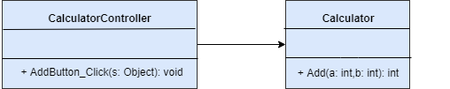
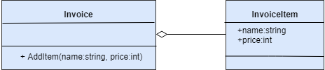
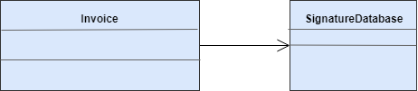
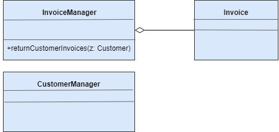
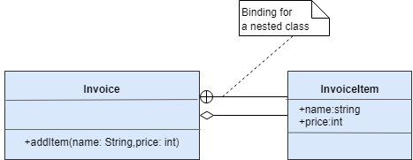
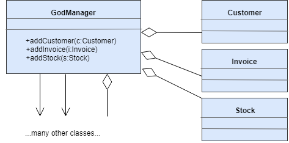
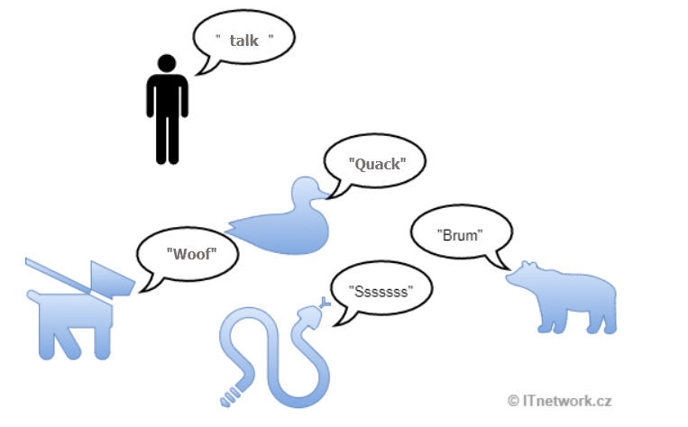
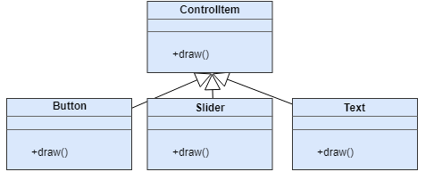
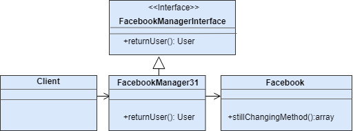

# GRASP

## Inleiding

GRASP is een acroniem van **General Responsibility Assignment Software Patterns**. De kwestie van het toewijzen van verantwoordelijkheid is een hardnekkig probleem in OOP toepassingen en een van de belangrijkste pijlers van een hoogwaardige architectuur. We hebben het al gehad over het belang van het toewijzen van verantwoordelijkheid bij architectuur en Depencency Injection. In tegenstelling tot bijvoorbeeld de "GOF Design Patterns", biedt GRASP geen specifieke implementatiepatronen, maar eerder **best practices**. Om deze reden kunnen we vandaag alle GRASP patronen in één les beschrijven.

9 GRASP patterns:

1. Creator 
2. Information Expert 
3. Low Coupling 
4. Controller 
5. High Cohesion 
6. Indirection 
7. Polymorphism 
8. Protected Variations 
9. Pure Fabrication

## Controller

Jullie, als programmeurs met belangstelling voor softwareontwerp, zouden de term "controller" goed moeten kennen, althans in de context van de "MVC architectuur". Het werkt een beetje zoals een afstandsbediening voor een TV of een Xbox controller. Het is een component wiens rol het is om te communiceren met de gebruiker. Variaties van het controller patroon vinden we in principe in alle goed geschreven applicaties. Bijvoorbeeld, C# .NET form apps gebruiken de *Code Behind layer*, die een controller is. Wanneer de communicatie met de gebruiker wordt bemiddeld door een aparte control class, wordt de applicatie opgedeeld in lagen en is de logica volledig ingekapseld van de presentatie. Dergelijke toepassingen zijn leesbaarder en makkelijker te onderhouden.

Laten we een eenvoudig voorbeeld geven. Stel dat we een rekenmachine programmeren. Een voorbeeld van een monolithische toepassing zou er als volgt uitzien:

```c#
public int Add()
{
    Console.WriteLine("Enter the 1st number");
    int a = int.Parse(Console.ReadLine());
    Console.WriteLine("Enter the 2nd number");
    int b = int.Parse(Console.ReadLine());
    return a + b;
}
```

In de methode hierboven is alle communicatie met de gebruiker (schrijven en lezen van de console) vermengd met de applicatielogica (de berekening zelf). In de praktijk zou de methode natuurlijk iets ingewikkelder berekenen, zodat het de moeite waard zou zijn om het te schrijven. Stel je voor dat er een veel ingewikkeldere bewerking is in plaats van a + b. Soms zeggen we dat zo'n methode neveneffecten heeft, dus niet universeel is en dat het aanroepen ervan ook wat console-communicatie teweegbrengt die op het eerste gezicht misschien niet opvalt. Dit probleem is hier vrij duidelijk en misschien zal het niet in je opkomen om de applicatie op deze manier te schrijven.

Hetzelfde probleem kan echter minder opvallen als we de applicatielogica direct naar de event handler methodes van form control elementen schrijven. Je hebt zeker al eens een formulier applicatie geprogrammeerd. Je hebt misschien code als deze gezien:

```c#
public void AddButton_Click(Object sender)
{
    int a = int.Parse(number1.Text);
    int b = int Parse(number2.Text);
    resultLabel.Text = (a + b).ToString();
}
```

We vervuilen de controller, de controle klasse, met applicatie logica (de berekening). In alle applicaties zou er altijd één laag moeten zijn die alleen dient om te communiceren met de gebruiker, of dat nu een mens is of een API. Deze laag mag niet ontbreken (de eerste foute code) of mag niets anders doen (de tweede foute code).

De correcte versie van de console calculator code zou bijvoorbeeld als volgt zijn:

```c#
public static function main()
{
    Calculator calculator = new Calculator();
    Console.WriteLine("Enter the 1st number");
    int a = int.Parse(Console.ReadLine());
    Console.WriteLine("Enter the 2nd number");
    int b = int.Parse(Console.ReadLine());
    Console.WriteLine (calculator.Add(a, b));
}
```

De main() methode is, in dit geval, een onderdeel van een controller die alleen communiceert met de gebruiker. Alle logica van de toepassing is ingekapseld in de klassen van de logische laag, hier in de klasse Calculator. Deze klasse bevat geen enkele interactie met de console.

Een correcte versie van het tweede voorbeeld zou er hetzelfde uitzien:

```c#
class CalculatorController
{
    private Calculator calculator = new Calculator();

    public void AddButton_Click(sender: Object)
    {
        int a = int.Parse(number1.Text);
        int b = int.Parse(number2.Text);
        resultLabel.Text = (calculator.Add(a, b)).ToString();
    }

}
```



We kunnen zien dat de verantwoordelijkheid van de controller ook parsing omvat, omdat het een input verwerking is. Hetzelfde is met het veranderen van de resultLabel label waarde, die de output is. Echter, de berekening zelf zit weer in de Calculator klasse, die niet eens weet van het formulier.

Om universele voorbeelden te geven, laten we ook zien hoe het renderen van een pagina zonder controller er in PHP uitziet:

```php
<?php
$database = new PDO('mysql:host=localhost;dbname = testdb;charset=utf8mb4', 'name', 'password');
$cars = $database->query("SELECT * FROM cars")->fetchAll();
?>
<table>
<?php foreach ($cars as $car) : ?>
    <tr>
        <td><?= htmlspecialchars($car['license_plate'])?></td>
        <td><?= htmlspecialchars($car['color'])?></td>
    </tr>
<?php endforeach ?>
</table>
```

Met controller:

```php
class CarController
{

    private $carManager;

    public function __construct()
    {
        $this->carManager = new CarManager();
    }

    public function all()
    {
        $cars = $this->carManager->getCars(); // A template variable
        require('Templates/cars.phtml'); // Loads the template
    }

}
```

car.phtml:

```php
<table border = "1">
    <?php foreach ($cars as $car) : ?>
        <tr>
            <td><?= htmlspecialchars($car['license_plate']) ?></td>
            <td><?= htmlspecialchars($car['color']) ?></td>
        </tr>
    <?php endforeach ?>
</table>
```

Wij hebben de logica en de presentatie in 2 bestanden gescheiden en de koppeling verminderd.

## Creator

Zie: https://www.ictdemy.com/software-design/design-patterns/grasp-design-patterns

Het Creator patroon beantwoordt de vraag in welke klasse we code moeten plaatsen die een instantie van een andere klasse creëert. Craig zegt dat de B klasse de A klasse instantieert als:

1. A is een onderdeel van B

   

2. A is afhankelijk van B

   Als deze afhankelijkheid ook ergens anders gebruikt wordt, is het beter om niet helemaal opnieuw nieuwe instanties van de afhankelijkheid te maken, maar het Dependency Injection patroon te gebruiken.

   

3. B beschikt over voldoende informatie om A te instantieren

   Typisch zijn er meerdere plaatsen waar we een instantie van een klasse zouden kunnen creëren. We zouden hem echter moeten creëren op een plaats waar alle informatie al beschikbaar is, d.w.z. de variabelen of instanties die nodig zijn voor de creatie. Het heeft niet veel zin om extra gegevens in een of andere klasse op te halen als alles al elders beschikbaar is.

   Laten we bijvoorbeeld beslissen of we de klasse InvoiceList met klantenfacturen willen instantiëren in de klasse InvoiceManager of in de klasse CustomerManager. Laten we eens kijken welke van de klassen alle informatie heeft die InvoiceList nodig heeft. Als we bijvoorbeeld alle facturen willen opvragen en de facturen van een bepaalde klant willen selecteren, zullen we InvoiceList instantiëren in InvoiceManager omdat de manager alle facturen heeft.

   

4. B bevat A

   Indien A een geneste klasse is in de B klasse, zou de instantie ervan ook moeten worden gecreëerd door de B klasse. Geneste klassen zijn echter niet erg populair geworden



## High Cohesion

Hoge cohesie betekent dat onze applicatie bestaat uit redelijk grote stukken code, elk gericht op één ding. Dit is ook een van de basisprincipes van OOP zelf. Hoge cohesie is nauw verwant met lage koppeling (zie hieronder), omdat wanneer we gerelateerde code concentreren op één plaats, de noodzaak om te verwijzen naar andere delen van de applicatie wordt verminderd. Een ander verwant patroon is de Wet van Demeter, die in feite zegt dat objecten niet mogen "praten" met objecten van vreemden.

Een voorbeeld van Hoge Cohesie is bijvoorbeeld het concentreren van de functionaliteit met betrekking tot gebruikers in de UserManager klasse. Als we bijvoorbeeld de code die de gebruiker aanmeldt in de klasse InvoiceManager zouden plaatsen, waar het nodig zou zijn om de facturen van de gebruiker te tonen, of als we de code die de account van de gebruiker annuleert in de klasse Cleaner zouden plaatsen, die inactieve accounts verwijdert, dan zouden we Hoge Cohesie schenden. De code die samen zou moeten staan in de UserManager klasse zou versnipperd worden op verschillende plaatsen in de applicatie, waar ze net nodig was. Daarom concentreren we de gerelateerde code op één plaats, zelfs als deze methodes slechts één keer binnen de applicatie worden gebruikt.

## Indirection

Indirection is een zeer interessant principe dat we al zijn tegengekomen bij Controller. Het zegt dat wanneer we ergens in onze applicatie een "man in het midden" klasse creëren, d.w.z. een "extra" klasse, dit paradoxaal genoeg de applicatie kan vereenvoudigen. We kunnen duidelijk zien dat controllers het aantal verwijzingen tussen objecten verminderen, en ten koste van slechts een paar regels code, ondersteunen ze ook een betere code herbruikbaarheid en leesbaarheid. Indirectie is een van de manieren om een lage koppeling te bereiken.

## Information expert

Een information expert is een ander principe dat ons helpt beslissen tot welke klasse een methode, een attribuut, of een ander klasselid behoort. De klasse met de meeste informatie heeft altijd de verantwoordelijkheid. We noemen deze klasse de information expert, en we voegen er meer functionaliteit en gegevens aan toe. We hebben het al over een soortgelijk principe gehad met het Creator patroon.

## Low Coupling

Lage koppeling is in feite hetzelfde als hoge cohesie, maar vanuit een ander gezichtspunt. In onze applicatie moeten we een zo klein mogelijk aantal referenties tussen objecten creëren. We kunnen dit bereiken door de verantwoordelijkheid verstandig te verdelen.

Laten we als tegen-voorbeeld een Manager klasse nemen die de logica zou bevatten voor het werken met klanten, facturen, logistiek, gewoon voor alles. Dergelijke objecten worden soms "god-objecten" genoemd, ze hebben te veel verantwoordelijkheid en creëren daardoor te veel koppeling (zo'n Manager zou typisch een groot aantal klassen gebruiken om zo te werken). Het totale aantal referenties in de applicatie is niet zo belangrijk, het is het aantal referenties tussen objecten wat telt. We proberen altijd om de klasse te laten communiceren met zo weinig mogelijk andere klassen, dus moeten we andere managers toevoegen zoals UsersManager, InvoiceManager, LogisticsManager en andere. Je hebt waarschijnlijk al begrepen dat zo'n manager niet erg herbruikbaar zou zijn in andere toepassingen. Het betreft een zogenaamd "anti-pattern".



Lage koppeling heeft ook te maken met, bijvoorbeeld, andere praktijken zoals methode naamgeving ("We moeten methoden een naam geven met zo weinig mogelijk woorden en zonder de AND conjunctie"). De Do() of ParseAndProcessRecord() methoden suggereren dat ze te veel doen.

Opmerking: *omdat we het al gehad hebben over god objecten, laten we het tegenovergestelde probleem aanhalen dat het Yoyo probleem wordt genoemd. Bij te weinig programmastructuren, een te hoge granulariteit, vaak zelfs door overmatig gebruik van overerving, zijn er zo veel kleine klassen in het programma. De programmeur moet dan steeds van klasse naar klasse switchen, om uit te vinden hoe het werkt en dan weer terug. Deze actie kan lijken op het naar beneden en omhoog gooien van een jojo, steeds maar weer. Om deze reden wordt vaak de voorkeur gegeven aan objectcompositie boven overerving*.

Als we het hebben over verwijzingen tussen objecten, moeten we ook cyclische verwijzingen vermijden, die over het algemeen als een slechte praktijk worden beschouwd. Dit gebeurt wanneer de A-klasse verwijst naar de B-klasse, die terugverwijst naar de A-klasse. Als dit gebeurt, is er iets mis met het ontwerp. Cyclische verwijzingen kunnen ook gecreëerd worden door meerdere klassen.

## Polymorphism

Ja, zelfs polymorfisme is een ontwerppatroon. Hoewel het principe van polymorfisme je welbekend zou moeten zijn, herhalen we het voor de volledigheid. Meestal is het zo dat een nakomeling het gedrag van zijn voorouder wijzigt, maar zijn interface behoudt. Vanuit programmeeroogpunt hebben we het dan over het overriden van methodes van de ouder. We kunnen dan met de objecten werken met behulp van een eengemaakte interface, maar elk object wijzigt zelf de geërfde functionaliteit. Polymorfisme is niet alleen beperkt tot overerving, het gaat in het algemeen over het werken met objecten van verschillende types met behulp van een gemeenschappelijke interface die ze allemaal implementeren. Laten we het populaire voorbeeld tonen van dieren die elk een talk() methode hebben, maar deze overrulen van de Animal voorouder om hun specifieke geluiden te maken:





Als je een realistischer voorbeeld van polymorfisme wilt, kan er een gemeenschappelijke voorouder zijn voor alle formulier besturingselementen. Elke nakomeling zou de methodes van de voorouder overriden, zoals draw(), getSize() en dergelijke, afhankelijk van hun specifieke functionaliteit.

## Protected variations

De praktijk spreekt over het creëren van een stabiele interface op de belangrijkste plaatsen van de toepassing, waar de wijziging van de interface zou leiden tot de noodzaak om een groot deel van de toepassing te overschrijven. Laten we nog eens een echt voorbeeld bespreken. In het informatiesysteem van ICT.social gebruiken we het "Protected variations" principe, meer bepaald het "Adapter design pattern" en dat is hoe we wijzigingen voorkomen die Facebook aanbrengt in hun API. Het toestaan van registraties via Facebook en soortgelijke integratie resulteren in een toename van het aantal en de activiteit van onze gebruikers, maar helaas ten koste van het herschrijven van de applicatie om de paar maanden. Door gebruik te maken van de FacebookManagerInterface interface, hoeft ons systeem niet meer te veranderen. Wanneer de nieuwe versie uitkomt en Facebook alles opnieuw doet, implementeren we deze interface gewoon door een nieuwe manager (zoals FacebookManagerXX, waarbij XX de Facebook API versie is), en geven we de nieuwe instantie die deze interface implementeert door aan het systeem. Natuurlijk kan de interface ook worden gedefinieerd door polymorfisme en abstracte klassen.



## Pure fabrication

We hebben het al gehad over *Pure Fabrication*: klassen die alleen dienen om het ontwerp van het systeem te vereenvoudigen. Net zoals *Controller* eigenlijk een geval van *Indirection* was, is *Indirection* een geval van *Pure Fabrication.* Service classes uit de toepassingsfunctionaliteit verminderen het aantal afhankelijkheden en vergroten de coherentie.